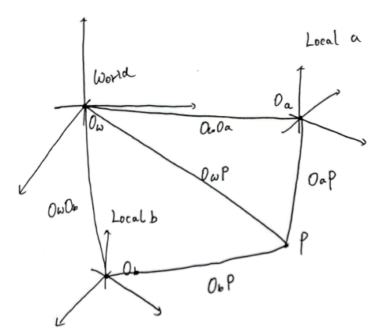

# Difference between Pose and Transformation

## Transformation

假设在world坐标系下，有两个坐标系，Local a 和 Local b，它们的基底分别为
$$
\mathrm{Local\space a:}\space [\mathbf{a}_1,\mathbf{a}_2,\mathbf{a}_3]
\qquad \mathrm{Local\space b:}\space [\mathbf{b}_1,\mathbf{b}_2,\mathbf{b}_3]
$$
假设空间中有一点P，它在Local a 和 Local b两个坐标系下的坐标为
$$
\mathrm{Local\space a:}\space [x_1,x_2,x_3]^T
\qquad \mathrm{Local\space b:}\space [y_1,y_2,y_3]^T
$$
如果，直接将坐标系基底与坐标相乘，得到的两个向量，**两个向量会相等吗？？**答案是不会的
$$
[\mathbf{a}_1,\mathbf{a}_2,\mathbf{a}_3]\begin{bmatrix}x_1\\ x_2\\ x_3\end{bmatrix}
\quad ? \quad
[\mathbf{b}_1,\mathbf{b}_2,\mathbf{b}_3]\begin{bmatrix}y_1\\ y_2\\ y_3\end{bmatrix}
$$
要解释这个首先就要明确一个概念

- **向量仅仅表示一个有长度的方向，向量与空间中的点是没有关系的**。只有给出向量的起始点，向量+起始点 这个组合的意义是**唯一的，明确的**

比如说

1. 现在只有一个向量，那么将这个向量平移到空间中任何一个地方，这个向量都是一样的，因为向量仅仅表示一个方向
2. 现在给一个向量加上一个起始点，那么 **向量+起始点** 这个组合就具有，从起始点出发，往哪个方向走多长，这样一个**唯一的，明确的**意义

所以，回到原来的问题，为什么基底与坐标相乘的两个向量不相等，关键在于两个基底默认的起始点
$$
\mathrm{Local\space a:}\space [\mathbf{a}_1,\mathbf{a}_2,\mathbf{a}_3] \quad 起始点: O_a
\\
\mathrm{Local\space b:}\space [\mathbf{b}_1,\mathbf{b}_2,\mathbf{b}_3] \quad 起始点: O_b
$$
加上起始点后，两个向量表达的意义应该是
$$
\begin{bmatrix}O_{a1}\\ O_{a2}\\ O_{a3}\end{bmatrix}+[\mathbf{a}_1,\mathbf{a}_2,\mathbf{a}_3]\begin{bmatrix}x_1\\ x_2\\ x_3\end{bmatrix}=\overrightarrow{O_aP}
\quad  \quad
\begin{bmatrix}O_{b1}\\ O_{b2}\\ O_{b3}\end{bmatrix}+[\mathbf{b}_1,\mathbf{b}_2,\mathbf{b}_3]\begin{bmatrix}y_1\\ y_2\\ y_3\end{bmatrix}=\overrightarrow{O_bP}
$$
显然，这两个意义不相等。

但如果，我们从世界坐标系的坐标原点$O_w$出发，先到a/b坐标系的坐标原点，再从a/b坐标系的坐标原点出发到P点，那么这两个意义就是相等的
$$
\begin{bmatrix}O_{w1}\\ O_{w2}\\ O_{w3}\end{bmatrix}+\mathbf{t}_{O_wO_a}
+[\mathbf{a}_1,\mathbf{a}_2,\mathbf{a}_3]\begin{bmatrix}x_1\\ x_2\\ x_3\end{bmatrix}=\overrightarrow{O_wP}
$$

$$
\begin{bmatrix}O_{w1}\\ O_{w2}\\ O_{w3}\end{bmatrix}+\mathbf{t}_{O_wO_b}
+[\mathbf{b}_1,\mathbf{b}_2,\mathbf{b}_3]\begin{bmatrix}y_1\\ y_2\\ y_3\end{bmatrix}=\overrightarrow{O_wP}
$$

**注意，除了$[x_1,x_2,x_3]^T,[y_1,y_2,y_3]^T$，上式其余的所有坐标都是在世界坐标系下的坐标，包括$\mathbf{t}_{O_wO_a},[\mathbf{a}_1,\mathbf{a}_2,\mathbf{a}_3]$**，给它们打上上标，表示在哪个坐标系下

将上面两个式子取等
$$
\begin{split}
\begin{bmatrix}O_{w1}\\ O_{w2}\\ O_{w3}\end{bmatrix}+\mathbf{t}_{O_wO_a}^w
+[\mathbf{a}_1^w,\mathbf{a}_2^w,\mathbf{a}_3^w]\begin{bmatrix}x_1\\ x_2\\ x_3\end{bmatrix}
&=
\begin{bmatrix}O_{w1}\\ O_{w2}\\ O_{w3}\end{bmatrix}+\mathbf{t}_{O_wO_b}^w
+[\mathbf{b}_1^w,\mathbf{b}_2^w,\mathbf{b}_3^w]\begin{bmatrix}y_1\\ y_2\\ y_3\end{bmatrix}\\

\mathbf{t}_{O_wO_a}^w+[\mathbf{a}_1^w,\mathbf{a}_2^w,\mathbf{a}_3^w]\begin{bmatrix}x_1\\ x_2\\ x_3\end{bmatrix}
&=
\mathbf{t}_{O_wO_b}^w+[\mathbf{b}_1^w,\mathbf{b}_2^w,\mathbf{b}_3^w]\begin{bmatrix}y_1\\ y_2\\ y_3\end{bmatrix}
\end{split}
$$
假设现在**已知P点在Local a坐标系中的坐标**$[x_1,x_2,x_3]^T$，**想求P点在Local b坐标系中的坐标**$[y_1,y_2,y_3]^T$
$$
\begin{split}
\mathbf{t}_{O_wO_a}^w+[\mathbf{a}_1^w,\mathbf{a}_2^w,\mathbf{a}_3^w]\begin{bmatrix}x_1\\ x_2\\ x_3\end{bmatrix}
&=
\mathbf{t}_{O_wO_b}^w+[\mathbf{b}_1^w,\mathbf{b}_2^w,\mathbf{b}_3^w]\begin{bmatrix}y_1\\ y_2\\ y_3\end{bmatrix}\\

\underbrace{(\mathbf{t}_{O_wO_a}^w-\mathbf{t}_{O_wO_b}^w)}_{\mathbf{t}_{O_bO_a}^w}
+[\mathbf{a}_1^w,\mathbf{a}_2^w,\mathbf{a}_3^w]\begin{bmatrix}x_1\\ x_2\\ x_3\end{bmatrix}
&=
[\mathbf{b}_1^w,\mathbf{b}_2^w,\mathbf{b}_3^w]\begin{bmatrix}y_1\\ y_2\\ y_3\end{bmatrix}\\

\underbrace{[\mathbf{b}_1^w,\mathbf{b}_2^w,\mathbf{b}_3^w]^{-1}\mathbf{t}_{O_bO_a}^w}_{3-vector\rightarrow translation}
+\underbrace{[\mathbf{b}_1^w,\mathbf{b}_2^w,\mathbf{b}_3^w]^{-1}[\mathbf{a}_1^w,\mathbf{a}_2^w,\mathbf{a}_3^w]}_{3\times3\space Matrix\rightarrow rotation}\begin{bmatrix}x_1\\ x_2\\ x_3\end{bmatrix}
&=
\begin{bmatrix}y_1\\ y_2\\ y_3\end{bmatrix}\\
\end{split}
$$
上式左边第一项的结果是一个三维向量，三维向量作用于一个点就是在**平移**，左边第二项是一个$3\times3$矩阵，作用在一个点上就是**旋转**

## Pose

**位姿(Pose) 都需要指明在哪个坐标系下**

用最简单的例子，在世界坐标系下，导出坐标系Local a在世界坐标系下的位姿。设世界坐标系的基底和起始点为
$$
\mathrm{World:}\space [\mathbf{e}_1,\mathbf{e}_2,\mathbf{e}_3] \quad 起始点: O_w
$$
且有
$$
[\mathbf{e}_1,\mathbf{e}_2,\mathbf{e}_3]=\begin{bmatrix}
1 & 0 & 0 \\ 0 & 1 & 0 \\ 0 & 0 & 1 
\end{bmatrix}
$$
同样，假设空间中有一点P，模仿上一节列等式
$$
\begin{split}
\mathbf{t}_{O_wO_a}^w+[\mathbf{a}_1^w,\mathbf{a}_2^w,\mathbf{a}_3^w]\begin{bmatrix}x_1\\ x_2\\ x_3\end{bmatrix}
&=
\underbrace{\mathbf{t}_{O_wO_w}^w}_{0}+\underbrace{[\mathbf{e}_1^w,\mathbf{e}_2^w,\mathbf{e}_3^w]}_{Identity(3)}\begin{bmatrix}w_1\\ w_2\\ w_3\end{bmatrix}\\

\mathbf{t}_{O_wO_a}^w+[\mathbf{a}_1^w,\mathbf{a}_2^w,\mathbf{a}_3^w]\begin{bmatrix}x_1\\ x_2\\ x_3\end{bmatrix}
&=
\begin{bmatrix}w_1\\ w_2\\ w_3\end{bmatrix}\\
\end{split}
$$
**这里的$\mathbf{t}_{O_wO_a}^w,\space[\mathbf{a}_1^w,\mathbf{a}_2^w,\mathbf{a}_3^w]$就是坐标系Local a在世界坐标系下的位姿**

**!!!!!注意!!!!!**

这里可以看到(非常重要)

- $[\mathbf{a}_1^w,\mathbf{a}_2^w,\mathbf{a}_3^w]$ 可以**将在坐标系Local a 中的点旋转到世界坐标系下**，那么$[\mathbf{a}_1^w,\mathbf{a}_2^w,\mathbf{a}_3^w]^{-1}$ 可以**将在世界坐标系中的点旋转到坐标系Local a下**
- $\mathbf{t}_{O_wO_a}^w$可以**将在坐标系Local a中的点平移回世界坐标系下**，$-\mathbf{t}_{O_wO_a}^w$可以**将在世界坐标系中的点平移回坐标系Local a下**，

要理解好$\mathbf{t}_{O_wO_a}^w,[\mathbf{a}_1^w,\mathbf{a}_2^w,\mathbf{a}_3^w]$**它的意义和能够做什么**，这两个是不一样的

**一般情况下的位姿**

通过上一节，我们得到
$$
\begin{split}
\underbrace{[\mathbf{b}_1^w,\mathbf{b}_2^w,\mathbf{b}_3^w]^{-1}\mathbf{t}_{O_bO_a}^w}_{3-vector\rightarrow translation}
+\underbrace{[\mathbf{b}_1^w,\mathbf{b}_2^w,\mathbf{b}_3^w]^{-1}[\mathbf{a}_1^w,\mathbf{a}_2^w,\mathbf{a}_3^w]}_{3\times3\space Matrix\rightarrow rotation}\begin{bmatrix}x_1\\ x_2\\ x_3\end{bmatrix}
&=
\begin{bmatrix}y_1\\ y_2\\ y_3\end{bmatrix}\\
\end{split}
$$
$[\mathbf{b}_1^w,\mathbf{b}_2^w,\mathbf{b}_3^w]$ 可以将在坐标系Local b 中的点旋转到世界坐标系下，$[\mathbf{b}_1^w,\mathbf{b}_2^w,\mathbf{b}_3^w]^{-1}$ 可以将在世界坐标系中的点旋转到坐标系Local b下，$[\mathbf{a}_1^w,\mathbf{a}_2^w,\mathbf{a}_3^w]$ 可以将在坐标系Local a 中的点旋转到世界坐标系下，用符号表示
$$
[\mathbf{b}_1^w,\mathbf{b}_2^w,\mathbf{b}_3^w]:\space \mathrm{Local\space b}\rightarrow \mathrm{world}\\
[\mathbf{b}_1^w,\mathbf{b}_2^w,\mathbf{b}_3^w]^{-1}:\space \mathrm{world}\rightarrow \mathrm{Local\space b}\\
[\mathbf{a}_1^w,\mathbf{a}_2^w,\mathbf{a}_3^w]:\space \mathrm{Local\space a}\rightarrow \mathrm{world}\\
$$
那么
$$
\begin{split}
[\mathbf{b}_1^w,\mathbf{b}_2^w,\mathbf{b}_3^w]^{-1}[\mathbf{a}_1^w,\mathbf{a}_2^w,\mathbf{a}_3^w]&:\space\mathrm{Local\space a}\rightarrow \mathrm{world}\rightarrow \mathrm{Local\space b}\\
&: \space \mathrm{Local\space a}\rightarrow \mathrm{Local\space b}
\end{split}
$$

$$
[\mathbf{b}_1^w,\mathbf{b}_2^w,\mathbf{b}_3^w]^{-1}\mathbf{t}_{O_bO_a}^w
\space \rightarrow \space
\mathbf{t}_{O_bO_a}^b
$$

上面的式子可以写成
$$
\begin{split}
\mathbf{t}_{O_bO_a}^b
+R_{ab}\begin{bmatrix}x_1\\ x_2\\ x_3\end{bmatrix}
&=
\begin{bmatrix}y_1\\ y_2\\ y_3\end{bmatrix}\\
\end{split}
$$

- $R_{ab}$能够从Local a旋转到Local b，也表示Local a在Local b下的位姿
- $\mathbf{t}_{O_bO_a}^b$能够在Local b坐标系下将点从Local a平移到Local b，也表示Local a在Local b下的位姿

