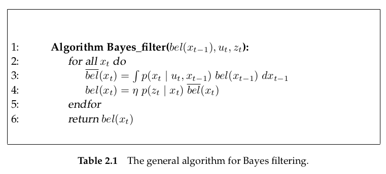
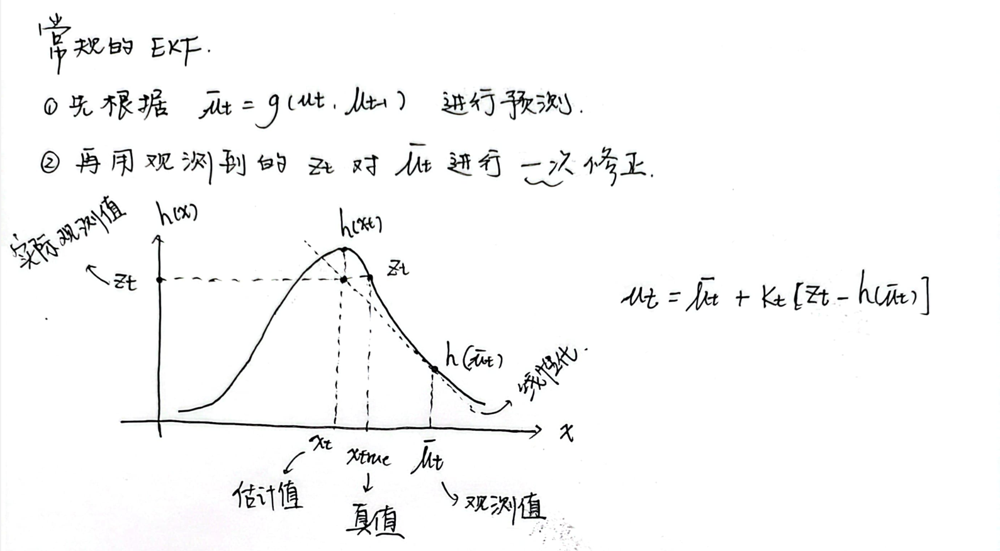
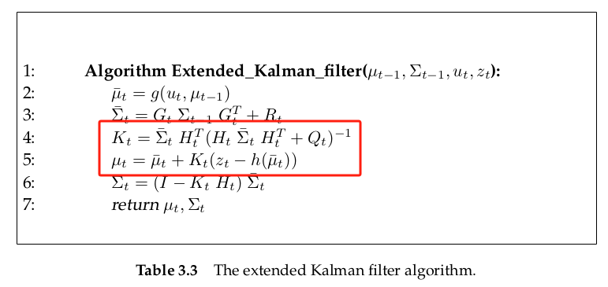
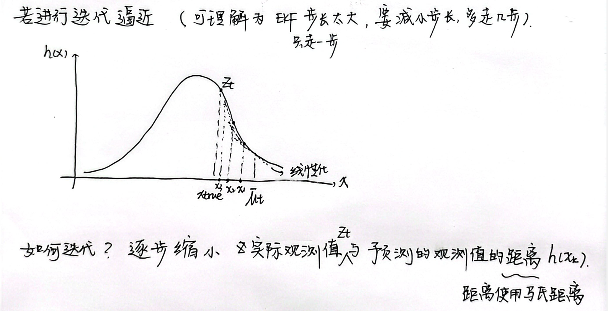
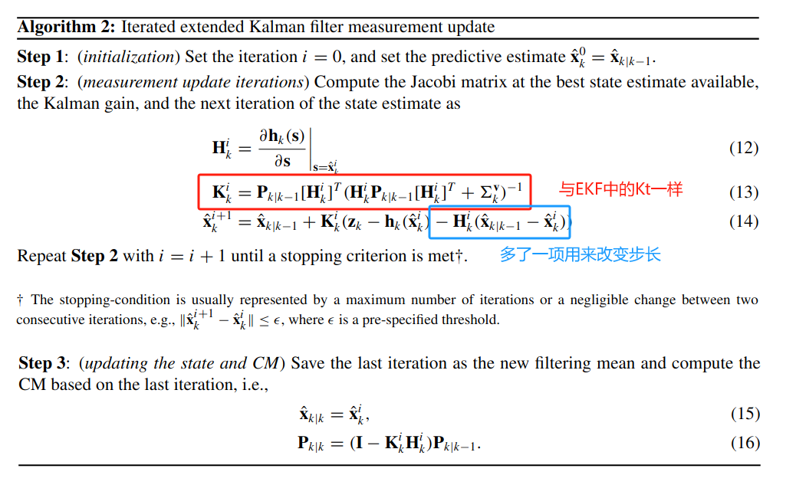
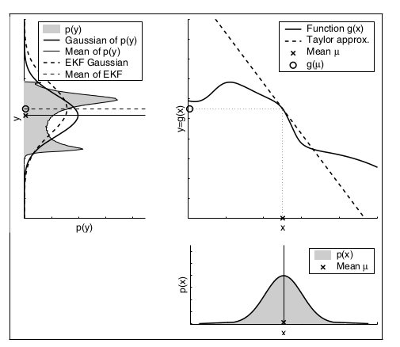

# Iterated Extended Kalman Filter

## Bayes Filter

对于Bayes滤波，主要分成两个步骤

- 预测：$\overline{bel}(x_t)=p(x_t|z_{1:t-1},u_{1:t})=\int p(x_t|u_t,x_{t-1})bel(x_{t-1})\dd{x_{t-1}}$
- 更新：$bel(x_t)=p(x_t|z_{1:t},u_{1:t})=\eta p(z_t|x_t)\overline{bel}(x_t)$

注意，上面**利用了$x_t$的马尔可夫性**

对于**每一个$x_t$($x_t$可以是连续的，也可以是离散的)**做了上面两个步骤，就得到了$bel(x_t)=p(x_t|z_{1:t},u_{1:t})$**这个概率分布**，注意，这是一个概率分布。

通常来说，我们**选择使得$bel(x_t)$这个概率最大的点来作为状态的估计值**。假如，我们再引入线性高斯系统这个假设，那么这个Bayes滤波就是Kalman滤波，$bel(x_t)$就是一个**单峰**的高斯分布。

## 为什么要使用迭代卡尔曼滤波

在得到预测值$\bar{\mu}_t$后，会对观测函数$h(x_t)$在点$x_t=\bar{\mu}_t$处进行线性化，线性化的雅可比为$H_t$。再利用该雅可比来计算卡尔曼增益以及对$\bar{\mu}_t$进行更新。

观察卡尔曼增益$K_t$在更新式中的作用，**$K_t$更像一个反函数的斜率，增量是$z_t-h(\bar{\mu}_t)$**。进行更新以后，得到的估计值$\mu_t$到了途中标注为估计值的$x_t$。因为这是对线性化后的$h(x_t)$做处理，因此非常有可能与真值存在很多偏差。

## Iterated Kalman Filter measurement update

这个步长是怎么确定的，可以参考[IEKF迭代扩展卡尔曼滤波器 | EpsilonJohn's Blog](http://epsilonjohn.club/2022/02/28/Fast-LIO系列/IEKF迭代扩展卡尔曼滤波器/)，从 对迭代扩展卡尔曼过滤算法的改进 部分开始

现在正式开始推导

**问题模型**
$$
x_t = g(u_t,x_{t-1})+\varepsilon_t\\
z_t = h(x_t)+\delta_t
$$
其中$g,h$都是非线性函数，$\varepsilon_t\sim \mathcal{N}(0,R_t),\delta_t\sim \mathcal{N}(0,Q_t)$都是零均值高斯白噪声

现在，已经完成了状态转移函数$g$的线性化，以及完成了预测部分

$$
g(u_t,x_{t-1})\approx g(u_t,\mu_{t-1})+\underbrace{\frac{\partial g(u_t,\mu_{t-1})}{\partial x_{t-1}}}_{=: G_t}\space(x_{t-1}-\mu_{t-1})\\
\bar{\mu}_t=g(u_t,\mu_{t-1})\\
\overline{bel}(x_t)=p(x_t|z_{1:t-1},u_{1:t})
\sim \mathcal{N}(\bar{\mu}_t,P_t)\\
$$
下面，我们**将EKF的更新部分建模成一个MAP问题**。
$$
\begin{split}
bel(x_t) &=p(x_t|z_{1:t},u_{1:t})=\eta p(z_t|x_t)p(x_t|z_{1:t-1},u_{1:t})\\
&\propto \exp\{-\frac{1}{2}[z_t-h(x_t)]^TQ_t^{-1}[z_t-h(x_t)]+[x_t-\bar{\mu}_t]^TP_t^{-1}[x_t-\bar{\mu}_t]\}
\end{split}
$$
**一般来说，都是选取使得$bel(x_t)$最大的$x_t$来作为当前状态的估计**。那么，这样就可以建模成一个MAP问题
$$
\begin{split}
\hat{x}_t &= \arg \max_{x_t}\exp\{-\frac{1}{2}\left([z_t-h(x_t)]^TQ_t^{-1}[z_t-h(x_t)]+[x_t-\bar{\mu}_t]^TP_t^{-1}[x_t-\bar{\mu}_t]\right)\}\\
&= \arg\min_{x_t} [z_t-h(x_t)]^TQ_t^{-1}[z_t-h(x_t)]+[x_t-\bar{\mu}_t]^TP_t^{-1}[x_t-\bar{\mu}_t]
\end{split}
$$
这样就可以用高斯牛顿法来求解这个最优化问题，详见 视觉slam十四讲 128页
$$
\begin{split}
\hat{x}_t 
&= \arg\min_{x_t} [z_t-h(x_t)]^TQ_t^{-1}[z_t-h(x_t)]+[x_t-\bar{\mu}_t]^TP_t^{-1}[x_t-\bar{\mu}_t]\\
&= \arg\min_{x_t} r(x_t)^Tr(x_t) = \arg\min_{x_t} ||r(x_t)||^2
\end{split}
$$
其中
$$
r(x_t)=\begin{bmatrix}
Q_t^{-\frac{1}{2}}(z_t-h(x_t))\\
P_t^{-\frac{1}{2}}(\bar{\mu}_t-x_t)
\end{bmatrix}
$$
验证一下有
$$
r(x_t)^Tr(x_t) = ||r(x_t)||^2 =[z_t-h(x_t)]^TQ_t^{-1}[z_t-h(x_t)]+[x_t-\bar{\mu}_t]^TP_t^{-1}[x_t-\bar{\mu}_t]
$$
求高斯-牛顿迭代的雅可比$\mathbf{J}$,$Q_t,P_t,z_t,\bar{\mu}_t$都与$x_t$无关。
$$
\mathbf{J}=\frac{\partial r(x_t)}{\partial x_t}|_{x_t=x_t}=\begin{bmatrix}
-Q_t^{-\frac{1}{2}}H_t\\
-P_t^{-\frac{1}{2}}x_t
\end{bmatrix}
=-\begin{bmatrix}
Q_t^{-\frac{1}{2}}H_t\\
P_t^{-\frac{1}{2}}x_t
\end{bmatrix}
$$
其中
$$
H_t=\frac{\partial h(x_t)}{\partial x_t}|_{x_t=x_t}
$$
那么根据高斯牛顿法，增量$\Delta \mathbf{x}$就等于
$$
\begin{split}
\Delta x &= -(\mathbf{J}^T\mathbf{J})^{-1}\mathbf{J}^T r(\mathbf{x}_t)\\
&= \bar{\mu}_t - x_t+(H_t^TQ_t^{-1}H_t+P_t^{-1})H_t^TQ_t^{-1}(z_t-h(x_t)-H_t(\bar{\mu}_t-x_t))
\end{split}
$$
那么迭代公式就是
$$
\begin{split}
x_t &= x_t+\Delta x \\
&= \bar{\mu}_t +(H_t^TQ_t^{-1}H_t+P_t^{-1})^{-1}H_t^TQ_t^{-1}(z_t-h(x_t)-H_t(\bar{\mu}_t-x_t))
\end{split}
$$
加上迭代次数标签
$$
\begin{split}
x_t^{i+1} &= \bar{\mu}_t +(H_t^TQ_t^{-1}H_t+P_t^{-1})^{-1}H_t^TQ_t^{-1}(z_t-h(x_t^{i})-H_t(\bar{\mu}_t-x_t^{i}))\\
&= \bar{\mu}_t +K_t^i(z_t-h(x_t^{i})-H_t(\bar{\mu}_t-x_t^{i}))
\end{split}
$$
其中卡尔曼增益
$$
K_t^i=(H_t^TQ_t^{-1}H_t+P_t^{-1})^{-1}H_t^TQ_t^{-1}
$$
ekf就是只迭代一次的iekf

**进行预测后的$x_t$的协方差矩阵$P_t$的求法**
$$
x_t = g(u_t,x_{t-1})+\varepsilon_t \qquad \varepsilon_t\sim \mathcal{N}(0,R_t)
$$
预测将$g$做了线性化，即在点$(u_t,\mu_{t-1})$做一阶泰勒展开
$$
g(u_t,x_{t-1})\approx g(u_t,\mu_{t-1})+\underbrace{\frac{\partial g(u_t,\mu_{t-1})}{\partial x_{t-1}}}_{=: G_t}\space(x_{t-1}-\mu_{t-1})
$$
则
$$
x_t=G_tx_{t-1}+g(u_t,\mu_{t-1})-G_t\mu_{t-1}+\varepsilon_t
$$
协方差矩阵有性质
$$
X\xrightarrow{协方差}\Sigma\\
X+const\xrightarrow{协方差}\Sigma\\
AX\xrightarrow{协方差}A\Sigma A^T
$$
**设$x_{t-1}$的协方差为$\Sigma_{t-1}$**，那么$x_{t}$的协方差矩阵为
$$
G_tx_{t-1}+g(u_t,\mu_{t-1})-G_t\mu_{t-1}+\varepsilon_t \xrightarrow{协方差} P_t=G_t\Sigma_{t-1}G_t^T+R_t
$$
**如果说噪声$\varepsilon_t$不是加性的**
$$
x_{t}=g(x_{t-1},u_t,\varepsilon_t)
$$
在点$(\mu_{t-1},u_t,0)$处进行一阶泰勒展开
$$
x_{t}\approx g(\mu_{t-1},u_t,0)
+\frac{\partial g}{\partial x}|_{x_{t-1}=\mu_{t-1}}\Delta x
+\frac{\partial g}{\partial u}|_{u_{t}=u_{t}}\Delta u
+\frac{\partial g}{\partial \varepsilon}|_{\varepsilon_{t-1}=0}\Delta \varepsilon
$$
其中$\Delta x=x_{t-1}-\mu_{t-1},\quad \Delta u=u_t-u_t=0, \quad \Delta \varepsilon=\varepsilon_{t-1}-0=\varepsilon_{t-1}$
$$
\begin{split}
x_{t}&\approx g(\mu_{t-1},u_t,0)
+\underbrace{\frac{\partial g}{\partial x}|_{x_{t-1}=\mu_{t-1}}}_{G_{x_{t-1}}}(x_{t-1}-\mu_{t-1})
+\underbrace{\frac{\partial g}{\partial \varepsilon}|_{\varepsilon_{t-1}=0}}_{G_{\varepsilon_{t-1}}}\varepsilon_{t-1}\\
&= G_{x_{t-1}} x_{t-1}+G_{\varepsilon_{t-1}}\varepsilon_{t-1}+g(\mu_{t-1},u_t,0)-G_{x_{t-1}}\mu_{t-1}
\end{split}
$$
此时，$x_{t}$的协方差矩阵为
$$
P_t = G_{x_{t-1}}\Sigma_{t-1}G_{x_{t-1}}^T+G_{\varepsilon_{t-1}}R_{t-1}G_{\varepsilon_{t-1}}^T
$$

