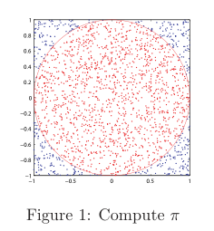

# Monte Carlo Method

This document is note of [Tutorial on Monte Carlo Techniques](./ref/Tutorial_on_Monte_Carlo_Techniques.pdf)

## Introduction

Monte Carlo (MC) method is a numerical method that makes use of random numbers to solve mathematical problems for which an analytical solution is not known.

**A simple MC example**

That is the determination of $\pi$. Suppose we have circle with radius $r=1$ **inscribe** within a square. Then the area ratio is
$$
\frac{A_{\mathrm{circle}}}{A_{\mathrm{square}}}=\frac{\pi r^2}{4r^2}=\frac{\pi}{4}
$$

To determine $\pi$ we randomly select $n$ points, $p_i=（x_i,y_i)$ for $i=1\ldots n$, in the square and approximate the area ratio by
$$
\frac{A_{\mathrm{circle}}}{A_{\mathrm{square}}}\approx \frac{m}{n}
\rightarrow \frac{\pi}{4}\approx \frac{m}{n}
$$
where $m$ is the number of random points in the circle.

The method is called **hit-or-miss Monte Carlo**.

## MC Integration

Let $f(x)$ be an arbitrary continuous function and $y=f(x)$ the new random variable. Then the expected value and variance of $y$ is 
$$
E[y]=E[f(x)]=\int_{a}^b f(x)p(x)\dd{x}\\
\mathrm{Var}[y]=\mathrm{Var}[f(x)]=\int_{a}^{b}(f(x)-E[f(x)])^2p(x)\dd{x}
$$
**Our goal is to calculate the expectation of $f(x)$ without computing the integral**. This can be achieved by using a MC simulation.

### Crude Monte Carlo

A simple estimate of the integral can be obtained by generating $n$ samples $x_i\sim p(x)$, for $i=1\ldots n$, and computing the estimate 
$$
I=\frac{1}{n}\sum_{i=1}^n f(x_i)
$$
It based on the two theorems.

**The law of large numbers**: it implies that the average of a sequence of random variables, of a known distribution, converge to its expectation as the numbers of samples goes to infinity.
$$
I=\frac{1}{n}\sum_{i=1}^nf(x_i)
\quad \rightarrow \quad E[f(x)]=\int_{a}^{b}f(x)p(x)\dd{x}
$$
**The central limit theorem**: the sum of a large number of independent random variables is approximately normally distributed. 

**It do not restrict the random variables to be identical and independent distribution**(i.i.d), see [baidu_baike]([中心极限定理_百度百科 (baidu.com)](https://baike.baidu.com/item/中心极限定理/829451)). (i.i.d) is one of the special situation. 

A sum of identical and independent distribution (i.i.d) random variables $z_i$ with mean $\mu$ and finite variance $\sigma^2$
$$
\frac{\sum_{i=1}^{n}z_i-n\mu}{\sigma\sqrt{n}}\rightarrow \mathcal{N}(0,1) \quad \mathrm{as} \quad  n\rightarrow \infty
$$

### The error of the MC method

$$
\begin{split}
error &= |I-E[f(x)]|\\
&= \left|\frac{1}{n}\sum_{i=1}^{n}f(x_i)- E[f(x)]\right|\\
&= \frac{\sqrt{\mathrm{Var}[f(x)]}}{\sqrt{n}}\left|\frac{\sum_{i=1}^{n}f(x_i)-nE[f(x)]}{\sqrt{\mathrm{Var}[f(x)]}\sqrt{n}} \right|\\
&\xlongequal[center \space limit \space theorem]{i.i.d} 
\frac{\sqrt{\mathrm{Var}[f(x)]}}{\sqrt{n}}\left|\mathcal{N}(0,1)\right|
\end{split}
$$

So the MC method has the mathematical properties:

1. If the variance of $f(x)$ is finite, the MC estimate is consistent.
2. The MC estimate is asymptotically unbiased
3. The MC estimate is asymptotically normally distributed
4. The standard deviation of the MC estimate is given by $\sigma=\frac{\sqrt{\mathrm{Var}[f(x)]}}{\sqrt{n}}$

Also note that the MC methods are immune to the curse of dimensionality. **According to the expression of error, the accuracy of the method can be improved by increasing the number of samples $n$, but the convergence is very slow. A better way to improve the accuracy is to decrease the variance, $\mathrm{Var}[f(x)]$.** This methods are called **variance-reducing techniques**.

### Variance Reducing Techniques

I only introduce the importance sampling technique. Read the document [Tutorial on Monte Carlo Techniques](./ref/Tutorial_on_Monte_Carlo_Techniques.pdf) for more variance reducing techniques.

#### Importance Sampling

The pdf under the integral, $p(x)$, may not be the best pdf for MC integration, which means that $p(x)$ is hard to be generated by computer to execute the sampling process. In this case we want to use a different and simpler pdf $q(x)$ from which we can draw sample. $q(x)$ is called the **importance density** or the **proposal distribution**.

Therefore we can write
$$
\begin{split}
E[y]=E[f(x)] &= \int_a^b f(x)p(x)\dd x\\
&= \int_a^b \frac{f(x)p(x)}{q(x)} q(x)\dd x\\
&= E\left[\frac{f(x)p(x)}{q(x)}\right]
\end{split}
$$
**By generating $n$ samples $x_i\sim q(x)$**, for $i=1\ldots n$, the estimate becomes
$$
I=\frac{1}{n}\sum_{i=1}^{n}\frac{f(x_i)p(x_i)}{q(x_i)}=\frac{1}{n}\sum_{i=1}^{n}W(x_i)f(x_i)
$$
where $W(x_i)=\frac{p(x_i)}{q(x_i)}$ are the **importance weights**. 

Since the normalizing factor $p(x_i)$ is not know, **we have to normalize the weights such that $\sum_{i=1}^{n}W(x_i)=1$
$$
I=\frac{\frac{1}{n}\sum_{i=1}^{n}W(x_i)f(x_i)}{\sum_{i=1}^{n}W(x_i)}=\frac{1}{n}\sum_{i=1}^{n}W_n(x_i)f(x_i)
$$
where $W_n(x_i)=\frac{W(x_i)}{\sum_{i=1}^nW(x_i)}$ are the **normalize importance weights**. 

**The variance** of the importance sampler estimate is
$$
\mathrm{Var}_q[f(x)]=\frac{1}{n}\int \left[\frac{[f(x)q(x)]^2}{q(x)}\right] \dd{x}-\frac{E_p^2[f(x)]}{n}
$$
**To reduce the variance $q(x)$ should be chosen to match the shape of $p(x)$ or $|f(x)|p(x)$**

## Sequential Monte Carlo

In this section, we focus on **sequential state estimation** using sequential Monte Carlo.

Consider the following nonlinear system, described by the difference equation and the observation model
$$
\begin{split}
\mathbf{x}_k &= \mathbf{f}(\mathbf{x_{k-1}},\mathbf{w_{k-1}})\\
\mathbf{z}_k &= \mathbf{h}(\mathbf{x}_k,\mathbf{v}_{k-1})
\end{split}
$$
Denote by $\mathbf{Z}_k=\{\mathbf{z}_i|1\leqslant i\leqslant k\}$ the set of all observations up to time k, **conditionally independent given process with distribution $p(\mathbf{z}_k|\mathbf{x}_k)$.** Also assume that **the state sequence $\mathbf{x}_k$ is an hidden Markov process** with initial distribution $p(\mathbf{x}_0)$ and **transition distribution $p(\mathbf{x}_{k+1}|\mathbf{x}_k)$**

Our goal is to **estimate recursively the expectation of the state $\mathbf{x}_{k+1}$**
$$
E[\mathbf{x}_{k+1}]=E[\mathbf{f}(\mathbf{x}_{k},\mathbf{w}_{k})]
=\int \mathbf{f}(\mathbf{x}_{k},\mathbf{w}_{k})p(\mathbf{x}_k|\mathbf{Z}_k) \dd{\mathbf{x}_k}
$$
**problem!!**

1. the correct integral should be
   $$
   E[\mathbf{f}(\mathbf{x}_{k},\mathbf{w}_{k})]
   =\int \mathbf{f}(\mathbf{x}_{k},\mathbf{w}_{k})p(\mathbf{x}_k,\mathbf{w}_k) \dd{\mathbf{x}_k \dd{\mathbf{w}_k}}
   $$

2. if the function f remove the noise, the expectation should be
   $$
   E[\mathbf{f}(\mathbf{x}_{k}]
   =\int \mathbf{f}(\mathbf{x}_{k},\mathbf{w}_{k})p(\mathbf{x}_k,\mathbf{w}_k) \dd{\mathbf{x}_k \dd{\mathbf{w}_k}}
   $$
   

