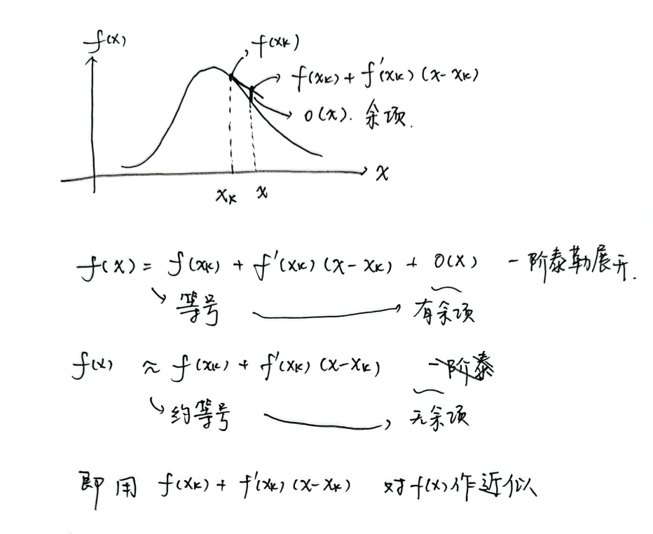
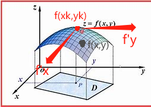

# Multivariate Taylor Expansion

## 单自变量单因变量情形

$$
y=f(x)
$$

其中，$x,y$都是标量

假设将函数在$x=x_k$处进行泰勒展开展开，那么在$x=x$处的取值为
$$
f(x)=f(x_k)+\frac{1}{1!}f'(x_k)(x-x_k)+\frac{1}{2!}f''(x_k)(x-x_k)^2+\cdots=\sum_{a=0}^{+\infty}\frac{1}{a!}f^{(a)}(x_k)\space (x-x_k)^a
$$
将后面部分写成余项的形式为
$$
f(x)=f(x_k)+\frac{1}{1!}f'(x_k)(x-x_k)+\Delta(x)
$$
**注意，这上面的都是等于号**

把余项去除之后，**将剩下的部分，作为在$x=x$处取值的估计**
$$
f(x)\approx f(x_k)+\frac{1}{1!}f'(x_k)(x-x_k)+\Delta(x)
$$
用图像来描述如下

## 双自变量单因变量情形

$$
y=f(x_1,x_2)
$$

用二元函数图像来说明，如图

要**近似**$f(x,y)$的值，可以用在$(x_k,y_k)$处的值$f(x_k,y_k)$，再加上沿$x$方向的增量$f'_x(x_k,y_k)(x-x_k)$，沿$y$方向的增量$f'_y(x_k,y_k)(y-y_k)$，来**近似**
$$
f(x,y)\approx f(x_k,y_k)+\frac{1}{1!}f'_x(x_k,y_k)(x-x_k)+\frac{1}{1!}f'_y(x_k,y_k)(y-y_k)
$$
写成矩阵相乘的形式就是
$$
f(x,y)\approx f(x_k,y_k)+\frac{1}{1!}[f'_x,f'_y]
\begin{bmatrix}
x-x_k\\
y-y_k
\end{bmatrix}
$$
这个类比成单自变量单因变量的情形

- $f(x_k,y_k)$ 类似于 $f(x_k)$
- $f'_x(x_k,y_k)(x-x_k)$和$f'_y(x_k,y_k)(y-y_k)$ 类似于 $f'(x_k)(x-x_k)$

当然，泰勒证明了当后面的增量项无限多的时候，在$(x,y)$处的值就等于 后面无限多增量项的叠加

二阶泰勒展开
$$
\begin{split}
f(x,y)=& f(x_k,y_k) +\frac{1}{1!}f'_x(x_k,y_k)(x-x_k)+\frac{1}{1!}f'_y(x_k,y_k)(y-y_k)\\
&+\frac{1}{2!}f''_x(x_k,y_k)(x-x_k)^2\\
&+\frac{1}{2!}f''_{xy}(x_k,y_k)(x-x_k)(y-y_k)\\
&+\frac{1}{2!}f''_{yx}(x_k,y_k)(y-y_k)(x-x_k)\\
&+\frac{1}{2!}f''_y(x_k,y_k)(y-y_k)^2\\
\end{split}
$$
写成矩阵的形式
$$
f(x,y)\approx f(x_k,y_k)+\frac{1}{1!}[f'_x,f'_y]
\begin{bmatrix}
x-x_k\\
y-y_k
\end{bmatrix}
+\frac{1}{2!}\begin{bmatrix}
x-x_k & y-y_k
\end{bmatrix}
\begin{bmatrix}
\frac{\dd{^2f}}{\dd{x^2}} & \frac{\dd{^2f}}{\dd{x}\dd{y}}\\ 
\frac{\dd{^2f}}{\dd{y}\dd{x}} & \frac{\dd{^2f}}{\dd{^2x}}\\ 
\end{bmatrix}
\begin{bmatrix}
x-x_k \\
y-y_k
\end{bmatrix}
$$

## 多自变量单因变量情形

$$
y=f(x_1,x_2,\ldots,x_n)
$$

在$(x_1^k,x_2^k,\ldots,x_n^k)$处进行泰勒展开，那么在$(x_1,x_2,\ldots,x_n)$的值为
$$
\begin{split}
f(x_1,x_2,\ldots,x_n)=& f(x_1^k,x_2^k,\ldots,x_n^k)\\
&+ \frac{1}{1!}f'_{x_1}(x_1^k,x_2^k,\ldots,x_n^k)(x_1-x_1^k)+\cdots+\frac{1}{1!}f'_{x_n}(x_1^k,x_2^k,\ldots,x_n^k)(x-x_n^k)\\
&+ \frac{1}{2!}f''_{x_1}(x_1^k,x_2^k,\ldots,x_n^k)(x_1-x_1^k)^2+\frac{1}{2!}f''_{x_1x_2}(x_1^k,x_2^k,\ldots,x_n^k)(x_1-x_1^k)(x_2-x_2^k)+\frac{1}{2!}f''_{x_1x_3}\cdot(x_1-x_1^k)(x_3-x_3^k)+\cdots\\
&+ \frac{1}{2!}f''_{x_2x_1}(x_1^k,x_2^k,\ldots,x_n^k)(x_2-x_2^k)(x_1-x_1^k)+\frac{1}{2!}f''_{x_2}(x_1^k,x_2^k,\ldots,x_n^k)(x_2-x_2^k)^2+\frac{1}{2!}f''_{x_2x_3}\cdot(x_2-x_2^k)(x_3-x_3^k)+\cdots\\
&+ \cdots\\
&+ \frac{1}{2!}f''_{x_nx_1}(x_n-x_n^k)(x_1-x_1^k)+\frac{1}{2!}f''_{x_nx_2}(x_n-x_n^k)(x_2-x_2^k)+\cdots+\frac{1}{2!}f''_{x_n}\cdot(x_n-x_n^k)^2\\
&+ o(\mathbf{x})\\
\end{split}
$$
一阶泰勒展开近似
$$
\begin{split}
f(x_1,x_2,\ldots,x_n)\approx& f(x_1^k,x_2^k,\ldots,x_n^k)\\
&+ \frac{1}{1!}f'_{x_1}(x_1^k,x_2^k,\ldots,x_n^k)(x_1-x_1^k)+\cdots+\frac{1}{1!}f'_{x_n}(x_1^k,x_2^k,\ldots,x_n^k)(x-x_n^k)\\
\end{split}
$$
写成矩阵的形式
$$
\begin{split}
f(x_1,x_2,\ldots,x_n)\approx& f(x_1^k,x_2^k,\ldots,x_n^k)
+ \frac{1}{1!}[f_{x_1},f_{x_2},\ldots,f_{x_n}]\begin{bmatrix}
x_1-x_1^k\\
x_2-x_2^k\\
\vdots\\
x_n-x_n^k\\
\end{bmatrix}
\end{split}
$$
二阶泰勒展开
$$
\begin{split}
f(x_1,x_2,\ldots,x_n)=& f(x_1^k,x_2^k,\ldots,x_n^k)\\
&+ \frac{1}{1!}f'_{x_1}(x_1^k,x_2^k,\ldots,x_n^k)(x_1-x_1^k)+\cdots+\frac{1}{1!}f'_{x_n}(x_1^k,x_2^k,\ldots,x_n^k)(x-x_n^k)\\
&+ \frac{1}{2!}f''_{x_1}(x_1^k,x_2^k,\ldots,x_n^k)(x_1-x_1^k)^2+\frac{1}{2!}f''_{x_1x_2}(x_1^k,x_2^k,\ldots,x_n^k)(x_1-x_1^k)(x_2-x_2^k)+\frac{1}{2!}f''_{x_1x_3}\cdot(x_1-x_1^k)(x_3-x_3^k)+\cdots\\
&+ \frac{1}{2!}f''_{x_2x_1}(x_1^k,x_2^k,\ldots,x_n^k)(x_2-x_2^k)(x_1-x_1^k)+\frac{1}{2!}f''_{x_2}(x_1^k,x_2^k,\ldots,x_n^k)(x_2-x_2^k)^2+\frac{1}{2!}f''_{x_2x_3}\cdot(x_2-x_2^k)(x_3-x_3^k)+\cdots\\
&+ \cdots\\
&+ \frac{1}{2!}f''_{x_nx_1}(x_n-x_n^k)(x_1-x_1^k)+\frac{1}{2!}f''_{x_nx_2}(x_n-x_n^k)(x_2-x_2^k)+\cdots+\frac{1}{2!}f''_{x_n}\cdot(x_n-x_n^k)^2\\
&+ o(\mathbf{x})\\
\end{split}
$$
写成矩阵形式
$$
\begin{split}
f(x_1,x_2,\ldots,x_n)\approx& f(x_1^k,x_2^k,\ldots,x_n^k)
+ \frac{1}{1!}[f_{x_1},f_{x_2},\ldots,f_{x_n}]\begin{bmatrix}
x_1-x_1^k\\
x_2-x_2^k\\
\vdots\\
x_n-x_n^k\\
\end{bmatrix}\\
&+
\frac{1}{2!}\begin{bmatrix}
(x_1-x_1^k) &
(x_2-x_2^k) &
\cdots  & 
(x_n-x_n^k)
\end{bmatrix}
\begin{bmatrix}
\frac{\dd{^2f}}{\dd{^2x_1}} & \frac{\dd{^2f}}{\dd{x_1}\dd{x_2}} & \cdots & \frac{\dd{^2f}}{\dd{x_1}\dd{x_n}}\\
\frac{\dd{^2f}}{\dd{x_2}\dd{^2x_1}} & \frac{\dd{^2f}}{\dd{^2x_2}} & \cdots & \frac{\dd{^2f}}{\dd{x_2}\dd{x_n}}\\
\vdots & \vdots & \ddots  & \vdots\\
\frac{\dd{^2f}}{\dd{x_n}\dd{x_1}} & \frac{\dd{^2f}}{\dd{x_n}\dd{x_2}} & \cdots & \frac{\dd{^2f}}{\dd{^2x_n}}\\
\end{bmatrix}
\begin{bmatrix}
(x_1-x_1^k) \\
(x_2-x_2^k) \\
\vdots \\
(x_n-x_n^k)
\end{bmatrix}
\end{split}
$$
将它记为Hessian矩阵
$$
\mathbf{H}=\begin{bmatrix}
\frac{\dd{^2f}}{\dd{^2x_1}} & \frac{\dd{^2f}}{\dd{x_1}\dd{x_2}} & \cdots & \frac{\dd{^2f}}{\dd{x_1}\dd{x_n}}\\
\frac{\dd{^2f}}{\dd{x_2}\dd{^2x_1}} & \frac{\dd{^2f}}{\dd{^2x_2}} & \cdots & \frac{\dd{^2f}}{\dd{x_2}\dd{x_n}}\\
\vdots & \vdots & \ddots  & \vdots\\
\frac{\dd{^2f}}{\dd{x_n}\dd{x_1}} & \frac{\dd{^2f}}{\dd{x_n}\dd{x_2}} & \cdots & \frac{\dd{^2f}}{\dd{^2x_n}}\\
\end{bmatrix}
$$

## 多自变量多因变量情形

$$
\mathbf{f}=\begin{bmatrix}
f_1(x_1,x_2,\ldots,x_n)\\
f_2(x_1,x_2,\ldots,x_n)\\
\vdots\\
f_m(x_1,x_2,\ldots,x_n)
\end{bmatrix}
$$

记
$$
\Delta \mathbf{x}=\begin{bmatrix}
(x_1-x_1^k)\\ 
(x_2-x_2^k)\\ 
\cdots\\ 
(x_n-x_n^k)
\end{bmatrix}
\qquad 
\mathbf{J}_m=[\frac{\dd{f_m}}{\dd{x_1}},\frac{\dd{f_m}}{\dd{x_2}},\cdots,\frac{\dd{f_m}}{\dd{x_n}}]
\qquad
\mathbf{H}_m=\begin{bmatrix}
\frac{\dd{^2f_m}}{\dd{^2x_1}} & \frac{\dd{^2f_m}}{\dd{x_1}\dd{x_2}} & \cdots & \frac{\dd{^2f_m}}{\dd{x_1}\dd{x_n}}\\
\frac{\dd{^2f_m}}{\dd{x_2}\dd{^2x_1}} & \frac{\dd{^2f_m}}{\dd{^2x_2}} & \cdots & \frac{\dd{^2f_m}}{\dd{x_2}\dd{x_n}}\\
\vdots & \vdots & \ddots  & \vdots\\
\frac{\dd{^2f_m}}{\dd{x_n}\dd{x_1}} & \frac{\dd{^2f_m}}{\dd{x_n}\dd{x_2}} & \cdots & \frac{\dd{^2f_m}}{\dd{^2x_n}}\\
\end{bmatrix}
$$
它的泰勒展开就是分别对 $f_1,f_2,\ldots,f_m$进行一阶泰勒展开
$$
\mathbf{f}=\begin{bmatrix}
f_1(x_1,x_2,\ldots,x_n)\\
f_2(x_1,x_2,\ldots,x_n)\\
\vdots\\
f_m(x_1,x_2,\ldots,x_n)
\end{bmatrix}
\approx
\begin{bmatrix}
f_1(x_1^k,\ldots,x_n^k)+\frac{1}{1!}\mathbf{J}_1\Delta\mathbf{x}\\
f_2(x_1^k,\ldots,x_n^k)+\frac{1}{1!}\mathbf{J}_2\Delta\mathbf{x}\\
\vdots\\
f_m(x_1^k,\ldots,x_n^k)+\frac{1}{1!}\mathbf{J}_m\Delta\mathbf{x}
\end{bmatrix}
$$
将上面的式子拆开
$$
\mathbf{f}=\begin{bmatrix}
f_1(x_1,x_2,\ldots,x_n)\\
f_2(x_1,x_2,\ldots,x_n)\\
\vdots\\
f_m(x_1,x_2,\ldots,x_n)
\end{bmatrix}
\approx
\begin{bmatrix}
f_1(x_1^k,\ldots,x_n^k)]\\
f_2(x_1^k,\ldots,x_n^k)]\\
\vdots\\
f_m(x_1^k,\ldots,x_n^k)]
\end{bmatrix}
+
\frac{1}{1!}\begin{bmatrix}
\mathbf{J}_1\\
\mathbf{J}_2\\
\cdots\\
\mathbf{J}_m\\
\end{bmatrix}\Delta\mathbf{x}
$$

记
$$
\mathbf{J}=\begin{bmatrix}
\mathbf{J}_1\\
\mathbf{J}_2\\
\cdots\\
\mathbf{J}_m\\
\end{bmatrix}
=\begin{bmatrix}
\frac{\dd{f_1}}{\dd{x_1}} & \frac{\dd{f_1}}{\dd{x_2}} & \cdots & \frac{\dd{f_1}}{\dd{x_n}}\\
\frac{\dd{f_2}}{\dd{x_1}} & \frac{\dd{f_2}}{\dd{x_2}} & \cdots & \frac{\dd{f_2}}{\dd{x_n}}\\
\vdots & \vdots & \ddots  & \vdots\\
\frac{\dd{f_m}}{\dd{x_1}} & \frac{\dd{f_m}}{\dd{x_2}} & \cdots & \frac{\dd{f_m}}{\dd{x_n}}\\
\end{bmatrix}
\qquad 
\mathbf{f}(x_1^k,\ldots,x_n^k)=\begin{bmatrix}
f_1(x_1^k,\ldots,x_n^k)]\\
f_2(x_1^k,\ldots,x_n^k)]\\
\vdots\\
f_m(x_1^k,\ldots,x_n^k)]
\end{bmatrix}
$$
那么一阶泰勒展开式就写成
$$
\mathbf{f}(x_1,x_2,\cdots,x_n)=\mathbf{f}(x_1^k,\ldots,x_n^k)+\mathbf{J}\Delta\mathbf{x}
$$

二维泰勒展开
$$
\mathbf{f}=\begin{bmatrix}
f_1(x_1,x_2,\ldots,x_n)\\
f_2(x_1,x_2,\ldots,x_n)\\
\vdots\\
f_m(x_1,x_2,\ldots,x_n)
\end{bmatrix}
\approx
\begin{bmatrix}
f_1(x_1^k,\ldots,x_n^k)+\frac{1}{1!}\mathbf{J}_1\Delta\mathbf{x}+\frac{1}{2!}\Delta\mathbf{x}^T\mathbf{H}_1\Delta\mathbf{x}\\
f_2(x_1^k,\ldots,x_n^k)+\frac{1}{1!}\mathbf{J}_2\Delta\mathbf{x}+\frac{1}{2!}\Delta\mathbf{x}^T\mathbf{H}_2\Delta\mathbf{x}\\
\vdots\\
f_m(x_1^k,\ldots,x_n^k)+\frac{1}{1!}\mathbf{J}_m\Delta\mathbf{x}+\frac{1}{2!}\Delta\mathbf{x}^T\mathbf{H}_m\Delta\mathbf{x}
\end{bmatrix}
$$

那么
$$
\mathbf{f}(x_1,x_2,\cdots,x_n)=\mathbf{f}(x_1^k,\ldots,x_n^k)+\mathbf{J}\Delta\mathbf{x}+\Delta\mathbf{x}^T\mathbf{H}\Delta\mathbf{x}
$$
其中
$$
\mathbf{H}=\begin{bmatrix}
\mathbf{H}_1\\
\mathbf{H}_2\\
\cdots\\
\mathbf{H}_m\\
\end{bmatrix}
$$

