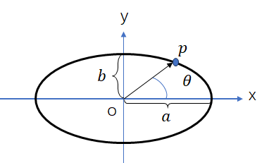
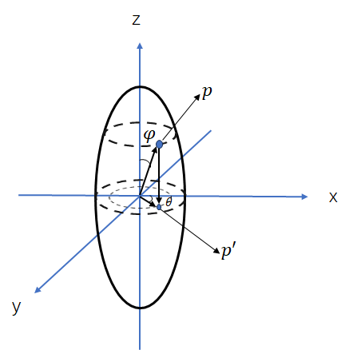
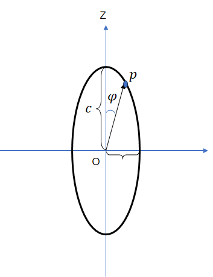

# Polar parametric equation for an ellipse

## Two-dimension Ellipses

Its equation is
$$
\frac{(x-x_0)^2}{a^2}+\frac{(y-y_0)^2}{b^2} = 1
$$
where $[x_0,y_0]^T$ is the center of the ellipse, $a$ and $b$ are semi-axis length for $x$-axis and $y$-axis respectively.

Its polar parameter equation is
$$
\begin{cases}
x-x_0 = a\cos\theta \\
y-y_0 = b\sin\theta
\end{cases}
$$

## Three-dimension Ellipsoid

In three dimension case, we assume that the semi-axis length is $a/b/c$ respectively along $x/y/z$ axis. Its equation is
$$
\frac{(x-x_0)^2}{a^2}+\frac{(y-y_0)^2}{b^2}+\frac{(z-z_0)^2}{c^2}=1
$$
Assuming an arbitrary point $p$ on the ellipsoid, we assume that we use a plane $poz$ to cut this ellipsoid. We will get the following ellipse whose semi-axis length along $z$-axis is determined to be $c$, and the another semi-axis length is unknown. 

We denote the unknown axis as $u$, unknown semi-axis length as $l$ and the angle between $oz$ and $op$ as $\varphi$. Then we can get the polar parameter equation of this ellipse
$$
\begin{cases}
z = c\cos\varphi \\
u = l\sin\varphi
\end{cases}
$$
So, **the parameter equation of $z$ is determined**. Then we will determine parameter equation of $x$ and $y$

We use a horizontal plane to cut the ellipsoid through point $p$ and then we will get an ellipse denoted as $A$. The ellipse which is gotten through using plane $xoy$ to cut the ellipsoid is denoted as $B$. $A$ is similar to $B$ since
$$
\begin{cases}
A: \frac{x^2}{a^2}+\frac{y^2}{b^2} = 1-\frac{z^2}{c^2}\\
B: \frac{x^2}{a^2}+\frac{y^2}{b^2} = 1\\
\end{cases}
$$
The ratio of similitude is
$$
\frac{A}{B}=\sqrt{\frac{1-\frac{z^2}{c^2}}{1}}=\sqrt{1-\frac{c^2\cos^2\varphi}{c^2}}=|\sin\varphi|
$$
The polar parameter equation in ellipse $B$ is
$$
\begin{cases}
x = a\cos\theta\\
y = b\sin\theta
\end{cases}
$$
So, the polar parameter equation in ellipse A can be written as
$$
\begin{cases}
x = a\cos\theta|\sin\varphi|\\
y = b\sin\theta|\sin\varphi|
\end{cases}
$$
To sum up, that polar parameter equation for ellipsoid is
$$
\begin{cases}
x = a\cos\theta|\sin\varphi|\\
y = b\sin\theta|\sin\varphi|\\
z = c\sin\varphi
\end{cases}
$$

## Using matlab to plot an ellipsoid

[在matlab中绘制椭圆和椭球 - 知乎 (zhihu.com)](https://zhuanlan.zhihu.com/p/61434972)

