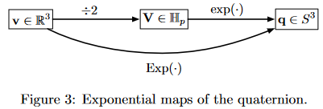

# Quaternion and Rotation

## The rotation group $SO(3)$

A group is an **algebraic structure** of **a set plus an operation**. (群是一种集合加上一种运算的代数结构)

A rotation group is **a set of operator** which can rotate a vector
$$
r:\mathbb{R}^3\rightarrow \mathbb{R}^3; 
\mathbf{v} \rightarrow r(\mathbf{v})\qquad \forall\mathbf{v}\in\mathbb{R}^3
$$
They have the following properties

- Rotation preserves the vector norm
  $$
  \Vert r(\mathbf{v})\Vert=\sqrt{\langle r(\mathbf{v}),r(\mathbf{v})\rangle}=\sqrt{\langle \mathbf{v},\mathbf{v}\rangle}=\Vert\mathbf{v}\Vert
  $$

- Rotation preserves angles between vectors
  $$
  \langle r(\mathbf{v}),r(\mathbf{w})\rangle=\langle \mathbf{v},\mathbf{w}\rangle=\Vert\mathbf{v}\Vert\Vert\mathbf{w}\Vert\cos\alpha
  \qquad \forall \mathbf{v},\mathbf{w}\in\mathbb{R}^3
  $$

- Rotation preserves the relative orientations of vectors
  $$
  \mathbf{u}\times\mathbf{v}=\mathbf{w}
  \space \Longleftrightarrow \space 
  r(\mathbf{u})\times r(\mathbf{v})=r(\mathbf{w})
  $$

We can thus define the rotation group $SO(3)$ as
$$
SO(3):\{r:\mathbb{R}^3\rightarrow \mathbb{R}^3/\forall\mathbf{v},\mathbf{w}\in\mathbb{R}^3,\Vert r(\mathbf{v})\Vert=\Vert\mathbf{v}\Vert, r(\mathbf{u})\times r(\mathbf{v})=r(\mathbf{\mathbf{u}\times\mathbf{v}})\}
$$

## Quaternion

- definition
  $$
  Q = q_w + q_xi+q_yj+q_zk
  $$
  a quaternion can be posed as a sum scalar + vector
  $$
  Q = q_w + \mathbf{q}_v
  \\
  where \quad \mathbf{q}_v = [q_x,q_y,q_z]=q_xi+q_yj+q_zk
  $$
  We should note that **although a vector can be write as a matrix, it is still the weighted sum of basic vector**

  we mostly represent a quaternion $Q$ as a 4-vector $\mathbf{q}$
  $$
  \mathbf{q}=\begin{bmatrix}
  q_w \\ \mathbf{q}_v
  \end{bmatrix}
  =
  \begin{bmatrix}
  q_w \\ q_x \\ q_y \\ q_z
  \end{bmatrix}
  $$

- pure quaternion (where define $\mathbf{u,v}$)
  $$
  \mathbf{v} = [0,\mathbf{q}_v]^T = v_xi+v_yj+v_zk
  $$
  let 
  $$
  \mathbf{u} = \frac{\mathbf{v}}{\Vert\mathbf{v}\Vert},\theta=\Vert\mathbf{v}\Vert
  \quad \rightarrow \quad \mathbf{v}=e^{\mathbf{u}\theta}
  $$

- unit quaternion or normalized quaternion

  Unit quaternions can be always be written in the form
  $$
  \mathbf{q}=q_w+\mathbf{q}_v=\begin{bmatrix}
  \cos\theta \\ \mathbf{u}\sin\theta
  \end{bmatrix}
  \quad where \quad \begin{cases}
  \mathbf{u}=u_xi+u_yj+u_zk & is\space a\space unit\space vector\\
  \theta = \arctan(q_w,\Vert \mathbf{q}_v\Vert)
  \end{cases}
  $$
  this formula can represent any unit quaternion. since it is unit quaternion, $0\leqslant q_w\leqslant 1$. $\cos\theta$ can cover this range. also because $\mathbf{u}$ can represent any 3-vector while it independent with $\theta$, $\mathbf{u}\theta$​ can represent any 3-vector. to sum up, $\begin{bmatrix}
  \cos\theta \\ \mathbf{u}\sin\theta
  \end{bmatrix}$ can represent any 4-vector while maintain its norm $\Vert \mathbf{q}\Vert=1$

- Exponential of **pure quaternions**

  using Taylor expansions to derivate it. please refer to page 10 for details
  $$
  \begin{split}
  e^{\mathbf{v}} &=e^{\mathbf{u}\theta}=\cos\theta+\mathbf{u}\sin\theta\\
  &= \cos\theta+\sin\theta(u_xi+u_yj+u_zk)\\
  &= \begin{bmatrix}
  \cos\theta \\ \mathbf{u}\sin\theta
  \end{bmatrix}
  \end{split}
  $$
  so, **the exponential of a pure quaternion is a unit quaternion**

- Exponential of **general quaternions**
  $$
  e^{\mathbf{q}}=e^{q_w+\mathbf{q}_v}=e^{q_w}e^{\mathbf{q}_v}=e^{q_w}\begin{bmatrix}
  \cos\Vert \mathbf{q}_v\Vert\\
  \frac{\mathbf{q}_v}{\Vert \mathbf{q}_v \Vert}\sin\mathbf{q}_v
  \end{bmatrix}
  $$

- Logarithm of **unit quaternions**
  $$
  \log\mathbf{q}=\log(\cos\theta+\mathbf{u}\sin\theta)=\log(e^{\mathbf{u}\theta})=\mathbf{u}\theta=\begin{bmatrix}
  0 \\ \mathbf{u}\theta
  \end{bmatrix}\\
  where \quad \begin{cases}
  \mathbf{u}=\mathbf{q}_v/\Vert \mathbf{q}_v \Vert\\
  \theta = \arctan(\Vert \mathbf{q}_v\Vert,q_w)
  \end{cases}
  $$

- Logarithm of general quaternions
  $$
  \log \mathbf{q} = \log(\Vert \mathbf{q}\Vert \frac{\mathbf{q}}{\Vert \mathbf{q}\Vert})=\log \Vert \mathbf{q}\Vert+\log \frac{\mathbf{q}}{\Vert \mathbf{q}\Vert}=\log \Vert \mathbf{q}\Vert+\mathbf{u}\theta =\begin{bmatrix} \log\Vert \mathbf{q}\Vert \\ \mathbf{u}\theta \end{bmatrix}
  $$

## The rotation group and the quaternion

- rotation action using quaternion
  $$
  r(\mathbf{v}) = \mathbf{q}\otimes \mathbf{v}\otimes \mathbf{q}^*
  \quad where \quad
  \mathbf{v}=\begin{bmatrix}
  0 \\ x \\ y \\ z
  \end{bmatrix}, \quad \Vert\mathbf{q}\Vert=1
  $$
  $(x,y,z)$ is the coordinate of the point

- The group of **unit quaternion** $S^3$

  The set of unit quaternions forms a group under the operation of multiplication. This group is topologically a 3-sphere, **the 3-dimensional surface of the unit sphere of $\mathbb{R}^4$ and is commonly noted as $S^3$**

  since the unit quaternion can be written as
  $$
  \mathbf{q}=q_w+\mathbf{q}_v=\begin{bmatrix}
  \cos\theta \\ \mathbf{u}\sin\theta
  \end{bmatrix}=\cos\theta+\mathbf{u}\sin\theta=e^{\mathbf{u}\theta}=e^{\mathbf{v}}
  $$
  it is actually 3-dimension

- The exponential map (where define $\mathbf{\Omega,V}$)
  $$
  \mathbf{q}^*\otimes \mathbf{q}=1 \quad \rightarrow \quad \frac{d(\mathbf{q}^*\otimes \mathbf{q})}{dt}=\dot{\mathbf{q}}^*\otimes \mathbf{q}+\mathbf{q}^*\otimes \dot{\mathbf{q}}=0
  $$
  solute the above difference equation
  $$
  \mathbf{q}^*\otimes \dot{\mathbf{q}}=\mathbf{\Omega}
  =\begin{bmatrix}
  0 \\ \mathbf{\Omega}
  \end{bmatrix} \in \mathbb{H}_p
  \quad \rightarrow \quad
  \mathbf{q}(t)=\mathbf{q}(0)\otimes e^{\mathbf{\Omega}t}
  $$
  defining $\mathbf{V}=\mathbf{\Omega}\Delta t\space\in\space\mathbb{H}_p$
  $$
  \mathbf{q}=e^{\mathbf{V}}
  $$
  the exp map
  $$
  \mathrm{exp}: \mathbb{H}_p\rightarrow S^3;\quad \mathbf{V}\rightarrow \mathrm{exp}(\mathbf{V})=e^{\mathbf{V}}
  $$

- The capitalized exponential map (where define $\phi,\boldsymbol{\phi}$)

  since $\mathbf{V}$ is a pure quaternion, we can write $\mathbf{V}$ as a 3-vector
  $$
  \mathbf{V}=\begin{bmatrix}
  0 \\ V_x \\ V_y \\ V_z
  \end{bmatrix}
      = V_xi+V_yj+V_zk
  =\theta\mathbf{u}
  =\theta\begin{bmatrix}u_x\\u_y\\u_z \end{bmatrix}
  \\
  here\quad \theta = \Vert\mathbf{V}\Vert,\space \mathbf{u}=\frac{\mathbf{V}}{\Vert\mathbf{V}\Vert}
  $$
  this is the same as pure quaternion in section [Quaternion](##Quaternion)

  and here we define
  $$
  \theta = \frac{\phi}{2} \rightarrow \mathbf{V}=\frac{\phi\mathbf{u}}{2} \in \mathbb{R}^3\\
  \boldsymbol{\phi}=\phi\mathbf{u} \rightarrow \mathbf{V}=\frac{\boldsymbol{\phi}}{2}\in\mathbb{R}^3
  $$
  and the proof of $\theta=\phi/2$ will be given as below
  $$
  \mathbf{q}=e^{\mathbf{V}}=e^{\boldsymbol{\phi}/2}
  $$
  the Exp map
  $$
  \mathrm{Exp}: \mathbb{R}^3\rightarrow S^3; \space \boldsymbol{\phi}\rightarrow \mathrm{Exp}(\boldsymbol{\phi})=e^{\boldsymbol{\phi}/2}=\mathrm{exp}(\boldsymbol{\phi}/2)
  $$
  

- $\phi$ and $\theta$

  
  
  - $\phi$ is the actually rotation angle
  - $\theta$ is the angle between $\mathbf{q}$ and the identity quaternion $\mathbf{q}_1$
  
- Quaternion and rotation vector

  since $\mathbf{u}$ is pure quaternion
  $$
  \mathbf{q}=\mathrm{Exp}(\boldsymbol{\phi})=e^{\phi\mathbf{u}/2}=\cos\frac{\phi}{2}+\mathbf{u}\sin\frac{\phi}{2}=\begin{bmatrix}
  \cos(\phi/2) \\ \mathbf{u}\sin(\phi/2)
  \end{bmatrix}
  $$
  
- The logarithmic maps

  we define the logarithmic map as the inverse of the exponential map
  $$
  \mathrm{log}: S^3\rightarrow \mathbb{H}_p;\quad \mathbf{q}\rightarrow \mathrm{log}(\mathbf{q})=\mathbf{V}=\mathbf{u}\theta \\
  \mathrm{Log}: S^3\rightarrow \mathbb{R}^3;\quad \mathbf{q}\rightarrow \mathrm{Log}(\mathbf{q})=\mathbf{u}\phi\\
  $$
  
  and
  $$
  \mathrm{Log}(\mathbf{q})=2\mathrm{log}(\mathbf{q})\\
  \phi=2\arctan(\Vert\mathbf{q}_v\Vert,q_w)\\
  \mathbf{u}=\mathbf{q}_v/\Vert\mathbf{q}_v\Vert
  $$

## The rotation group and the rotation matrix

although quaternion and rotation matrix both use $\boldsymbol{\phi}$, they don't have any relation. They are independent with each other

- The exponential map (where define $\boldsymbol{\omega,\phi}$)
  $$
  \begin{split}
  \mathbf{R}^T\mathbf{R}=\mathbf{I}
  &\rightarrow
  \frac{d}{dt}(\mathbf{R}^T\mathbf{R})=\dot{\mathbf{R}}^T\mathbf{R}+\mathbf{R}^T\dot{\mathbf{R}}=0\\
  &\rightarrow \dot{\mathbf{R}}^T\mathbf{R}=-\mathbf{R}^T\dot{\mathbf{R}}
  \end{split}
  $$
  meaning that **$\mathbf{R}^T\dot{\mathbf{R}}$ is skew-symmetric**. So we can take a vector $\boldsymbol{\omega}=[\omega_x,\omega_y,\omega_z]\in\mathbb{R}^3$ and write
  $$
  \mathbf{R}^T\dot{\mathbf{R}}=[\boldsymbol{\omega}]_{\times}
  \qquad [\boldsymbol{\omega}]_{\times}=\begin{bmatrix}
  0 & -\omega_z & \omega_y\\
  \omega_y & 0 & -\omega_x\\
  -\omega_y & \omega_x & 0\\
  \end{bmatrix}\in\mathfrak{se}(3)
  $$
  so we have $\dot{\mathbf{R}}=\mathbf{R}[\boldsymbol{\omega}]_{\times}$ and solve this difference equation
  $$
  \mathbf{R}(t)=\mathbf{R}(0)e^{[\boldsymbol{\omega}]_{\times}t}=\mathbf{R}(0)e^{[\boldsymbol{\omega}t]_{\times}}
  $$
  we define the vector
  $$
  \boldsymbol{\phi}=\boldsymbol{\omega}\Delta t = \phi\boldsymbol{u}
  \quad\rightarrow\quad 
  \mathbf{R}=e^{[\boldsymbol{\phi}]_{\times}}
  $$
  this is known as the exponential map
  $$
  \mathrm{exp}:\mathfrak{se}(3)\rightarrow SO(3); \quad [\boldsymbol{\phi}]_{\times}\rightarrow \mathrm{exp}([\boldsymbol{\phi}]_{\times})=e^{[\boldsymbol{\phi}]_{\times}}
  $$

- The capitalized exponential map
  $$
  \mathrm{Exp}:\mathbb{R}^3\rightarrow SO(3); 
  \quad 
  \boldsymbol{\phi}\rightarrow \mathrm{Exp}(\boldsymbol{\phi})=e^{[\boldsymbol{\phi}]_{\times}}=\mathrm{exp}([\boldsymbol{\phi}]_{\times})
  $$

- The logarithmic maps
  $$
  \mathrm{log}:SO(3)\rightarrow \mathfrak{se}(3); \quad \mathbf{R} \rightarrow \mathrm{log}(\mathbf{R})=[\boldsymbol{\phi}]_{\times}
  $$
  with
  $$
  \begin{split}
  \phi &= \arccos(\frac{\mathrm{trace}(\mathbf{R})-1}{2})\\
  \mathbf{u} &= \frac{(\mathbf{R}-\mathbf{R}^T)^{\lor}}{2\sin\phi}
  \end{split}
  $$
  where $(\cdot)^{\lor}$ is the inverse of $[\cdot]_{\times}$, that is $([\mathbf{v}]_{\times})^{\lor}=\mathbf{v}$ and $[\mathbf{V}^{\lor}]_{\times}=\mathbf{V}$

- The capitalized logarithmic maps
  $$
  \mathrm{Log}:SO(3)\rightarrow \mathbb{R}^3;
  \space
  \mathbf{R}\rightarrow\mathrm{Log}(\mathbf{R})=\boldsymbol{\phi}=\mathbf{u}\phi
  $$
  

