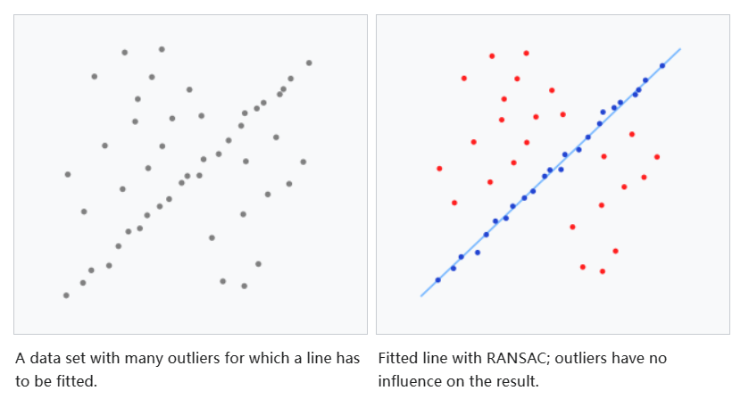

# RANSAC

翻译自[Random sample consensus - Wikipedia](https://en.wikipedia.org/wiki/Random_sample_consensus)

随机抽样一致性（RANSAC）是一种迭代方法，用于从包含异常值的一组观测数据中估计数学模型的参数，当异常值不应对估计值产生影响时。因此，它也可以解释为一种异常值检测方法。[1] 这是一种非确定性算法，只有在一定概率下才能产生合理的结果，随着允许更多迭代，这种概率会增加。该算法最早由Fischler和Bolles于1981年在SRI International发表。他们使用RANSAC来解决位置确定问题（LDP），其中的目标是确定空间中投影到图像中的一组具有已知位置的地标的点。

RANSAC 使用重复的随机子采样[2]。基本的假设是数据包括“内点”，即其分布可以用某组模型参数解释，尽管可能受到噪声的影响，以及“外点”，它们是不符合模型的数据。外点可能来自于噪声的极端值，或者由于错误的测量或对数据解释的不正确假设而产生。RANSAC 还假设，给定（通常是小的）一组内点，存在一种过程可以估计一个最佳解释或拟合该数据的模型参数。

## Example

一个简单的例子是在二维空间中拟合一条直线到一组观测数据。假设这组数据既包含内点（即大致可以拟合成一条直线的点），又包含外点（即无法拟合成这条直线的点），使用简单的最小二乘法进行直线拟合通常会得到一条对包括内点和外点在内的数据拟合效果不佳的直线。原因在于这种方法被最优地拟合到所有点，包括外点。另一方面，RANSAC 试图排除外点，并找到一个仅使用内点进行计算的线性模型。这是通过对数据的多个随机抽样进行线性模型拟合，并返回在子集数据上拟合效果最佳的模型来实现的。由于内点往往比内点和外点的随机混合更具线性关系，完全由内点组成的随机子集将具有最佳的模型拟合效果。在实践中，无法保证内点的子集将被随机抽样，算法成功的概率取决于数据中内点的比例以及选择的几个算法参数。



## Overview

RANSAC算法是一种通过对观测数据进行随机抽样来估计模型参数的学习技术。给定一个数据集，其中的数据元素包含内点和外点，RANSAC使用投票方案来找到最优的拟合结果。数据集中的数据元素被用来为一个或多个模型投票。这个投票方案的实现基于两个假设：噪声特征不会一致地为任何单一模型投票（外点较少），并且有足够的特征来达成对一个好模型的一致意见（缺少数据较少）。RANSAC算法基本上由两个迭代重复的步骤组成：

1. 在第一步中，从输入数据集中随机选择一个包含最小数据项的样本子集。仅使用该样本子集的元素计算具有模型参数的拟合模型。样本子集的基数（例如，该子集中的数据量）足以确定模型参数。

2. 在第二步中，算法检查整个数据集中哪些元素与由第一步得到的估计模型参数实例化的模型一致。如果数据元素不符合模型，即其不在内点的最大数据偏差定义的误差阈值内（超出此偏差的数据元素为外点），则将其视为异常值。

拟合模型的内点集合被称为共识集。RANSAC算法将迭代地重复上述两个步骤，直到在某次迭代中获得的共识集具有足够的内点。

RANSAC算法的输入包括一组观测数据值、要拟合到观测数据的模型以及定义异常值的一些置信参数。与前述的RANSAC算法概述相比，RANSAC通过重复以下步骤来实现其目标：

1. 从原始数据中随机选择一个子集，将其称为假设的内点。
2. 对假设的内点集合进行模型拟合。
3. 对所有数据进行测试，判断其是否符合估计的模型。所有原始数据中符合估计模型的数据点，根据某个特定于模型的损失函数，被称为共识集（即模型的内点集合）。
4. 如果有足够多的数据点被分类为共识集的一部分，那么估计的模型是合理的。
5. 可以通过使用共识集的所有成员重新估计模型来改进模型。拟合质量，作为模型与共识集拟合的好坏程度的度量，将被用于在迭代中调整模型拟合（例如，通过将此度量设置为下一次迭代的拟合质量标准）。

为了收敛到足够好的模型参数集，这个过程会被重复固定次数，每次都会产生两种可能的结果：要么拒绝一个模型，因为共识集中的点太少，要么得到一个比前一次共识集更大的共识集的改进模型。


RANSAC: Inliers and Outliers. The linear fitting to data points in this example is with 7 inliers (data points fitted well with the model under some criteria). It is not a good fitting since there is a linear line where most data points are distributed near it (i.e., more inliers).

## Pseudocode

```pseudocode
Given:
    data – A set of observations.
    model – A model to explain the observed data points.
    n – The minimum number of data points required to estimate the model parameters.
    k – The maximum number of iterations allowed in the algorithm.
    t – A threshold value to determine data points that are fit well by the model (inlier).
    d – The number of close data points (inliers) required to assert that the model fits well to the data.

Return:
    bestFit – The model parameters which may best fit the data (or null if no good model is found).


iterations = 0
bestFit = null
bestErr = something really large // This parameter is used to sharpen the model parameters to the best data fitting as iterations go on.

while iterations < k do
    maybeInliers := n randomly selected values from data
    maybeModel := model parameters fitted to maybeInliers
    confirmedInliers := empty set
    for every point in data do
        if point fits maybeModel with an error smaller than t then
             add point to confirmedInliers
        end if
    end for
    if the number of elements in confirmedInliers is > d then
        // This implies that we may have found a good model.
        // Now test how good it is.
        betterModel := model parameters fitted to all the points in confirmedInliers
        thisErr := a measure of how well betterModel fits these points
        if thisErr < bestErr then
            bestFit := betterModel
            bestErr := thisErr
        end if
    end if
    increment iterations
end while

return bestFit
```

## Example Code

```python
from copy import copy
import numpy as np
from numpy.random import default_rng
rng = default_rng()


class RANSAC:
    def __init__(self, n=10, k=100, t=0.05, d=10, model=None, loss=None, metric=None):
        self.n = n              # `n`: Minimum number of data points to estimate parameters
        self.k = k              # `k`: Maximum iterations allowed
        self.t = t              # `t`: Threshold value to determine if points are fit well
        self.d = d              # `d`: Number of close data points required to assert model fits well
        self.model = model      # `model`: class implementing `fit` and `predict`
        self.loss = loss        # `loss`: function of `y_true` and `y_pred` that returns a vector
        self.metric = metric    # `metric`: function of `y_true` and `y_pred` and returns a float
        self.best_fit = None
        self.best_error = np.inf

    def fit(self, X, y):
        for _ in range(self.k):
            ids = rng.permutation(X.shape[0])

            maybe_inliers = ids[: self.n]
            maybe_model = copy(self.model).fit(X[maybe_inliers], y[maybe_inliers])

            thresholded = (
                self.loss(y[ids][self.n :], maybe_model.predict(X[ids][self.n :]))
                < self.t
            )

            inlier_ids = ids[self.n :][np.flatnonzero(thresholded).flatten()]

            if inlier_ids.size > self.d:
                inlier_points = np.hstack([maybe_inliers, inlier_ids])
                better_model = copy(self.model).fit(X[inlier_points], y[inlier_points])

                this_error = self.metric(
                    y[inlier_points], better_model.predict(X[inlier_points])
                )

                if this_error < self.best_error:
                    self.best_error = this_error
                    self.best_fit = better_model

        return self

    def predict(self, X):
        return self.best_fit.predict(X)

def square_error_loss(y_true, y_pred):
    return (y_true - y_pred) ** 2


def mean_square_error(y_true, y_pred):
    return np.sum(square_error_loss(y_true, y_pred)) / y_true.shape[0]


class LinearRegressor:
    def __init__(self):
        self.params = None

    def fit(self, X: np.ndarray, y: np.ndarray):
        r, _ = X.shape
        X = np.hstack([np.ones((r, 1)), X])
        self.params = np.linalg.inv(X.T @ X) @ X.T @ y
        return self

    def predict(self, X: np.ndarray):
        r, _ = X.shape
        X = np.hstack([np.ones((r, 1)), X])
        return X @ self.params


if __name__ == "__main__":

    regressor = RANSAC(model=LinearRegressor(), loss=square_error_loss, metric=mean_square_error)

    X = np.array([-0.848,-0.800,-0.704,-0.632,-0.488,-0.472,-0.368,-0.336,-0.280,-0.200,-0.00800,-0.0840,0.0240,0.100,0.124,0.148,0.232,0.236,0.324,0.356,0.368,0.440,0.512,0.548,0.660,0.640,0.712,0.752,0.776,0.880,0.920,0.944,-0.108,-0.168,-0.720,-0.784,-0.224,-0.604,-0.740,-0.0440,0.388,-0.0200,0.752,0.416,-0.0800,-0.348,0.988,0.776,0.680,0.880,-0.816,-0.424,-0.932,0.272,-0.556,-0.568,-0.600,-0.716,-0.796,-0.880,-0.972,-0.916,0.816,0.892,0.956,0.980,0.988,0.992,0.00400]).reshape(-1,1)
    y = np.array([-0.917,-0.833,-0.801,-0.665,-0.605,-0.545,-0.509,-0.433,-0.397,-0.281,-0.205,-0.169,-0.0531,-0.0651,0.0349,0.0829,0.0589,0.175,0.179,0.191,0.259,0.287,0.359,0.395,0.483,0.539,0.543,0.603,0.667,0.679,0.751,0.803,-0.265,-0.341,0.111,-0.113,0.547,0.791,0.551,0.347,0.975,0.943,-0.249,-0.769,-0.625,-0.861,-0.749,-0.945,-0.493,0.163,-0.469,0.0669,0.891,0.623,-0.609,-0.677,-0.721,-0.745,-0.885,-0.897,-0.969,-0.949,0.707,0.783,0.859,0.979,0.811,0.891,-0.137]).reshape(-1,1)

    regressor.fit(X, y)

    import matplotlib.pyplot as plt
    plt.style.use("seaborn-darkgrid")
    fig, ax = plt.subplots(1, 1)
    ax.set_box_aspect(1)

    plt.scatter(X, y)

    line = np.linspace(-1, 1, num=100).reshape(-1, 1)
    plt.plot(line, regressor.predict(line), c="peru")
    plt.show()
```

## Parameter

The threshold value to determine when a data point fits a model (*t*), and the number of inliers (data points fitted to the model within *t*) required to assert that the model fits well to data (*d*) are determined based on specific requirements of the application and the dataset, and possibly based on experimental evaluation. The number of iterations (*k*), however, can be roughly determined as a function of the desired probability of success (*p*) as shown below.

Let $p$ be the desired probability that the RANSAC algorithm provides at least one useful result after running. In extreme (for simplifying the derivation), RANSAC returns a successful result if in some iteration it selects only inliers from the input data set when it chooses $n$ points from the data set from which the model parameters are estimated. (In other words, all the selected *n* data points are inliers of the model estimated by these points). Let $\omega$ be the probability of choosing an inlier each time a single data point is selected, that is roughly,
$$
\omega=\mathrm{number\space of\space inliers\space in\space data/\space number\space of\space points\space in\space data}
$$
A common case is that $\omega$ is not well known beforehand because of an unknown number of inliers in data before running the RANSAC algorithm, but some rough value can be given. With a given rough value of $\omega$ roughly assuming that the *n* points needed for estimating a model are selected independently (It is a rough assumption because each data point selection reduces the number of data point candidates to choose in the next selection in reality), $\omega^n$ is the probability that all *n* points are inliers and $1-\omega^n$ is the probability that at least one of the *n* points is an outlier, a case which implies that a bad model will be estimated from this point set. That probability to the power of $k$ (the number of iterations in running the algorithm) is the probability that the algorithm never selects a set of *n* points which all are inliers, and this is the same as $1-p$ (the probability that the algorithm does not result in a successful model estimation) in extreme. Consequently,
$$
1-p=(1-\omega^n)^k
$$
which, after taking the [logarithm](https://en.wikipedia.org/wiki/Logarithm) of both sides, leads to
$$
k=\frac{\log(1-p)}{\log(1-\omega^n)}
$$
This result assumes that the *n* data points are selected independently, that is, a point which has been selected once is replaced and can be selected again in the same iteration. This is often not a reasonable approach and the derived value for *k* should be taken as an upper limit in the case that the points are selected without replacement. For example, in the case of finding a line which fits the data set illustrated in the above figure, the RANSAC algorithm typically chooses two points in each iteration and computes `maybe_model` as the line between the points and it is then critical that the two points are distinct.

To gain additional confidence, the [standard deviation](https://en.wikipedia.org/wiki/Standard_deviation) or multiples thereof can be added to *k*. The standard deviation of *k* is defined as
$$
\mathrm{SD}(k)=\frac{\sqrt{1-\omega^n}}{\omega^n}
$$

## Advantages and disadvantages

RANSAC的优点之一是其能够对模型参数进行鲁棒估计[3]，即使数据集中存在大量的异常值，也能够以高度精确性估计参数。RANSAC的缺点是计算这些参数的时间没有上限（除非穷尽）。当计算的迭代次数有限时，得到的解可能不是最优的，甚至可能不是一个良好拟合数据的解。因此，RANSAC提供了一种权衡；通过计算更多的迭代，产生合理模型的概率增加。此外，RANSAC并不总能够找到最优集，即使对于受到中度污染的集合，当内点数量小于50%时，它通常性能较差。提出了 Optimal RANSAC [4] 来处理这两个问题，并能够在内点比例低于5%的情况下找到受到严重污染的集合的最优解。RANSAC的另一个缺点是需要设置问题特定的阈值。

RANSAC只能针对特定数据集估计一个模型。与任何单模型方法一样，当存在两个（或更多）模型实例时，RANSAC可能无法找到其中任何一个。霍夫变换是另一种可用的鲁棒估计技术，当存在多个模型实例时可能很有用。另一种用于多模型拟合的方法称为PEARL[5]，它将模型从数据点中进行采样（与RANSAC相似），同时通过迭代重新估计内点，并将多模型拟合构建为一个具有全局能量函数的优化问题，该函数描述了整体解的质量。

## Applications

The RANSAC algorithm is often used in [computer vision](https://en.wikipedia.org/wiki/Computer_vision), e.g., to simultaneously solve the [correspondence problem](https://en.wikipedia.org/wiki/Correspondence_problem) and estimate the [fundamental matrix](https://en.wikipedia.org/wiki/Fundamental_matrix_(computer_vision)) related to a pair of stereo cameras; see also: [Structure from motion](https://en.wikipedia.org/wiki/Structure_from_motion), [scale-invariant feature transform](https://en.wikipedia.org/wiki/Scale-invariant_feature_transform), [image stitching](https://en.wikipedia.org/wiki/Image_stitching), [rigid motion segmentation](https://en.wikipedia.org/wiki/Rigid_motion_segmentation).

## Development and improvements

自1981年以来，RANSAC已成为计算机视觉和图像处理领域的基本工具。在算法的25周年纪念日2006年，国际计算机视觉和模式识别大会（CVPR）组织了一个研讨会，总结了对原始算法的最新贡献和变体，主要旨在提高算法的速度、估计解的鲁棒性和准确性，并减少对用户定义常数的依赖。

RANSAC对正确噪声阈值的选择很敏感，该阈值定义了哪些数据点适应具有一定参数集的模型。如果此阈值过大，则所有假设往往都会被等级为相等（好）。另一方面，当噪声阈值过小时，估计的参数往往不稳定（即仅通过添加或删除一个数据点到内点集合，参数的估计可能会波动）。为了部分补偿这种不良影响，Torr等人提出了RANSAC的两种修改称为MSAC（M-estimator SAmple and Consensus）和MLESAC（Maximum Likelihood Estimation SAmple and Consensus）。[6] 主要思想是通过计算共识集的质量（即适应模型和一定参数集的数据）来评估其可能性（而在Fischler和Bolles的原始公式中，等级是该集合的基数）。 Tordoff提出了一种考虑与输入数据集相关的先验概率的MLESAC扩展。[7] 所得到的算法被称为Guided-MLESAC。在类似的方向上，Chum提出了如果已知有关输入数据的一些先验信息，即数据点可能是内点还是外点，则可以指导采样过程的方法。所提出的方法被称为PROSAC，即PROgressive SAmple Consensus。[8]

Chum等人还提出了RANSAC的随机版本，称为R-RANSAC，[9]以减轻识别良好共识集的计算负担。其基本思想是最初仅使用一小部分点评估当前实例化模型的优劣，而不是整个数据集。合理的策略将在高置信度的情况下告诉我们何时应该评估整个数据集的拟合，或者何时可以直接丢弃模型。可以合理地认为这种方法在内点比例较大的情况下影响更为显著。Chum等人提出的此类策略称为抢先方案。Nistér提出了一种称为Preemptive RANSAC [10] 的范式，可以实现场景结构和摄像机运动的实时鲁棒估计。该方法的核心思想在于生成固定数量的假设，以便与生成的假设的质量进行比较，而不是根据某些绝对质量度量。

其他研究人员尝试应对噪声尺度未知和/或存在多个模型实例的困难情况。对于第一个问题，Wang和Suter的研究进行了处理。[11] Toldo等人使用每个数据点适应该点的随机模型集的特征函数来表示每个数据。然后，多个模型被视为将支持相同模型的点聚类的簇。这种聚类算法称为J-linkage，不需要事先指定模型数量，也不需要手动参数调整。[12]

RANSAC还被定制用于递归状态估计应用，其中输入测量受到异常值的影响，依赖于测量误差的卡尔曼滤波方法注定会失败。这样的方法被称为KALMANSAC。[13]

## Related methods

- MLESAC（最大似然估计样本共识） - 最大化数据是从样本拟合的模型生成的可能性，例如内点和外点的混合模型
- MAPSAC（最大后验样本共识） - 将MLESAC扩展到包含要拟合的参数的先验概率，并最大化后验概率
- KALMANSAC - 对动态系统状态进行因果推断
- 重采样（统计学）
- Hop-Diffusion Monte Carlo 使用随机抽样，包括全局跳跃和局部扩散，在RANSAC的每个步骤中选择样本，用于极宽基线图像之间的极线几何估计。[14]


