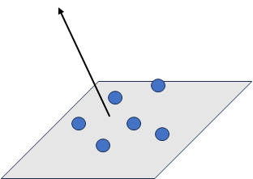
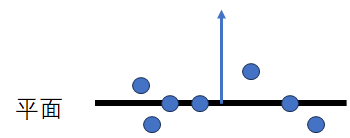
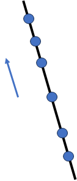
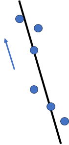

# The Geometric Meaning of Eigenvalues and Eigenvectors of Covariance Matrix

为防止耗费不必要的实现，请直接参考[协方差矩阵的特征值与特征向量的几何意义 - 知乎 (zhihu.com)](https://zhuanlan.zhihu.com/p/645372196)

## 结论

1. 在**所有特征向量的方向上，对应的特征值越大，样本投影的方差越大，在该方向的散布程度越高**。
2. **沿最大特征值对应的特征向量方向，样本的散布程度最大。**
3. **沿最小特征值对应的特征向量方向，样本的散布程度最小。**

## 三维空间中分布在平面上的点

假设平面法向量为$\mathbf{n}$，空间中的点为$\mathbf{r_1,r_2,...,r_n}$. 如果这些点**精确**地在同一个平面上，则有
$$
\mathbf{n}^T\cdot (\mathbf{r}_i-\mathbf{r}_j)=0
$$
这些点的重心也会在这个平面上
$$
\bar{\mathbf{r}}=\frac{1}{n}\sum_{k=1}^n\mathbf{r}_k  \qquad and \qquad \mathbf{n}^T\cdot (\bar{\mathbf{r}}-\mathbf{r}_i)=0
$$
但很多时候会存在**噪声**，也就是**这些点并不是那么精确地共面**，见下图

那么，我们如何将这些点**拟合成一个平面**，**拟合的标准**又是什么

由于在一个面上的点有性质
$$
\mathbf{n}^T\cdot (\mathbf{r}_i-\mathbf{r}_j)=0
$$
所以我们将拟合的标准定为，**这些点在平面法向量上的散布最小的平面，作为拟合的平面**，一般取这些点的重心作为平面所经过的点。为什么说是**散布最小**而不是**投影最小**？因为投影有正负。

我们之前得到了

- **沿最小特征值对应的特征向量方向，样本的散布程度最小。**

那么**点的协方差矩阵最小特征值对应的特征向量就可以作为拟合的平面的法向量**

## 三维空间中分布在直线上的点

假设直线的方向向量为$\mathbf{n}$，空间中的点为$\mathbf{r_1,r_2,...,r_n}$. 如果这些点**精确**地在同一条直线上，则有
$$
\mathbf{n}^T\cdot(\mathbf{r}_i-\mathbf{r}_j)=\Vert\mathbf{n}\Vert\cdot \Vert\mathbf{r}_i-\mathbf{r}_j\Vert\cos\theta= \Vert\mathbf{r}_i-\mathbf{r}_j\Vert
$$
当**这些点并不是那么精确地共线**时

有
$$
\mathbf{n}^T\cdot(\mathbf{r}_i-\mathbf{r}_j)=\Vert\mathbf{r}_i-\mathbf{r}_j\Vert\cos\theta < \Vert\mathbf{r}_i-\mathbf{r}_j\Vert
$$
因此，当需要拟合这些点成一个直线时，拟合的标准可以定为**在方向向量上散布最大的向量作为直线的方向向量**，一般使用这些点的重心作为直线经过的点。

前面有结论

- **沿最大特征值对应的特征向量方向，样本的散布程度最大。**

那么**点的协方差矩阵最大特征值对应的特征向量就可以作为拟合的直线的方向向量**

