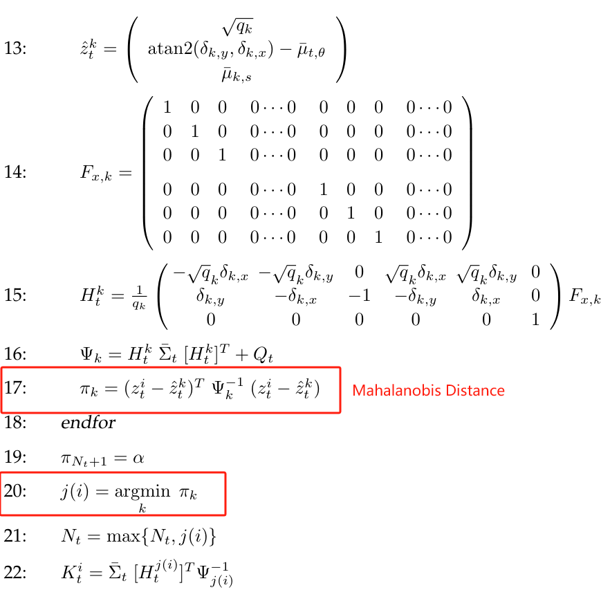

# Simultaneous Localization and Mapping

SLAM problems arise when the robot does not have access to a map of the environment, nor does it know its own pose. Instead, all it is given are measurements $z_{1:t}$ and controls $u_{1:t}$. The term "simultaneous localization and mapping" describes the resulting problem: In SLAM, the robot acquires a map of its environment while simultaneously localizing itself relative to this map.

## Two Forms of the SLAM Problem

- *online SLAM problem*: It involves estimating the **posterior over the momentary pose along with the map**
  $$
  p(x,m|z_{1:t},u_{1:t})
  $$
  

- *full SLAM problem*: we seek to calculate a posterior **over the entire path $x_{1:t}$ along with the map**, instead of just the current pose $x_t$
  $$
  p(x_{1:t},m|z_{1:t},u_{1:t})
  $$
  

In particular, the online SLAM problem is the result of integrating out past poses from full SLAM problem
$$
p(x_t,m|z_{1:t},u_{1:t}) = \int\int\cdots\int p(x_{1:t},m|z_{1:t},u_{1:t})dx_1dx_2\ldots dx_{t-1}
$$

## Two Component of SLAM Problem

SLAM problems possess a **continuous and a discrete component**. 

- *The continuous estimation problem* pertains to the **location of the objects in the map and the robot's own pose variables.**
- *The discrete nature* has to do with correspondence: When an object is detected, a SLAM problem must reason about **the relation of this object to previously detected objects**

The online SLAM posterior is then given by
$$
p(x_t,m,c_t|z_{1:t},u_{1:t})
$$
and the full SLAM posterior by
$$
p(x_{1:t},m,c_{1:t}|z_{1:t},u_{1:t})
$$
The online posterior is obtained from the full posterior by **integrating out past robot poses and summing over all past correspondences**
$$
p(x_t,m,c_t|z_{1:t},u_{1:t})=\int\int\cdots\int\sum_{c_1}\sum_{c_2}\cdots\sum_{c_{t-1}}p(x_{1:t},m,c_{1:t}|z_{1:t},u_{1:t})dx_1dx_2\ldots dx_{t-1}
$$

## Problem

Calculating a full posterior is usually infeasible. Problems arise from two sources

1. the high dimensionality of the continuous parameter space
2. the large number of discrete correspondence variables

## SLAM with Extended Kalman Filters

### SLAM with Known Correspondence

In the EKF localization algorithm, it **only estimates the robot pose with map as prior**. In EKF SLAM with known correspondence, in addition to estimating the tobot pose $x_t$, it also **estimates the coordinates of all landmarks encountered along the way**.
$$
p(x,y,\theta,m_{1,x},m_{1,y},s_1,m_{2,x} , m_{2,y} , s_2 , \cdots , m_{N,x} , m_{N,y} , s_N|z_{1:t},u_{1:t})
$$
Here $x,y,\theta$ denote the robot's coordinates at time $t$, $m_{i,x},m_{i,y}$ are the coordinates of the $i$-th landmark, for $i=1,\ldots,N$, and $s_i$ is its signature. For what is signature, you can refer to Landmark Measurements section in [ch6_Robot_perception.md](ch6_Robot_perception.md).

For convenience, let us call the state vector comprising robot pose and the map the  *combined state vector*, and denote this vector $y_t$. The combined vector is given by
$$
y_t = \begin{bmatrix} x_t\\m \end{bmatrix} =\begin{bmatrix}
x & y & \theta & m_{1,x} & m_{1,y} & s_1 & m_{2,x} & m_{2,y} & s_2 & \cdots & m_{N,x} & m_{N,y} & s_N
\end{bmatrix}^T
$$
The dimension of this state vector is $3N+3$, where N denotes the number of landmarks in the map. We can rewrite the posterior as 
$$
p(y_t|z_{1:t},u_{1:t})
$$

#### Mathematical Derivation of EKF SLAM

As the robot moves, the state vector changes according to the standard noise velocity model. We do not decompose the into motion $[v_t, \omega_t]^T$ and noise $\mathcal{N}(0,M_t)$. We directly treat it as a random variable 
$$
\begin{bmatrix}
\hat{v}_t\\ \hat{\omega}_t
\end{bmatrix}
=
\begin{bmatrix}
v_t \\ \omega_t
\end{bmatrix}
+
\begin{bmatrix}
\varepsilon_{\alpha_1 v_t^2+\alpha_2\omega_t^2}\\
\varepsilon_{\alpha_3 v_t^2+\alpha_4\omega_t^2}\\
\end{bmatrix}
=
\begin{bmatrix}
v_t \\ \omega_t
\end{bmatrix}
+
\mathcal{N}(0,M_t)
$$

$$
u_t=\begin{bmatrix}
\hat{v}_t\\ \hat{\omega}_t
\end{bmatrix}
\sim
\mathcal{N}(\begin{bmatrix} v_t\\ \omega_t\end{bmatrix},M_t)
$$

In SLAM, this motion model is extended to the augmented state vector
$$
y_t = \underbrace{
y_{t-1}+\begin{bmatrix}
-\frac{\hat{v}_t}{\hat{\omega_t}}\sin\theta+\frac{\hat{v}_t}{\hat{\omega}_t}\sin(\theta+\hat{\omega}_t\Delta t)\\
\frac{\hat{v}_t}{\hat{\omega}_t}\cos\theta-\frac{\hat{v}_t}{\hat{\omega}_t}\cos(\theta+\hat{\omega}_t\Delta t)\\
\hat{\omega}_t\Delta t\\
0\\ \vdots \\ 0
\end{bmatrix}
}_{g(u_t,x_{t-1})}
= \underbrace{
y_{t-1}+ F_x^T \begin{bmatrix}
-\frac{\hat{v}_t}{\hat{\omega_t}}\sin\theta+\frac{\hat{v}_t}{\hat{\omega}_t}\sin(\theta+\hat{\omega}_t\Delta t)\\
\frac{\hat{v}_t}{\hat{\omega}_t}\cos\theta-\frac{\hat{v}_t}{\hat{\omega}_t}\cos(\theta+\hat{\omega}_t\Delta t)\\
\hat{\omega}_t\Delta t
\end{bmatrix}
}_{g(u_t,x_{t-1})}
$$
Here $F_x$ is a matrix that maps the 3-dimensional state vector into a vector of dimension $3N+3$
$$
F_x=\begin{bmatrix}
1 & 0 & 0 &  0  \cdots  0\\
0 & 1 & 0 &  0  \cdots  0\\
0 & 0 & 1 &  \underbrace{0  \cdots  0}_{3N \space columns}\\
\end{bmatrix}
$$
Approximate the motion function $g$ using a first degree Taylor expansion
$$
g(u_t,y_{t-1})\approx g(u_t,\mu_{t-1})+\underbrace{\frac{\partial g}{\partial y_{t-1}}}_{G_t}(y_{t-1}-\mu_{t-1})+\underbrace{\frac{\partial g}{\partial u_t}}_{V_t}(u_t-\begin{bmatrix}v_t\\ \omega_t\end{bmatrix})
$$
the additive form enables us to decompose this Jacobian into an identity matrix of dimension $(3N+3)\times(3N+3)$ plus a low-dimensional Jacobian $g_t$ that characterizes the change of the robot pose. The identity matrix is the derivative of $y_{t-1}$
$$
G_t = I+F^T_xg_tF_x
$$
with
$$
g_t = \frac{\partial}{\partial y_{t-1}}\begin{bmatrix}
-\frac{\hat{v}_t}{\hat{\omega_t}}\sin\theta+\frac{\hat{v}_t}{\hat{\omega}_t}\sin(\theta+\hat{\omega}_t\Delta t)\\
\frac{\hat{v}_t}{\hat{\omega}_t}\cos\theta-\frac{\hat{v}_t}{\hat{\omega}_t}\cos(\theta+\hat{\omega}_t\Delta t)\\
\hat{\omega}_t\Delta t
\end{bmatrix}
=
\begin{bmatrix}
1 & 0 & \frac{v_t}{\omega_t}(-\cos\mu_{t-1,\theta}+\cos(\mu_{t-1,\theta}+\omega_t\Delta t))\\
0 & 1 & \frac{v_t}{\omega_t}(-\sin\mu_{t-1,\theta}+\sin(\mu_{t-1,\theta}+\omega_t\Delta t))\\
0 & 0 & 1
\end{bmatrix}
$$
$F^T_xg_tF_x$ just expand $g_t$ to $(3N+3)\times(3N+3)$ dimension

since
$$
u_t=\begin{bmatrix}
\hat{v}_t\\ \hat{\omega}_t
\end{bmatrix}
\sim
\mathcal{N}(\begin{bmatrix} v_t\\ \omega_t\end{bmatrix},M_t) 
\rightarrow
(u_t-\begin{bmatrix}v_t\\ \omega_t\end{bmatrix})\sim \mathcal{N}(0,M_t)
$$
we can rewrite the approximation
$$
\begin{split}
g(u_t,y_{t-1})&\approx g(u_t,\mu_{t-1})+\underbrace{\frac{\partial g}{\partial y_{t-1}}}_{G_t}(y_{t-1}-\mu_{t-1})+\underbrace{\frac{\partial g}{\partial u_t}}_{V_t}(u_t-\begin{bmatrix}v_t\\ \omega_t\end{bmatrix})\\
&= g(u_t,\mu_{t-1})+(I+F_x^Tg_tF_x)(y_{t-1}-\mu_{t-1})+\mathcal{N}(0,F_x^TV_tM_tV_t^TF_x)
\end{split}
$$
then linearize the observation and calculate the Kalman gain
$$
h(y_t,j)\approx h(\bar{\mu}_t,j)+H_t^i(y_t-\bar{\mu}_t)\\
H_t^i=h_t^iF_{x,j}\\
h_t^i=\begin{bmatrix}
\frac{\bar{\mu}_{t,x}-\bar{\mu}_{j,x}}{\sqrt{q_t}} & \frac{\bar{\mu}_{t,y}-\bar{\mu}_{j,y}}{\sqrt{q_t}} & 0 &\frac{\bar{\mu}_{j,x}-\bar{\mu}_{t,x}}{\sqrt{q_t}} & \frac{\bar{\mu}_{j,y}-\bar{\mu}_{t,y}}{\sqrt{q_t}} & 0\\
\frac{\bar{\mu}_{j,y}-\bar{\mu}_{t,y}}{\sqrt{q_t}} & \frac{\bar{\mu}_{t,x}-\bar{\mu}_{j,x}}{\sqrt{q_t}} & -1 &\frac{\bar{\mu}_{t,y}-\bar{\mu}_{j,y}}{\sqrt{q_t}} & \frac{\bar{\mu}_{j,x}-\bar{\mu}_{t,x}}{\sqrt{q_t}} & 0\\
0 & 0 & 0 & 0 & 0 & 1
\end{bmatrix}\\
q_t=(\bar{\mu}_{j,x}-\bar{\mu}_{t,x})^2+(\bar{\mu}_{j,y}-\bar{\mu}_{t,y})^2
$$
and $F_{x,j}$ is of dimension $6\times(3N+3)$ which maps the low-dimensional matrix $h_t^i$ into a matrix of dimension $3\times(3N+3)$
$$
F_{x,j}=\begin{bmatrix}
1 & 0 & 0 & 0\cdots 0 & 0 & 0 & 0 & 0\cdots 0\\
0 & 1 & 0 & 0\cdots 0 & 0 & 0 & 0 & 0\cdots 0\\
0 & 0 & 1 & 0\cdots 0 & 0 & 0 & 0 & 0\cdots 0\\
0 & 0 & 0 & 0\cdots 0 & 1 & 0 & 0 & 0\cdots 0\\
0 & 0 & 0 & 0\cdots 0 & 0 & 1 & 0 & 0\cdots 0\\
0 & 0 & 0 & \underbrace{0\cdots 0}_{3j-3} & 0 & 0 & 1 & \underbrace{0\cdots 0}_{3N-3j}\\
\end{bmatrix}
$$

### SLAM with Unknown Correspondence

Use ML estimator to determine the correspondence

## Feature Selection and Map Management

### Dealing with Outliers

- *provisional landmark list* : Instead of augmenting the map by a new landmark once a measurement indicates the existence of a new landmark, such a new landmark is first added to a provisional list of landmarks, This list is just like a map, but landmarks on this list are not used to adjust the robot pose. Once a landmark has consistently been observed and its uncertainty ellipse has shrunk, it is transitioned into the regular map.
- *landmark existence probability*: Such a posterior probability may be implemented as log odds ratio and be denoted $o_j$ for the $j$-th landmark in the map. Whenever the $j$-th landmark $m_j$ is observed, $o_j$ is incremented by a fixed value. Not observing $m_j$ when it would be in the perceptual range of the robot's sensors leads to a decrement of $o_j$. Landmarks are removed from the map when the value $o_j$ drops below a threshold.

### Dealing with Landmark Confusion

Instead of maintaining a joint posterior over augmented states and data associations, the maximum likelihood approach reduces the data association problem to a deterministic determination, which is treated as if the maximum likelihood association was always correct. **This limitation makes EKF brittle with regards to landmark confusion, which in turn can lead to wrong results.** In practice, researchers often remedy the problem by choosing one of the following two methods, both of which reduce the chances of confusing landmarks:

- *Spatial arrangement*: The further apart landmarks are, the smaller the chance to accidentally confuse them.
- *Signatures*: When selecting appropriate landmarks, it is essential to maximize the perceptual distinctiveness of landmarks.

