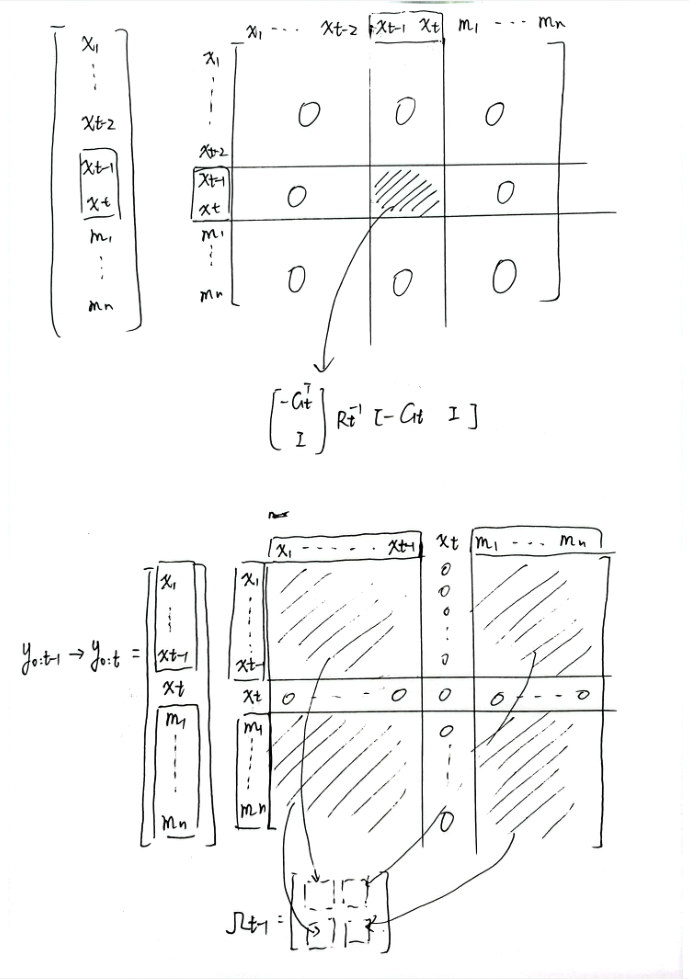

### Information Form while Building the Graph

The recursive formula of the full SLAM posterior is
$$
\begin{split}
p(y_{0:t}|z_{1:t},u_{1:t},c_{1:t})&=\eta p(z_t|y_t,c_t)p(x_t|x_{t-1},u_t)p(y_{0:t-1}|z_{1:t-1},u_{1:t-1},c_{1:t-1})\\
&= \eta \bigg[\prod_ip(z_t^i|y_t,c_t^i)\bigg]p(x_t|x_{t-1},u_t)p(y_{0:t-1}|z_{1:t-1},u_{1:t-1},c_{1:t-1})
\end{split}
$$
since we will linearize the motion function and measurement function, the system will be a linear Gaussian system. **The outcome of the motion function and measurement function is Gaussian.** 
$$
x_t = g(u_t,x_{t-1})+\varepsilon_t \quad \sim \quad \mathcal{N}(g(u_t,x_{t-1}),R_t)\\
z_t = h(x_t)+\delta_t \quad \sim \quad \mathcal{N}(h(x_{t-1}),Q_t)\\
z_t^i = h(x_t,c_t^i)+\delta_t \quad \sim \quad \mathcal{N}(h(x_{t-1},c_t^i),Q_t)\\
$$
We can write the following expression
$$
\begin{split}
p(x_t|x_{t-1},u_t)&=\frac{1}{(2\pi)^{n/2}\vert\Sigma\vert^{1/2}}\exp{(-\frac{1}{2}(x_t-g(u_t,x_{t-1}))^TR_t^{-1}(x_t-g(u_t,x_{t-1})))}\\
p(z_t^i|y_t,c_t^i)&=\frac{1}{(2\pi)^{n/2}\vert\Sigma\vert^{1/2}}\exp{(-\frac{1}{2}(z^i_t-h(x_{t-1},c_t^i))^TQ_t^{-1}(z^i_t-h(x_{t-1},c_t^i)))}\\
p(y_{0:t-1}|z_{1:t-1},u_{1:t-1},c_{1:t-1}) &= \frac{1}{(2\pi)^{n/2}\vert\Sigma\vert^{1/2}}\exp{(-\frac{1}{2}(y_{0:t-1}-\mu_{0:t-1})^T\Omega_{t-1}(y_{0:t-1}-\mu_{0:t-1}))}
\end{split}
$$
the log posterior
$$
\begin{split}
\log p(x_t|x_{t-1},u_t) &= \mathrm{const.}-\frac{1}{2}(x_t-g(u_t,x_{t-1}))^TR_t^{-1}(x_t-g(u_t,x_{t-1}))\\
\log p(z_t^i|y_t,c_t^i)&=\mathrm{const.}-\frac{1}{2}(z^i_t-h(x_{t-1},c_t^i))^TQ_t^{-1}(z^i_t-h(x_{t-1},c_t^i))\\
\log p(y_{0:t-1}|z_{1:t-1},u_{1:t-1},c_{1:t-1}) &= \mathrm{const.}-\frac{1}{2}(y_{0:t-1}-\mu_{0:t-1})^T\Omega_{t-1}(y_{0:t-1}-\mu_{0:t-1}))
\end{split}
$$
after linearization
$$
\begin{split}
\log p(x_t|x_{t-1},u_t) &= \mathrm{const.}-\frac{1}{2}(x_t-g(u_t,\mu_{t-1})-G_t(x_{t-1}-\mu_{t-1}))^TR_t^{-1}(x_t-g(u_t,\mu_{t-1})-G_t(x_{t-1}-\mu_{t-1}))\\
\log p(z_t^i|y_t,c_t^i)&=\mathrm{const.}-\frac{1}{2}(z_t^i-h(\mu_t,c_t^i)-H_t^i(y_t-\mu_t))^TQ_t^{-1}(z^i_t-h(\mu_t,c_t^i)-H_t^i(y_t-\mu_t))\\
\end{split}
$$
**the events $g(u_t,\mu_{t-1}),G_t,\mu_{t-1},R_t,h(\mu_t,c_t^i),H_t^i,\mu_t,Q_t$ is constant**, which we can subsume into $\mathrm{const.}$
$$
\begin{split}
\log p(x_t|x_{t-1},u_t) =& \mathrm{const.}-\frac{1}{2}(x_t-g(u_t,\mu_{t-1})-G_t(x_{t-1}-\mu_{t-1}))^TR_t^{-1}(x_t-g(u_t,\mu_{t-1})-G_t(x_{t-1}-\mu_{t-1}))\\
=& \mathrm{const.}-\frac{1}{2}\bigg[(x_t-G_tx_{t-1})+(-g(u_t,\mu_{t-1})+G_t\mu_{t-1})\bigg]^TR_t^{-1}\bigg[(x_t-G_tx_{t-1})+(-g(u_t,\mu_{t-1})+G_t\mu_{t-1})\bigg]\\
=& \mathrm{const.}-\frac{1}{2}\bigg[\underbrace{(x_t-G_tx_{t-1})^TR_t^{-1}(x_t-G_tx_{t-1})}_{\mathrm{quadratic\space in\space} x_{t-1},x_t}\\

&+ \underbrace{(x_t-G_tx_{t-1})^TR_t^{-1}(-g(u_t,\mu_{t-1})+G_t\mu_{t-1})+(-g(u_t,\mu_{t-1})+G_t\mu_{t-1})^TR_t^{-1}(x_t-G_tx_{t-1})}_{\mathrm{linear\space in\space} x_{t-1},x_t}\\

&+ \underbrace{(-g(u_t,\mu_{t-1})+G_t\mu_{t-1})^TR_t^{-1}(-g(u_t,\mu_{t-1})+G_t\mu_{t-1})\bigg]}_{\mathrm{const.}}
\end{split}
$$
combine like terms and rewrite in matrix form
$$
\begin{split}
\log p(x_t|x_{t-1},u_t) 
=& \mathrm{const.}-\frac{1}{2}\bigg[
\Big([-G_t\quad I]\begin{bmatrix}x_{t-1}\\x_t\end{bmatrix}\Big)^T
R_t^{-1}
\Big([-G_t\quad I]\begin{bmatrix}x_{t-1}\\x_t\end{bmatrix}\Big)\\

&+ \Big([-G_t\quad I]\begin{bmatrix}x_{t-1}\\x_t\end{bmatrix}\Big)^TR_t^{-1}(-g(u_t,\mu_{t-1})+G_t\mu_{t-1})\\
&+(-g(u_t,\mu_{t-1})+G_t\mu_{t-1})^TR_t^{-1}\Big([-G_t\quad I]\begin{bmatrix}x_{t-1}\\x_t\end{bmatrix}\Big)\bigg]\\
=& \mathrm{const.}-\frac{1}{2}\bigg[
[x_{t-1}^T\quad x_t^T]
\underbrace{\Big(\begin{bmatrix}-G_t^T\\I\end{bmatrix}R_t^{-1}[-G_t\quad I]\Big)}
\begin{bmatrix}x_{t-1}\\x_t\end{bmatrix}\\

&+ [x_{t-1}^T\quad x_t^T]\underbrace{\Big(\begin{bmatrix}-G_t^T\\I\end{bmatrix}R_t^{-1}(-g(u_t,\mu_{t-1})+G_t\mu_{t-1})\Big)}\\
&+\underbrace{\Big((-g(u_t,\mu_{t-1})+G_t\mu_{t-1})^TR_t^{-1}[-G_t\quad I]\Big)}\begin{bmatrix}x_{t-1}\\x_t\end{bmatrix}\bigg]\\
\end{split}
$$
Here, $I$ is the identity matrix whose dimension is identical to $x_{t}$

Since the result of $[x_{t-1}^T\quad x_t^T]\Big(\begin{bmatrix}-G_t^T\\I\end{bmatrix}^TR_t^{-1}(-g(u_t,\mu_{t-1})+G_t\mu_{t-1})\Big)$ and $\Big((-g(u_t,\mu_{t-1})+G_t\mu_{t-1})^TR_t^{-1}[-G_t\quad I]\Big)\begin{bmatrix}x_{t-1}\\x_t\end{bmatrix}$ are scalar and they transpose each other, their values are equal.
$$
[x_{t-1}^T\quad x_t^T]\Big(\begin{bmatrix}-G_t^T\\I\end{bmatrix}R_t^{-1}(-g(u_t,\mu_{t-1})+G_t\mu_{t-1})\Big)=\Big((-g(u_t,\mu_{t-1})+G_t\mu_{t-1})^TR_t^{-1}[-G_t\quad I]\Big)\begin{bmatrix}x_{t-1}\\x_t\end{bmatrix}=\mathrm{scalar}
$$

So, they can be combined
$$
\begin{split}
\log p(x_t|x_{t-1},u_t) 
=& \mathrm{const.}-\frac{1}{2}
[x_{t-1}^T\quad x_t^T]
\underbrace{\Big(\begin{bmatrix}-G_t^T\\I\end{bmatrix}R_t^{-1}[-G_t\quad I]\Big)}
\begin{bmatrix}x_{t-1}\\x_t\end{bmatrix}\\

&- [x_{t-1}^T\quad x_t^T]\underbrace{\Big(\begin{bmatrix}-G_t^T\\I\end{bmatrix}R_t^{-1}(-g(u_t,\mu_{t-1})+G_t\mu_{t-1})\Big)}\\

=& \mathrm{const.}-\frac{1}{2}
[x_{t-1}^T\quad x_t^T]
\underbrace{\Big(\begin{bmatrix}-G_t^T\\I\end{bmatrix}R_t^{-1}[-G_t\quad I]\Big)}
\begin{bmatrix}x_{t-1}\\x_t\end{bmatrix}\\

&+ [x_{t-1}^T\quad x_t^T]\underbrace{\Big(\begin{bmatrix}-G_t^T\\I\end{bmatrix}R_t^{-1}(g(u_t,\mu_{t-1})-G_t\mu_{t-1})\Big)}\\
\end{split}
$$
Similarly
$$
\begin{split}
\log p(z_t^i|y_t,c_t^i)=&\mathrm{const.}-\frac{1}{2}(z_t^i-h(\mu_t,c_t^i)-H_t^i(y_t-\mu_t))^TQ_t^{-1}(z^i_t-h(\mu_t,c_t^i)-H_t^i(y_t-\mu_t))\\
=& \mathrm{const.}-\frac{1}{2}\bigg[
\underbrace{(-H_t^iy_t)^TQ_t^{-1}(-H_t^iy_t)}_{\mathrm{quadratic\space in\space} y_t}\\
&+ \underbrace{(-H_t^iy_t)^TQ_t^{-1}(z_t^i-h(\mu_t,c_t^i)+H_t^i\mu_t)+(z_t^i-h(\mu_t,c_t^i)+H_t^i\mu_t)^TQ_t^{-1}(-H_t^iy_t)}_{\mathrm{linear\space in\space} y_t}\\
&+ \underbrace{(z_t^i-h(\mu_t,c_t^i)+H_t^i\mu_t)^TQ_t^{-1}(z_t^i-h(\mu_t,c_t^i)+H_t^i\mu_t)}_{\mathrm{const.}}
\bigg]\\

=& \mathrm{const.}-\frac{1}{2}y_t^T \underbrace{H_t^{iT}Q_t^{-1}H_t^i} y_t\\
&-(-H_t^iy_t)^TQ_t^{-1}(z_t^i-h(\mu_t,c_t^i)+H_t^i\mu_t)\\

=& \mathrm{const.}-\frac{1}{2}y_t^T \underbrace{H_t^{iT}Q_t^{-1}H_t^i} y_t\\
&+y_t^T \underbrace{H_t^{iT}Q_t^{-1}(z_t^i-h(\mu_t,c_t^i)+H_t^i\mu_t)}\\
\end{split}
$$
Here, the variable that is aims to estimate is $y_t$. $z_t^i$ is the measurement that we will obtain from sensor.
$$
\begin{split}
\log p(y_{0:t}|z_{1:t},u_{1:t},c_{1:t})&=\mathrm{const.}-\frac{1}{2}(y_{0:t}-\mu_{0:t})^T\Omega_{0:t}(y_{0:t}-\mu_{0:t})\\

&= \mathrm{const.}-\frac{1}{2}y^T_{0:t}\Omega_{0:t}y_{0:t}
+\underbrace{\frac{1}{2}y_{0:t}^T\Omega_{0:t}\mu_{0:t}+\frac{1}{2}\mu_{0:t}^T\Omega_{0:t}y_{0:t}}_{\mathrm{scalar\space and \space equal}}
-\underbrace{\frac{1}{2}\mu_{0:t}^T\Omega_{0:t}\mu_{0:t}}_{\mathrm{const.}}\\

&= \mathrm{const.}-\frac{1}{2}y^T_{0:t}\Omega_{0:t}y_{0:t}+y_{0:t}^T\underbrace{\Omega_{0:t}\mu_{0:t}}_{\xi}\\

&= \mathrm{const.}-\frac{1}{2}y^T_{0:t}\Omega_{0:t}y_{0:t}+y_{0:t}^T\xi_{0:t}\\

\log p(y_{0:t-1}|z_{1:t-1},u_{1:t-1},c_{1:t-1})&=
\mathrm{const.}-\frac{1}{2}y^T_{0:t-1}\Omega_{0:t-1}y_{0:t-1}+y_{0:t-1}^T\underbrace{\xi_{0:t-1}}_{\Omega_{t-1}\mu_{t-1}}\\
\end{split}
$$
Now, we get
$$
\begin{split}
\log p(y_{0:t}|z_{1:t},u_{1:t},c_{1:t})&=\mathrm{const.}-\frac{1}{2}y^T_{0:t}\Omega_{0:t}y_{0:t}+y_{0:t}^T\xi_{0:t}\\

\log p(y_{0:t-1}|z_{1:t-1},u_{1:t-1},c_{1:t-1})&=
\mathrm{const.}-\frac{1}{2}y^T_{0:t-1}\Omega_{0:t-1}y_{0:t-1}+y_{0:t-1}^T\xi_{0:t-1}\\

\log p(x_t|x_{t-1},u_t) &= \mathrm{const.}-\frac{1}{2}
\begin{bmatrix}x_{t-1}\\x_t\end{bmatrix}^T
\underbrace{\Big(\begin{bmatrix}-G_t^T\\I\end{bmatrix}R_t^{-1}[-G_t\quad I]\Big)}
\begin{bmatrix}x_{t-1}\\x_t\end{bmatrix}\\
&+ \begin{bmatrix}x_{t-1}\\x_t\end{bmatrix}^T\underbrace{\Big(\begin{bmatrix}-G_t^T\\I\end{bmatrix}R_t^{-1}(g(u_t,\mu_{t-1})-G_t\mu_{t-1})\Big)}\\

\log p(z_t^i|y_t,c_t^i)&=\mathrm{const.}-\frac{1}{2}y_t^T \underbrace{H_t^{iT}Q_t^{-1}H_t^i} y_t\\
&+y_t^T \underbrace{H_t^{iT}Q_t^{-1}(z_t^i-h(\mu_t,c_t^i)+H_t^i\mu_t)}\\
\end{split}
$$
**Now, we expand $\begin{bmatrix}x_{t-1}\\x_t\end{bmatrix}$ and $y_{0:t-1}$ to $y_{0:t}$**. Correspondingly, the information matrix and information vector will expand.

$$
\begin{split}
\log p(y_{0:t}|z_{1:t},u_{1:t},c_{1:t})&=\mathrm{const.}-\frac{1}{2}y^T_{0:t}\Omega_{0:t}y_{0:t}+y_{0:t}^T\xi_{0:t}\\

\log p(y_{0:t-1}|z_{1:t-1},u_{1:t-1},c_{1:t-1})&=
\mathrm{const.}-\frac{1}{2}y^T_{0:t}[\Omega_{0:t-1}]^{\mathrm{expand}}y_{0:t}+y_{0:t}^T[\xi_{0:t-1}]^{\mathrm{expand}}\\

\log p(x_t|x_{t-1},u_t) &= \mathrm{const.}-\frac{1}{2}
y_{0:t}^T
\Big(\begin{bmatrix}-G_t^T\\I\end{bmatrix}R_t^{-1}[-G_t\quad I]\Big)^{\mathrm{expand}}
y_{0:t}\\
&+ y_{0:t}^T\Big(\begin{bmatrix}-G_t^T\\I\end{bmatrix}R_t^{-1}(g(u_t,\mu_{t-1})-G_t\mu_{t-1})\Big)^{\mathrm{expand}}\\

\log p(z_t^i|y_t,c_t^i)&=\mathrm{const.}-\frac{1}{2}y_{0:t}^T [H_t^{iT}Q_t^{-1}H_t^i]^{\mathrm{expand}} y_{0:t}\\
&+y_{0:t}^T [H_t^{iT}Q_t^{-1}(z_t^i-h(\mu_t,c_t^i)+H_t^i\mu_t)]^{\mathrm{expand}}\\
\end{split}
$$
So, we can combine them
$$
\begin{split}
\Omega_{0:t} \quad &\longleftarrow \quad [\Omega_{0:t-1}]^{\mathrm{expand}}
+\underbrace{\Big(\begin{bmatrix}-G_t^T\\I\end{bmatrix}R_t^{-1}[-G_t\quad I]\Big)^{\mathrm{expand}}}_{\mathrm{add\space control\space constraint}}
+\underbrace{[H_t^{iT}Q_t^{-1}H_t^i]^{\mathrm{expand}}}_{\mathrm{add\space measurement\space constraint}}\\

\xi_{0:t} \quad &\longleftarrow \quad [\xi_{0:t-1}]^{\mathrm{expand}}
+\underbrace{\Big(\begin{bmatrix}-G_t^T\\I\end{bmatrix}R_t^{-1}[-G_t\quad I]\Big)^{\mathrm{expand}}}_{\mathrm{add\space control\space constraint}}
+\underbrace{[H_t^{iT}Q_t^{-1}(z_t^i-h(\mu_t,c_t^i)+H_t^i\mu_t)]^{\mathrm{expand}}}_{\mathrm{add\space measurement\space constraint}}
\end{split}
$$

