# The GraphSLAM Algorithm

## Introduction

The EKF SLAM Algorithm solve the online SLAM problem. In contrast to the EKF, **GraphSLAM solves the *full SLAM problem***. **The posterior of the full SLAM problem naturally forms a *sparse graph*. This graph leads to a sum of nonlinear quadratic constrains. Optimizing these constraints yields a maximum likelihood map and a corresponding set of robot pose**

### Sparse Graph

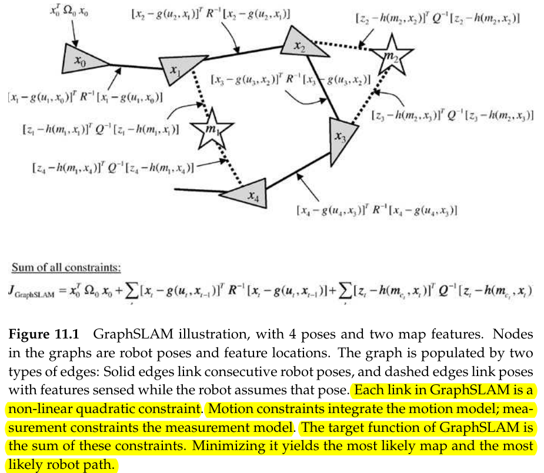

Figure 11.1 illustrates the GraphSLAM algorithm. It contains five **pose** labeled $x_0,\ldots, x_4$, and two **map feature** $m_1,m_2$. 

- pose node
- map feature node

Arcs in this graph come in two types:

- *motion arcs*: It **links any two consecutive robots poses**
- *measurement arcs*: It **links poses to features that were measured there**

**Each edge in the graph corresponds to a nonlinear constraint**

- *Motion constraints* integrate the *motion model*
- *Measurement constrains* integrate the *measurement model*
- The *target function* of GraphSLAM is the sum of these constraints

**The sum of all constraints results in a nonlinear *least squares problem***. Minimizing it yields the most likely map and the most likely robot path.

### Difference Between EKF SLAM and GraphSLAM

1. The representation of information

   EKF SLAM represents information through a **covariance matrix and a mean vector**. GraphSLAM represents the information as a **graph of soft constraints**. **Updating the covariance in an EKF is computationally expensive whereas growing the graph is cheap.**

2. EKF is a *incremental* SLAM algorithm and GraphSLAM is more like a *lazy* SLAM technique

   EKF resolves any new piece of information **immediately** into an improved estimate of the state of the world. It maintains a **posterior over the momentary pose** of the robot. GraphSLAM, in contrast, simply accumulates the information into its graph without resolving it. 

## Building Up the Graph

#### Some Notation

Suppose we are given 

- a set of measurements $z_{1:t}$ with associated correspondence variables $c_{1:t}$
- a set of controls $u_{1:t}$

The node in the graph are

- the robot poses $x_{1:t}$
- the features in the map $m=\{m_j\}$

Each edge in the graph correspond to an event

- a motion event generates an edge between two poses
- a measurement event creates a link between a pose and a feature in the map

The constraints are generally nonlinear, but in the process of resolving them they are linearized and transformed into an information matrix.

For a linear system, these constraints are **equivalent to entries in an information matrix and an information vector of a large system of equations.**(这些约束与信息矩阵和信息向量里的条目等价). The meaning of the information matrix and information vector is same as that in information filter
$$
\Omega = \Sigma^{-1},\quad \xi=\Sigma^{-1}\mu
$$
here
$$
\Sigma=Cov(y_{1:t},y_{1:t}),\quad y_t=[x_1,\ldots,x_{t},m_1,\ldots,m_n]^T
$$
$m_k$ in $y_{1:t}$ is the features in the map, not the measurement $z_t$

#### Building

##### Observing a Landmark

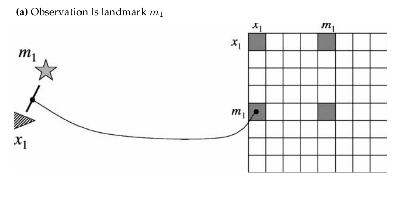

At some pose $x_t$, we get a measurement $z_t^i$ which corresponds to the $j$-th landmark $m_j$. In the GraphSLAM, **this information is mapped into a constraint between $x_t$ and $m_j$. **The constraint will be added to the information matrix and information vector just as shown in the figure.

The constraint is of the type
$$
(z_t^i-h(x_t,m_j))^TQ_t^{-1}(z_t^i-h(x_t,m_j))
$$
We will prove it in the mathematical derivation section.

##### Robot Motion

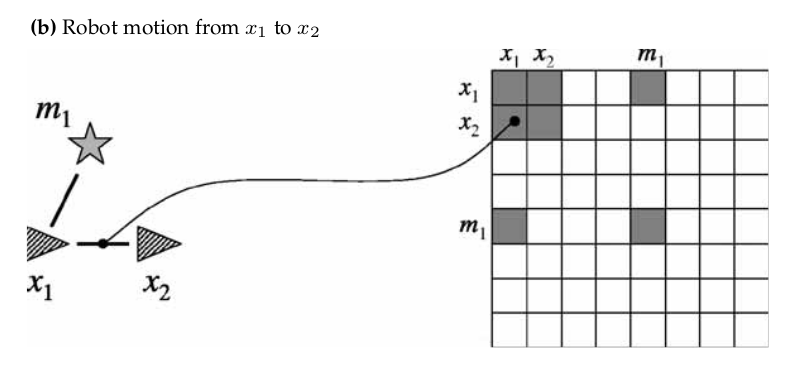

The control $u_t$ provides information about the relative value of the robot pose a time $t-1$ and the pose at time $t$. This information induces a constraint between poses $x_{t-1}$ and $x_t$ just as shown in the figure. The constraint will be of the form
$$
(x_t-g(u_t,x_{t-1}))^TR_t^{-1}(x_t-g(u_t,x_{t-1}))
$$
Here $g$ is the familiar kinematic motion model of the robot and $R_t$ is the covariance of the motion noise.

##### Observing the Landmark while moving

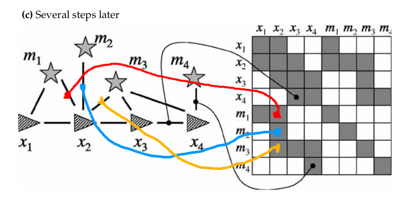

While moving from $x_{t-1}$ to $x_t$, robot will observe some landmarks at pose $x_t$, which will induce some constraint just as shown in the above picture.

##### The Sum of All Constraints

The sum of all constraints in the graph will be of the form
$$
J_{\mathrm{GraphSLAM}}=x_0^T\Omega_0x_0+\sum_t(x_t-g(u_t,x_{t-1}))^TR_t^{-1}(x_t-g(u_t,x_{t-1}))\\
+\sum_t\sum_i(z_t^i-h(y_t,c_t^i))^TQ_t^{-1}(z_t^i-h(y_t,c_t^i))
$$
In the associated information matrix $\Omega$, **the off-diagonal elements are all zero with two exceptions**:

1. Between any two consecutive poses $x_{t-1}$ and $x_t$ will sbe a non-zero value that represents the information link introduced by the control $u_t$.
2. Also non-zero will be any element between a map feature $m_j$ and a pose $x_t$, if $m_j$ was observed when the robot was a $x_t$.

**All elements between pairs of different features remain zero. This reflects the fact that we never received information pertaining to their relative location -- all we receive in SLAM are measurements that constrain the location of a feature relative to a robot pose**.

## Inference

1. In GraphSLAM, the map and the path are obtained from the linearize information matrix via $\mu=\Omega^{-1}\xi$. 

   Recalling Kalman Filter, we use $\mu$ as the estimation of the state $x_t$. In GraphSLAM, the state vector is extended to $y_{1:t}=[x_1,\ldots,x_t,m_1,\ldots,m_n]^T$. We use $\mu$ as the estimation of $y_{1:t}$. So we can obtain map and path from $\mu$

2. If the feature is seen only locally in time, the graph represented by the constraints is linear. Thus, $\Omega$ can be **reordered** so that it becomes a **band-diagonal** matrix, and all non-zero values occur near its diagonal. The equation $\mu=\Omega^{-1}\xi$ can then be computed in linear time.

3. **Most worlds possess cycles**. There will exist features $m_j$ that are seen at drastically different time step $x_{t_1}$ and $x_{t_2}$, with $t_2\gg t_1$. In our constraint graph, this introduces a cyclic dependence: $x_{t_1}$ and $x_{t_2}$ are linked through the sequence of controls $u_{t_1+1},u_{t_1+2},\ldots,u_{t_2}$ and through the joint observation links between $x_{t_1}$ and $m_j$, and $x_{t_2}$ and $m_j$, respectively.

### Variable Elimination Algorithm

The GraphSLAM algorithm now employs an important *factorization trick*, which we can think of as propagating information through the information matrix (in fact, it is a generalization of the well-known *variable elimination algorithm* for matrix inversion). 

Suppose we would like to remove a feature $m_j$ from the information matrix $\Omega$ and the information state $\xi$. In our spring mass model, **this is equivalent to removing the node and all springs attached to this node**. As we shall see below, this is possible by a remarkably simple operation: We can remove all those springs between $m_j$ and the poses at which $m_j$ was observed, **by introducing new springs between any pair of such poses**.

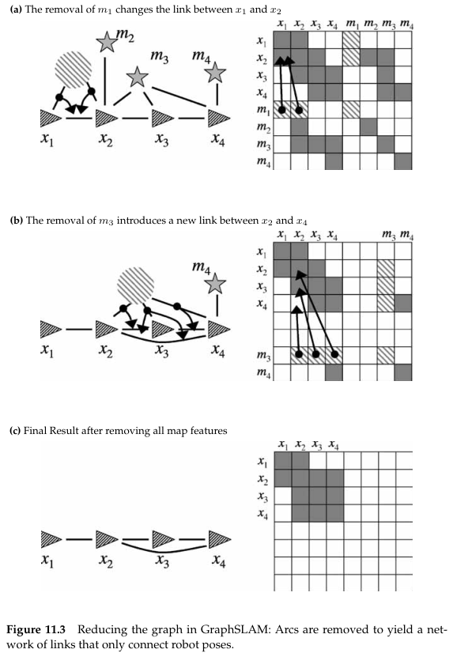

By removing each feature $m_j$ from $\Omega$ and $\xi$, we ultimately arrive at a much smaller information from $\tilde{\Omega}$ and $\tilde{\xi}$ **defined only over the robot path variables**. The **posterior over the robot path** is new recovered as $\tilde{\Sigma}=\tilde{\Omega}^{-1}$ and $\tilde{\mu}=\tilde{\Sigma}\xi$. Unfortunately, **our reduction step does not eliminate cycles in the posterior**.

### Using Mathematical Language to Describe this Process

Let $\tau(j)$ be **the set of poses at which $m_j$ was observed**. That is
$$
x_t\in \tau(j) \space\Longleftrightarrow\space \exists i:c_t^i=j 
$$
By construction, $m_j$ is **not links any feature in the map**.

1. Set all links between $m_j$ and the poses $\tau(j)$ to zero **by introducing a new link between any two poses $x_t,x_{t'}\in \tau(j)$.** Similarly, **the information vector values for all poses $\tau(j)$ are also updated.**
2. By removing each feature $m_j$ from $\Omega$ and $\xi$, we ultimately arrive at a much smaller information from $\tilde{\Omega}$ and $\tilde{\xi}$ **defined only over the robot path variables**. The **posterior over the robot path** is new recovered as $\tilde{\Sigma}=\tilde{\Omega}^{-1}$ and $\tilde{\mu}=\tilde{\Sigma}\xi$. Unfortunately, **our reduction step does not eliminate cycles in the posterior**.
3. At a last step, GraphSLAM **recovers the feature locations**. Conceptually, this is achieved by **building a new information matrix $\Omega_j$ and information vector $\xi_j$ for each $m_j$**. Both are defined over the variable $m_j$ and the poses $\tau(j)$ at which $m_j$ were observed. **It contains the original links between $m_j$ and $\tau(j)$, but the poses $\tau(j)$ are set to the values in $\tilde{\mu}$, without uncertainty**.

## The GraphSLAM Algorithm

The main difficulty in implementing the simple additive information algorithm pertains to the conversion of a conditional probability of the form $p(z_t^i|x_t,m)$ and $p(x_t|u_t,x_{t-1})$ into a link in the information matrix.(困难主要是将这两个概率转换成信息矩阵中的link). The *full GraphSLAM algorithm* is shown below

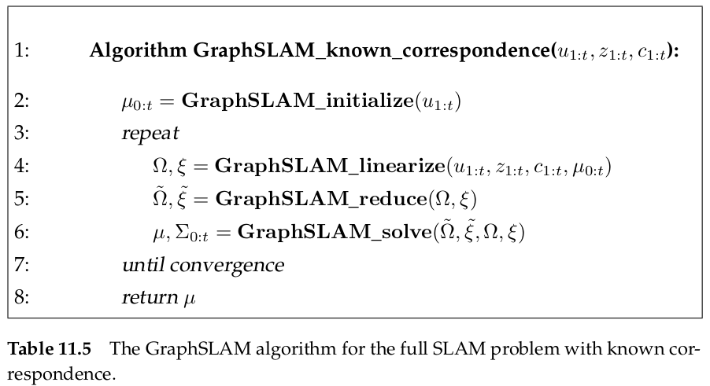

It contains several steps

- GraphSLAM initialize
- GraphSLAM linearize
- GraphSLAM reduce
- GraphSLAM solve

### GraphSLAM_initialize

To build out initial information matrix $\Omega$ and $\xi$, we need an **initial estimate $\mu_{0:t}$ **for all poses $x_{0:t}$. 

There exist a number of solutions to the problem of finding an initial mean $\mu$ suitable for linearization. For example, we can run a EKF SLAM and use its estimate for linearization. **Our initial estimate will simply be provided by chaining together the motion model $p(x_t|u_t,x_{t-1})$**

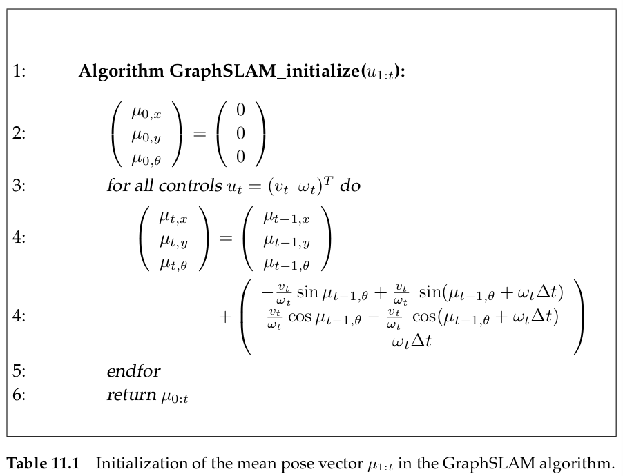

This algorithm takes the controls $u_{1:t}$ as input, and output sequence of pose estimates $\mu_{0:t}$. It initializes the first pose by zero, and then calculates subsequent poses by recursively applying the velocity motion model.

### GraphSLAM_linearize

Refer to the mathematical derivation section

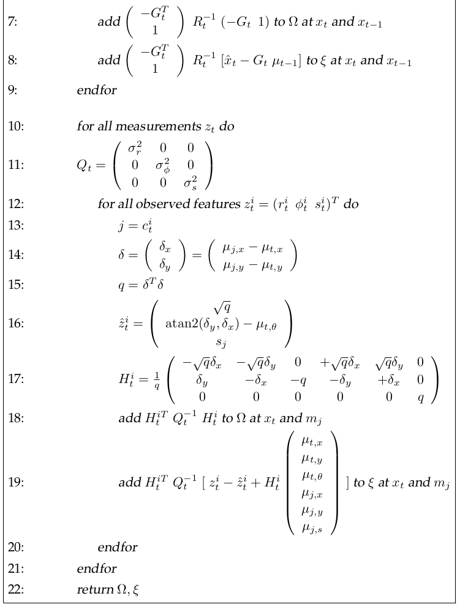

### GraphSLAM_reduce

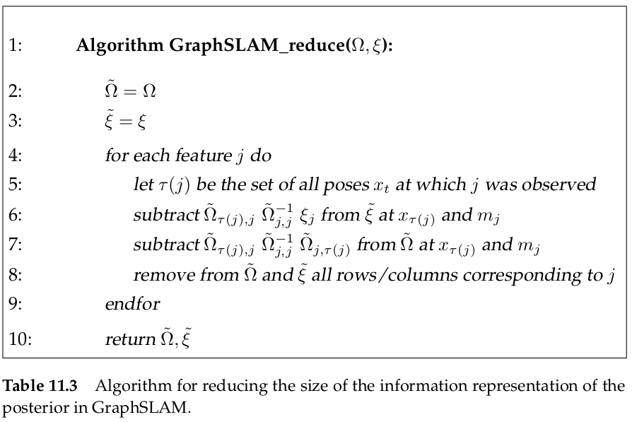

### GraphSLAM_solve

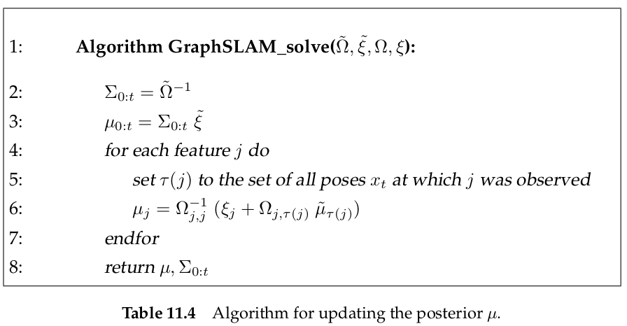

## Mathematical Derivation of GraphSLAM

The derivation of the GraphSLAM algorithm is divided into the following steps

1. A derivation of a **recursive formula** for calculating the full SLAM posterior, represented in information form.
2. Then we investigate each term in this posterior, and derive from them **the additive SLAM updates** through Taylor expansions.
3. We will derive the necessary equations for **recovering recovering the path and the map**.

We firstly introduce a variable for the augmented state of the full SLAM problem.

We will use $y$ to denote state variables that combine one or more poses $x$ with the map $m$. In particular, we define $y_{0:t}$ to be a vector composed of the path $x_{0:t}$ and the map $m$, whereas $y_t$ is composed of the momentary pose at time $t$ and the map $m$.
$$
y_{0:t}=\begin{bmatrix}
x_0\\x_1\\ \vdots \\x_t\\m
\end{bmatrix}
\quad \mathrm{and} \quad 
y_t=\begin{bmatrix}
x_t \\ m
\end{bmatrix}
$$

### Recursive Formula of the Full SLAM Posterior

The full posterior
$$
p(y_{0:t}|z_{1:t},u_{1:t},c_{1:t})
$$
could be factored by Bayes rule
$$
p(y_{0:t}|z_{1:t},u_{1:t},c_{1:t})=\eta p(z_t|y_{0:t},z_{1:t-1},u_{1:t},c_{1:t})p(y_{0:t}|z_{1:t-1},u_{1:t},c_{1:t})
$$
derivation
$$
\begin{split}
p(y_{0:t}|z_{1:t},u_{1:t},c_{1:t})&=\frac{p(y_{0:t},z_{1:t},u_{1:t},c_{1:t})}{p(z_{1:t},u_{1:t},c_{1:t})}\\
&= \frac{p(z_t|y_{0:t},z_{1:t-1},u_{1:t},c_{1:t})p(y_{0:t},z_{1:t-1},u_{1:t},c_{1:t})}{p(z_t)p(z_{1:t-1},u_{1:t},c_{1:t})}\\
&= \frac{p(z_t|y_{0:t},z_{1:t-1},u_{1:t},c_{1:t})}{p(z_t)}\cdot\frac{p(y_{0:t},z_{1:t-1},u_{1:t},c_{1:t})}{p(z_{1:t-1},u_{1:t},c_{1:t})}\\
&= \eta p(z_t|y_{0:t},z_{1:t-1},u_{1:t},c_{1:t}) p(y_{0:t}|z_{1:t-1},u_{1:t},c_{1:t})
\end{split}
$$
we can simplify the equation

- The firstly probability on the right-hand side can be reduced by dropping irrelevant conditioning variables, since the measurement $z_t$ is only correspond to current state $y_t$ and its correspondence
  $$
  p(z_t|y_{0:t},z_{1:t-1},u_{1:t},c_{1:t})=p(z_t|y_t,c_t)
  $$

- Similarly, we can factor the second probability by partitioning $y_{0:t}$ into $x_t$ and $y_{0:t-1}$, and obtain
  $$
  \begin{split}
  p(y_{0:t}|z_{1:t-1},u_{1:t},c_{1:t})&=p(x_t|y_{0:t-1},z_{1:t-1},u_{1:t},c_{1:t})p(y_{0:t-1}|z_{1:t-1},u_{1:t},c_{1:t})\\
  &= p(x_t|x_{t-1},u_t)p(y_{0:t-1}|z_{1:t-1},u_{1:t-1},c_{1:t-1})
  \end{split}
  $$
  since state $x_t$ is only correspond to last state $x_{t-1}$ and motion $u_t$

Putting these expression back gives us the **recursive** definition of the full SLAM posterior
$$
p(y_{0:t}|z_{1:t},u_{1:t},c_{1:t})=\eta p(z_t|y_t,c_t)p(x_t|x_{t-1},u_t)p(y_{0:t-1}|z_{1:t-1},u_{1:t-1},c_{1:t-1})
$$
The item $p(y_{0:t-1}|z_{1:t-1},u_{1:t-1},c_{1:t-1})$ also has the **recursive** expression. So the closed form expression is obtained through induction over $t$
$$
\begin{split}
p(y_{0:t}|z_{1:t},u_{1:t},c_{1:t})&= \eta p(y_0)\prod_tp(x_t|x_{t-1},u_t)p(z_t|y_t,c_t)\\
&= \eta p(y_0)\prod_t[p(x_t|x_{t-1},u_t)\prod_ip(z_t^i|y_t,c_t^i)]
\end{split}
$$
Here $p(y_0)$ is the prior over the map $m$ and the initial pose $x_0$. The prior $p(y_0)$ **factors into two independent priors, $p(x_0)$ and $p(m)$.** In SLAM, we usually have no prior knowledge about the map $m$. We simply replace $p(y_0)$ by $p(x_0)$ and subsume the factor $p(m)$ into the normalizer $\eta$.
$$
\begin{split}
p(y_{0:t}|z_{1:t},u_{1:t},c_{1:t})
&= \eta p(y_0)\prod_t[p(x_t|x_{t-1},u_t)\prod_ip(z_t^i|y_t,c_t^i)]\\
&= \underbrace{\eta p(m)}_{\eta}p(x_0)\prod_t[p(x_t|x_{t-1},u_t)\prod_ip(z_t^i|y_t,c_t^i)]
\end{split}
$$

### The Negative Log Posterior

The log-SLAM posterior follows directly from the previous equation
$$
\log p(y_{0:t}|z_{1:t},u_{1:t},c_{1:t})=\mathrm{const.}+\log p(x_0)+\sum_t\bigg[\log p(x_t|x_{t-1},u_t)+\sum_ip(z_t^i|y_t,c_t^i)\bigg]
$$
Just as in Chapter 10, we assume the **outcome of robot motion is distributed normally** according to $\mathcal{N}(g(u_t,x_{t-1}),R_t)$
$$
x_t = g(x_{t-1},u_t)+\varepsilon_t \space \sim \space \mathcal{N}(g(u_t,x_{t-1}),R_t)
$$
where $g$ is the deterministic motion function, and $R_t$ is the covariance of the motion error. 

Similarly
$$
z_t^i = h(y_t,c_t^i)+\delta_t \space \sim \space \mathcal{N}(h(y_t,c_t^i),Q_t)
$$
In equations, we have
$$
\begin{split}
p(x_t|x_{t-1},u_t) &= \eta \exp\big\{-\frac{1}{2}(x_t-g(u_t,x_{t-1}))^TR_t^{-1}(x_t-g(u_t,x_{t-1}))\big\}\\
p(z_t^i|y_t,c_t^i) &= \eta \exp\big\{-\frac{1}{2}(z_t^i-h(y_t,c_t^i))^TQ_t^{-1}(z^i_t-h(t_t,c_{t}^i))\big\}\\
\end{split}
$$
The prior $p(x_0)$ is also easily expressed by a Gaussian-type distribution. **It anchors the initial pose $x_0$ to the origin of the global coordinate system: $x_0=[0,0,0]^T$**
$$
p(x_0)=\eta \exp\big\{-\frac{1}{2}x_0^T\Omega_0x_0\big\}
$$
with
$$
\Sigma_0=\begin{bmatrix}
0 & 0 & 0\\
0 & 0 & 0\\
0 & 0 & 0\\
\end{bmatrix}
\rightarrow
\Omega_0=\Sigma^{-1}_0=\begin{bmatrix}
\infty & 0 & 0\\
0 & \infty & 0\\
0 & 0 & \infty\\
\end{bmatrix}
$$
We can implement the value of $\infty$ by easily substituting $\infty$ with a large positive number. 

The negative log-SLAM posterior can be written as
$$
-\log p(y_{0:t}|z_{1:t},u_{1:t},c_{1:t})=\mathrm{const.}+\frac{1}{2}\bigg[x_0^T\Omega_0x_0+\sum_t(x_t-g(u_t,x_{t-1}))^TR_t^{-1}(x_t-g(u_t,x_{t-1}))\\
+\sum_t\sum_i (z_t^i-h(y_t,c_t^i))^TQ_t^{-1}(z^i_t-h(t_t,c_{t}^i))\bigg]
$$
This is essentially the same as $J_{GraphSLAM}$. This equation highlights an essential characteristic of the full SLAM posterior in the **information form**: **It is composed of a number of quadratic terms, one for the prior, and one for each control and each measurement**.

### Using Taylor Expansion to Linearize

$$
\begin{split}
g(u_t,x_{t-1}) &\approx g(u_t,\mu_{t-1})+G_t(x_{t-1}-\mu_{t-1})\\
h(y_t,c_t^i) &\approx h(\mu_t,c_t^i)+H_t^i(y_t-\mu_t)
\end{split}
$$

Since the state vector $y_t$ is a combination vector, $H_t^i=h_t^iF_{x,j}$, which could be found in [ch10_Simultaneous_Localization_and_Mapping.md](./ch10_Simultaneous_Localization_and_Mapping.md) at Mathematical Derivation of EKF SLAM section. 

By linearization, we can obtain
$$
\begin{split}
\log &p(y_{0:t}|z_{1:t},u_{1:t},c_{1:t})=\mathrm{const.}-\frac{1}{2}\\
&\bigg\{
x_0^T\Omega_0x_0+\sum_t(x_t-g(u_t,\mu_{t-1})-G_t(x_{t-1}-\mu_{t-1}))^TR_t^{-1}(x_t-g(u_t,\mu_{t-1})-G_t(x_{t-1}-\mu_{t-1}))\\
&+\sum_t\sum_i (z_t^i-h(\mu_t,c_t^i)-H_t^i(y_t-\mu_t))^TQ_t^{-1}(z^i_t-h(\mu_t,c_t^i)-H_t^i(y_t-\mu_t))
\bigg\}
\end{split}
$$
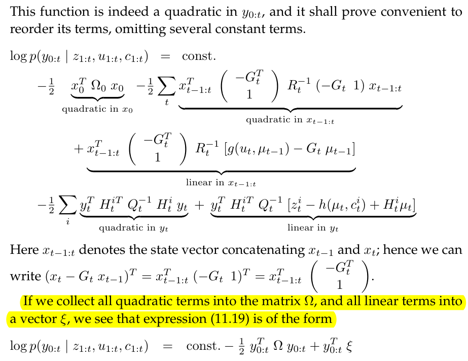

This linearization part of book is a piece of shit. You can refer to [ch11_Derivation.md](./ch11_Derivation.md) for detailed derivation.

### Constructing the Information Form

$$
\begin{split}
\Omega_{0:t} \quad &\longleftarrow \quad [\Omega_{0:t-1}]^{\mathrm{expand}}
+\underbrace{\Big(\begin{bmatrix}-G_t^T\\I\end{bmatrix}R_t^{-1}[-G_t\quad I]\Big)^{\mathrm{expand}}}_{\mathrm{add\space control\space constraint}}
+\underbrace{[H_t^{iT}Q_t^{-1}H_t^i]^{\mathrm{expand}}}_{\mathrm{add\space measurement\space constraint}}\\

\xi_{0:t} \quad &\longleftarrow \quad [\xi_{0:t-1}]^{\mathrm{expand}}
+\underbrace{\Big(\begin{bmatrix}-G_t^T\\I\end{bmatrix}R_t^{-1}[-G_t\quad I]\Big)^{\mathrm{expand}}}_{\mathrm{add\space control\space constraint}}
+\underbrace{[H_t^{iT}Q_t^{-1}(z_t^i-h(\mu_t,c_t^i)+H_t^i\mu_t)]^{\mathrm{expand}}}_{\mathrm{add\space measurement\space constraint}}
\end{split}
$$

### Reducing the Information Form

The reduction step GraphSLAM_reduce is based on a factorization of the full SLAM posterior
$$
p(y_{0:t}|z_{1:t},u_{1:t},c_{1:t})=p(m|x_{0:t},z_{1:t},u_{1:t},c_{1:t})p(x_{0:t}|z_{1:t},u_{1:t},c_{1:t})\\
\rightarrow p(x_{0:t}|z_{1:t},u_{1:t},c_{1:t})=\int p(y_{0:t}|z_{1:t},u_{1:t},c_{1:t})dm
$$
since
$$
p(x_{0:t}|z_{1:t},u_{1:t},c_{1:t})\sim\mathcal{N}(\tilde{\xi},\tilde{\Omega})
$$
According to the following two form

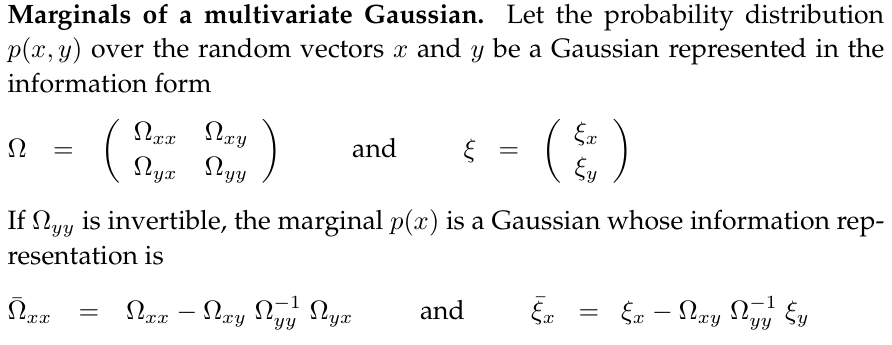

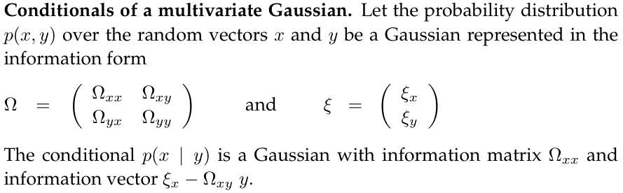

We firstly subdivide the matrix $\Omega_{0:t}=\Omega$ and the vector $\xi_{0:t}=\xi$ into submatrices, for the robot path $x_{0:t}$ and the map $m$
$$
\begin{split}
\Omega&=\begin{bmatrix}
\Omega_{x_{0:t},x_{0:t}} & \Omega_{x_{0:t},m}\\
\Omega_{m,x_{0:t}} & \Omega_{m,m}\\
\end{bmatrix}\\

\xi &= \begin{bmatrix}
\xi_{x_{0:t}}\\
\xi_{m}
\end{bmatrix}
\end{split}
$$
According to the marginalization lemma, the probability is obtained as 
$$
\begin{split}
\tilde{\Omega} &= \Omega_{x_{0:t},x_{0:t}}-\Omega_{x_{0:t},m}\Omega_{m,m}^{-1}\Omega_{m,x_{0:t}}\\
\tilde{\xi}&= \xi_{x_{0:t}}-\Omega_{x_{0:t},m}\Omega_{m.m}^{-1}\xi_{m}
\end{split}
$$

### Recovering the Path and the Map

#### Recovering the Path

$$
\tilde{\Sigma}=\tilde{\Omega}^{-1}\\
\tilde{\mu}=\tilde{\Sigma}\tilde{\xi}
$$

#### Recovering the Map

we will recover the map from
$$
p(m|x_{0:t},z_{1:t},u_{1:t},c_{1:t})
$$
According to the conditioning lemma
$$
\begin{cases}
\Omega_m = \Omega_{m,m}\\
\xi_m = \xi_{m}-\Omega_{m,x_{0:t}}\tilde{\mu}_{x_{0:t}}
\end{cases}
\rightarrow
\begin{cases}
\Sigma_m = \Omega_{m,m}^{-1}\\
\mu_m = \Sigma_m(\xi_{m}-\Omega_{m,x_{0:t}}\tilde{\mu}_{x_{0:t}})
\end{cases}
$$
It is important to notice that this is a Gaussian $p(m|x_{0:t},z_{1:t},u_{1:t},c_{1:t})$ conditioned on the true path $x_{0:t}$. In practice, we do not know the path, hence one might want to know the posterior $p(m|z_{1:t},u_{1:t},c_{1:t})$ **without the path in the conditioning set**. **This Gaussian cannot be factored in the moments parameterization, as locations of different features are correlated through the uncertainty over the robot pose.** For this reason, GraphSLAM_solve returns the mean estimate of the posterior but only the covariance over the robot path.

