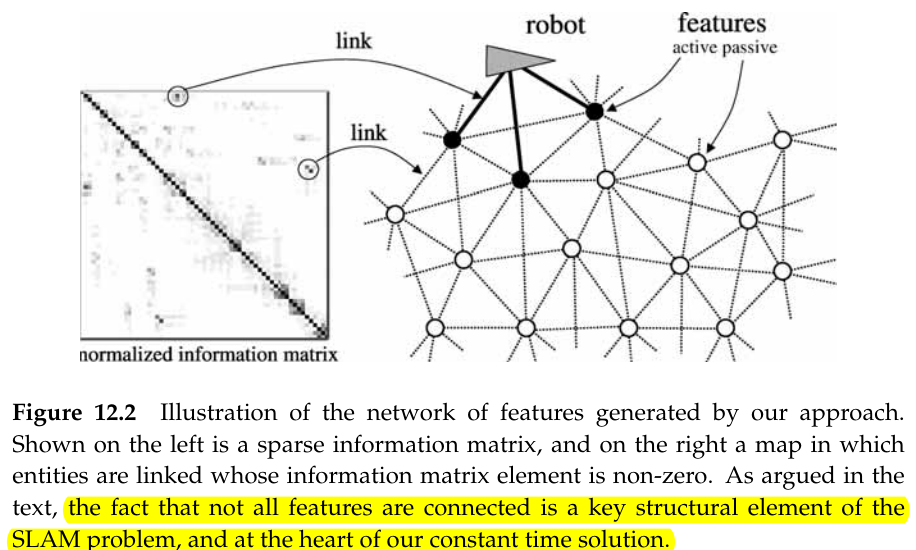
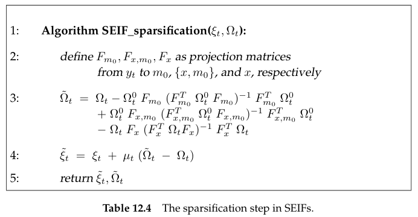

# The Sparse Extended Information Filter

## Introduction

We already noted that EKF SLAM is proactive which resolves the information into a probability distribution every time information is acquired. The GraphSLAM algorithm is lazy, which simply memorizes the information it receives. 

This raises the question as to whether we can devise an **online filter** algorithm that inherits the efficiency of the information representation. The answer is yes, but only with a number of **approximations**. 

### Illustration of the SEIF

This sparseness is distinctly different from that in the previous chapter:

- there exist links **between pairs of landmarks**
- the **strength** of each link **is related to the distance** of the corresponding features: Strong links are found only between nearby features. The more distant two features, the weaker their link
- **the sparseness is only approximate**: In fact, all elements of the normalized information matrix are non-zero, but nearly all of them are very close to zero. 

**This diagram also shows the robot, which is linked to a small subset of all features only.** Those features are called **active features** and are drawn in black.

## The SEIF SLAM algorithm

### Intuitive Description

Specifically, a SEIF update is composed of 4 steps: 

- motion update step, 
- measurement update step
- sparsifivation step
- state estimation step

using figures to illustrate these steps

1. measurement update

2. motion update

The motion affects the information state in multiple ways

- **the links between the robot's pose and the features $m_1,m_2$ are weakened.** This is a result of the fact that robot motion introduces new uncertainty, hence causes us to lose information about where the robot is relative to the map.
- **a new link is added between features $m_1,m_2$**. This shift of information comes about since even through we lost information on the robot pose, we did not lose information on the relative location of features in the map. By integrating out past pose variables, we lose those links, and they are mapped back into the between-feature elements in the information matrix.
- **feature $m_3$ is not active, remains untouched**. For a pair features to acquire a direct link in this process, both have to be active before the update. Feature $m_3$ remaining untouched suggests that by controlling the number of active landmarks at any point in time, we can control the computational complexity of the motion update, and the number of links in the information matrix.

3. Sparsification

The sparsification involves the removal of a link between the robot and an active feature, effectively turning the active feature into a passive one. In SEIFs, **this arc removal leads to a *redistribution* of information into neighboring links,** specifically between other active features and the robot pose. However, it is an **approximation**, one that induces an information loss in the robot's posterior. 

### The SEIF SLAM Algorithm

## Mathematical Derivation of the SEIF

$$
y_t = \begin{bmatrix}
x_t \\ m
\end{bmatrix}
=
\begin{bmatrix}
x \\ y \\ \theta \\ m_1 \\ \vdots \\ m_n
\end{bmatrix}
$$

### Motion Update

The motion update in SEIF processes the control $u_t$ by transforming the information matrix $\Omega_{t-1}$ and the information vector $\xi_{t-1}$ into a new matrix $\bar{\Omega}_t$ and the vector $\bar{\xi}_t$. This derivation is best started with the corresponding formula for the EKF. **The aim of the SEIFs is to exploiting the sparseness of the information matrix to make it possible to perform this update in time independent of the map size $n$**.

motion update
$$
\begin{split}
\bar{\mu}_{t} &= \mu_{t-1}+F_x^T\delta\\
\bar{\Sigma}_{t} &= G_t\Sigma_{t-1}G_t^T+F_x^TR_tF_x\\
\end{split}
$$
The essential elements of this update were defined as follows
$$
\begin{split}
F_x &= \begin{bmatrix}
1 & 0 & 0 &  0  \cdots  0\\
0 & 1 & 0 &  0  \cdots  0\\
0 & 0 & 1 &  \underbrace{0  \cdots  0}_{3N \space columns}\\
\end{bmatrix}
\\
\delta &= \begin{bmatrix}
-\frac{\hat{v}_t}{\hat{\omega_t}}\sin\theta+\frac{\hat{v}_t}{\hat{\omega}_t}\sin(\theta+\hat{\omega}_t\Delta t)\\
\frac{\hat{v}_t}{\hat{\omega}_t}\cos\theta-\frac{\hat{v}_t}{\hat{\omega}_t}\cos(\theta+\hat{\omega}_t\Delta t)\\
\hat{\omega}_t\Delta t
\end{bmatrix}
\\
\Delta &=
\begin{bmatrix}
0 & 0 & \frac{v_t}{\omega_t}(-\cos\mu_{t-1,\theta}+\cos(\mu_{t-1,\theta}+\omega_t\Delta t))\\
0 & 0 & \frac{v_t}{\omega_t}(-\sin\mu_{t-1,\theta}+\sin(\mu_{t-1,\theta}+\omega_t\Delta t))\\
0 & 0 & 0
\end{bmatrix}
\\
G_t &= I + F_x^T\Delta F_x
\end{split}
$$

#### Computing the Information Matrix

since the information matrix equation $\Omega=\Sigma^{-1}$,
$$
\begin{split}
\bar{\Omega}_t &=\bar{\Sigma}^{-1} = [G_t\Omega_{t-1}^{-1}G_t^T+F_x^TR_tF_x]^{-1}\\
&= [(I + F_x^T\Delta F_x)\Omega_{t-1}^{-1}(I + F_x^T\Delta F_x)^T+F_xR_tF_x]^{-1}
\end{split}
$$
we do the following process

we define
$$
\begin{split}
\Phi_t &= [G_t\Omega_{t-1}^{-1}G_t^T]^{-1}\\
&= [G_t^T]^{-1}\Omega_{t-1}G_t^{-1}
\end{split}
$$
$\bar{\Omega}_t$ can be rewritten as
$$
\begin{split}
\bar{\Omega}_t &= [\Phi^{-1}+F_x^TR_tF_x]^{-1}
\end{split}
$$
We now can apply the **matrix inversion lemma** and obtain
$$
\begin{split}
\bar{\Omega}_t &= [\Phi^{-1}+F_x^TR_tF_x]^{-1}\\
&= \Phi_t - \underbrace{\Phi_tF_x^T(R_t^{-1}+F_x\Phi_tF_x^T)^{-1}F_x\Phi_t}_{\kappa_t}\\
&= \Phi_t-\kappa_t
\end{split}
$$
**If we can compute $\Phi_t$ in constant time from $\Omega_{t-1}$, we can calculate this expression in constant time**. Why

- $R^{-1}_t+F_x\Phi_tF_x^T$ is 3-dimensional. So the time of computing inversion of it is independent of the map
- $\underbrace{\Phi_t}_{const}F_x^T\underbrace{(R_t^{-1}+F_x\Phi_tF_x^T)^{-1}}_{const\space time}F_x\underbrace{\Phi_t}_{const}$ , so the time of computing $\kappa_t$ is constant.

whether is the time of compute $\Phi_t$ independent of map?
$$
\begin{split}
\Phi_t &= [G_t^T]^{-1}\Omega_{t-1}G_t^{-1}\\
&= (I + F_x\Delta^T F_x^{T})^{-1}\Omega_{t-1}(I + F_x^T\Delta F_x)^{-1}
\end{split}
$$
The key of computing time the inversion of $I+F_x^T\Delta F_x$

note that
$$
\begin{split}
I+F_x^T\Delta F_x &= \begin{bmatrix}
1 & 0 & \frac{v_t}{\omega_t}(-\cos\mu_{t-1,\theta}+\cos(\mu_{t-1,\theta}+\omega_t\Delta t)) & 0 & \cdots & 0\\
0 & 1 & \frac{v_t}{\omega_t}(-\sin\mu_{t-1,\theta}+\sin(\mu_{t-1,\theta}+\omega_t\Delta t)) & 0 & \cdots & 0\\
0 & 0 & 1 & 0 & \cdots & 0\\
0 & 0 & 0 & 1 & \cdots & 0\\
\vdots & \vdots & \vdots & \vdots & \ddots & \vdots \\
0 & 0 & 0 & 0 & \cdots & 1\\
\end{bmatrix}
\end{split}
$$
It could be written as a block matrix
$$
\begin{split}
I+F_x^T\Delta F_x &= \begin{bmatrix}
A_{3\times 3} & O \\ O & I
\end{bmatrix}
\end{split}
\quad where \quad 
A = \begin{bmatrix}
1 & 0 & \frac{v_t}{\omega_t}(-\cos\mu_{t-1,\theta}+\cos(\mu_{t-1,\theta}+\omega_t\Delta t))\\
0 & 1 & \frac{v_t}{\omega_t}(-\sin\mu_{t-1,\theta}+\sin(\mu_{t-1,\theta}+\omega_t\Delta t))\\
0 & 0 & 1\\
\end{bmatrix}
$$
According to the inversion expression of block. [reference](https://www.zhihu.com/question/47760591)
$$
(I+F_x^T\Delta F_x)^{-1} = \begin{bmatrix}
A^{-1} & O \\ O & I^{-1}
\end{bmatrix}
= \begin{bmatrix}
A^{-1} & O \\ O & I
\end{bmatrix}
$$
which is independent of map. So the time of computing $\Phi_t$ is independent of map. Controlling the sparseness of $\Omega_{t-1}$ can control computing time. 

#### Computing the Information Vector

From EKF SLAM, we obtain
$$
\bar{\mu} = \mu_{t-1}+F_x^T\delta_t
$$
This implies for the information vector
$$
\begin{split}
\bar{\xi}_t &= \bar{\Omega}_t\bar{\mu}_t = \bar{\Omega}_t(\Omega_{t-1}^{-1}\xi_{t-1}+F_x^T\delta_t)\\
&= \bar{\Omega}_t\Omega_{t-1}^{-1}\xi_{t-1}+\bar{\Omega}_tF_x^T\delta_t\\
&= (\bar{\Omega}_t\underbrace{-\Phi_t+\Phi_t}_{=0}\underbrace{-\Omega_{t-1}+\Omega_{t-1}}_{=0})\Omega_{t-1}^{-1}\xi_{t-1}+\bar{\Omega}_tF_x^T\delta_t\\
&= (\underbrace{\bar{\Omega}_t-\Phi_t}_{-\kappa_t}+\underbrace{\Phi_t-\Omega_{t-1}}_{-\kappa_t})\underbrace{\Omega_{t-1}^{-1}\xi_{t-1}}_{\mu_{t-1}}+\underbrace{\Omega_{t-1}\Omega_{t-1}^{-1}}_{=I}\xi_{t-1}+\bar{\Omega}_tF_x^T\delta_t\\
&= \xi_{t-1}+(\lambda_t-\kappa_t)\mu_{t-1}+\bar{\Omega}_tF_x^T\delta_t
\end{split}
$$
???你在秀啥???  Algorithm SEIF_update_state_estimate return $\mu_t$

### Measurement Updates

The measurement update in SEIF directly implements the general extended information filter update
$$
\begin{split}
\Omega_t &= \bar{\Omega}_t + H_t^TQ_t^{-1}H_t = \bar{\Omega}_t + \sum_iH_t^{iT}Q_t^{-1}H_t^i\\
\xi_t &= \bar{\xi}_t + \sum_iH_t^{iT}Q_t^{-1}[z_t^i-\hat{z}_t^i-H_t^i\mu_t]
\end{split}
$$

### Saprsification

#### General Idea

Sparsification is an **approximation** through which a **posterior distribution is approximated by two of its marginals**.

Suppose $a,b$ and $c$ are sets of random variables and we are given a joint distribution $p(a,b,c)$ over these variables. To sparsify this distribution, we have to **remove any direct link between the variables $a$ and $b$.** In other words, we would like to **approximate $p$ by a distribution $\tilde{p}$ for which the following property holds: $\tilde{p}(a|b,c)=p(a|c)$ and $\tilde{p}(b|a,c)=p(b|c)$.** In multivariate Gaussians, it is easily shown that this conditional independence is **equivalent to the absence of a direct link between $a$ and $b$.** The corresponding element in the information matrix is zero.

**A good approximation** $\tilde{p}$ is obtain by **a term proportional to the product of the marginals, $p(a,c)$ and $p(b,c)$.** **Neither of these marginals retain dependence between the variables $a$ and $b$, since they both contain only one of those variables**. Thus, the product $p(a,c)p(b,c)$ does not contain any direct dependencies between $a$ and $b$, **instead, $a$ and $b$ are conditionally independent given $c$**. However, $p(a,c)p(b,c)$ is not yet a valid probability distribution over $a,b$ and $c$. This is because $c$ occurs twice in this expression. However, proper normalization by $p(c)$ yields a probability distribution
$$
\tilde{p}(a,b,c)=\frac{p(a,c)p(b,c)}{p(c)}
$$
We do the following process
$$
\begin{split}
\tilde{p}(a,b,c) &= \frac{p(a,b,c)}{p(a,b,c)}\frac{p(a,c)p(b,c)}{p(c)}\\
&= p(a,b,c)\frac{p(a,c)}{p(c)}\frac{p(b,c)}{p(a,b,c)}\\
&= p(a,b,c)\frac{p(a|c)}{p(a|b,c)}
\end{split}
$$
In other words, **removing the direct dependence between $a$ and $b$ is equivalent to approximating the conditional $p(a|b,c)$ by a conditional $p(a|c)$**. 

We also note that among all approximations $q$ of $p$ where $a$ and $b$ are conditionally independent given $c$, the one described here is "closet" to $p$, where closeness is measured by the Kullback-Leibler divergence(KL散度), a common asymmetric measure of the "nearness" of one probability distribution to another.

An important observation pertains to the fact that the original $p(a | b, c)$ is at least as **informative** as $p(a | c)$, the conditional that replaces p(a | b, c) in $\tilde{p}$. This is because $p(a | b, c)$ is conditioned on a superset of variables of the conditioning variables in $p(a | c)$. For Gaussians, this implies that the **variances** of the approximation $p(a | c)$ is equal or larger than the variance of the original conditional, $p(a | b, c)$. Further, the variances of the marginals $\tilde{p}(a)$, $\tilde{p}(b)$, and $\tilde{p}(c)$ are also larger than or equal to the corresponding **variances** of $p(a), p(b)$, and $p(c)$. In other words, it is impossible that the variance shrinks under this approximation.

#### Sparsification in SEIF

The SEIF applies the idea of sparsification to the posterior $p(y_t|z_{1:t},u_{1:t},c_{1:t})$, to maintain an information matrix $\Omega_t$ that is sparse at all times. To do so, **it suffices to deactivate links between the robot pose and individual features in the map**.

To define the sparsification step, it will prove useful to partition the set of all features into three **disjoint** subsets
$$
m=m^++m^0+m^-
$$
where

- $m^+$ is the set of all active features that shall **remain** active
- $m^0$ is set of one or more active features that we **seek to deactivate**. Put differently, we seek to remove the links between $m^0$ and the robot pose
- $m^-$ are all currently passive features and shall remain passive in the process of sparsification

$m^+\cup m^0$ contains all **currently** active features

the posterior can be factored as follows
$$
\begin{split}
p(y_t|z_{1:t},u_{1:t},c_{1:t}) &= p(x_t,m^0,m^+,m^-|z_{1:t},u_{1:t},c_{1:t})\\
&= p(x_t|m^0,m^+,m^-,z_{1:t},u_{1:t},c_{1:t})p(m^0,m^+,m^-|z_{1:t},u_{1:t},c_{1:t})\\
&= p(x_t|m^0,m^+,m^-=0,z_{1:t},u_{1:t},c_{1:t})p(m^0,m^+,m^-=0|z_{1:t},u_{1:t},c_{1:t})\\
\end{split}
$$
In the last step we exploited the fact that if we know the active features $m^0\cup m^+$, **the variable $x_t$ does not depend on the passive features $m^-$**. We can hence set $m^-$ to an arbitrary value without affecting the conditional posterior over $x_t,p(x_t|m^0,m^+,m^-,z_{1:t},u_{1:t},c_{1:t})$. 

Following the sparsification idea discussed in the general terms in the previous section

> **removing the direct dependence between $a$ and $b$ is equivalent to approximating the conditional $p(a|b,c)$ by a conditional $p(a|c)$**. 

we now replace $p(x_t|m^0,m^+,m^-=0)$ by $p(x_t|m^+,m^-=0)$ and there by **drop the dependence on $m^0$**
$$
\begin{split}
p(x_t,m|z_{1:t},u_{1:t},c_{1:t})
&= p(x_t|m^0,m^+,m^-=0,z_{1:t},u_{1:t},c_{1:t})p(m^0,m^+,m^-=0|z_{1:t},u_{1:t},c_{1:t})\\
\rightarrow \tilde{p}(x_t,m|z_{1:t},u_{1:t},c_{1:t})
&= p(x_t|m^+,m^-=0,z_{1:t},u_{1:t},c_{1:t})p(m^0,m^+,m^-=0|z_{1:t},u_{1:t},c_{1:t})\\
&= \frac{p(x_t,m^+|m^-=0,z_{1:t},u_{1:t},c_{1:t})}{p(m^+|m^-=0,z_{1:t},u_{1:t},c_{1:t})}p(m^0,m^+,m^-=0|z_{1:t},u_{1:t},c_{1:t})\\
\end{split}
$$

#### Mathematical Derivation of Information Matrix and Vector of the Sparsification

Denoting the information matrix respectively
$$
\begin{split}
p(x_t,m^0,m^+,m^-=0|z_{1:t},u_{1:t},c_{1:t}) &\rightarrow \Omega_t^0\\
p(x_t,m^+|m^-=0,z_{1:t},u_{1:t},c_{1:t}) &\rightarrow \Omega_t^1\\
p(m^+|m^-=0,z_{1:t},u_{1:t},c_{1:t}) &\rightarrow \Omega_t^2\\
p(m^0,m^+,m^-=0|z_{1:t},u_{1:t},c_{1:t}) &\rightarrow \Omega_t^3\\
\end{split}
$$
so
$$
\tilde{p}(x_t,m|z_{1:t},u_{1:t},c_{1:t})
= \frac{p(x_t,m^+|m^-=0,z_{1:t},u_{1:t},c_{1:t})}{p(m^+|m^-=0,z_{1:t},u_{1:t},c_{1:t})}p(m^0,m^+,m^-=0|z_{1:t},u_{1:t},c_{1:t})\\
\rightarrow \tilde{\Omega}_t=\Omega_t^1-\Omega_t^2+\Omega_t^3
$$
Here
$$
\Omega_t^0 = F_{x,m^+,m^0}F_{x,m^+,m^0}^T\Omega_t F_{x,m^+,m^0}F_{x,m^+,m^0}^T
$$
**problem 1: Is not $\Omega_t^0 = F_{x,m^+,m^0}^T\Omega_t F_{x,m^+,m^0}$ enough? Why do he multiply one more $F$ matrix**

According to the marginals of a multivariate Gaussian

$$
\begin{split}
\Omega_t^1 &= \Omega_t^0-\Omega_t^0F_{m^0}(F_{m^0}^T\Omega_t^0F_{m^0})^{-1}F_{m^0}^T\Omega_t^0\\
\Omega_t^2 &= \Omega_t^0-\Omega_t^0F_{x,m^0}(F_{x,m^0}^T\Omega_t^0F_{x,m^0})^{-1}F_{x,m^0}^T\Omega_t^0\\
\Omega_t^3 &= \Omega_t^0-\Omega_t^0F_{x}(F_{x}^T\Omega_t^0F_{x})^{-1}F_{x}^T\Omega_t^0\\
\end{split}
$$
**problem 2: Here we note that $\Omega_t^1,\Omega_t^2,\Omega_t^3$ could be obtained from $\Omega_t^0$, which means that they are margined from $p(x_t,m^0,m^+,m^-=0|z_{1:t},u_{1:t},c_{1:t})$. So, why they set $\Omega_t^0$ to be the information matrix of $p(x_t,m^0,m^+|m^-=0)$ in page 401?**

**Information Vector**
$$
\begin{split}
\tilde{\xi}_t &= \tilde{\Omega}_t\mu_t\\
&= (\Omega_t-\Omega_t+\tilde{\Omega}_t)\mu_t\\
&= \Omega_t\mu_t + (\tilde{\Omega}_t-\Omega_t)\mu_t
\end{split}
$$

### Amortized Approximate Map Recovery

The final update step in SEIFs is concerned with the computation of the mean $\mu$. Throughout this section, we will drop the time index from our notation, **since the time index plays no role in the techniques to be discussed.** So we will write $\mu$ instead of $\mu_t$

SEIFs need the state estimate $\mu$ **of the robot pose and the active features in the map**. These estimates are needed at three different occasions:

1. The mean is used for the linearization of the motion model, which takes
   place in lines 3, 4, and 10 in Table 12.2.
2. It is also used for linearization of the measurement update, see lines 6, 8,
   10, 13 in Table 12.3.
3. Finally, it is used in the sparsification step, specifically in line 4 in Ta-
   ble 12.4.

**However, we never need the full vector $\mu$. We only need an estimate of the robot pose, and an estimate of the locations of all active features.** This is a small subset of all state variables in $\mu$. 

Obtaining the **exact $\mu$** via $\mu=\Omega^{-1}\xi$ requires matrix inversion. We would define an iterative algorithm from the sparseness of the matrix for recovering state variables online, as the data is being gathered and the estimates $\xi$ and $\Omega$ are being constructed. To do so, we will 

- firstly reformulate $\mu=\Omega^{-1}\xi$ as an optimization problem.
- using the sparseness of $\Omega$ to obtain an iterative algorithm

#### Mathematical Derivation

##### MAP 

the state $\mu$ is the mode
$$
\begin{split}
\hat{\mu} &= \mathop{\arg\max}\limits_{\mu} p(\mu)\\
&= \mathop{\arg\max}\limits_{\mu}\space\eta\exp{\{-\frac{1}{2}\mu^T\Omega\mu+\xi^T\mu\}}
\end{split}
$$
If we directly resolve this formula
$$
\frac{\partial p(\mu)}{\partial \mu} = \eta(-\Omega\mu+\xi)\exp\{-\frac{1}{2}\mu^T\Omega\mu+\xi^T\mu\}=0\\
\rightarrow \Omega\mu = \xi \rightarrow \mu=\Omega^{-1}\xi
$$

##### Iterative Algorithm

Simplify the MAP formula
$$
\begin{split}
\hat{\mu} &= \mathop{\arg\max}\limits_{\mu}\space\eta\exp{\{-\frac{1}{2}\mu^T\Omega\mu+\xi^T\mu\}}\\
&= \mathop{\arg\min}\limits_{\mu} \space \frac{1}{2}\mu^T\Omega\mu+\xi^T\mu
\end{split}
$$
The argument of the min-operator can be written in a form that makes the individual coordinate variables $\mu_i$
$$
\begin{split}
\hat{\mu} &= \mathop{\arg\min}\limits_{\mu} \space \frac{1}{2}\mu^T\Omega\mu+\xi^T\mu\\
&= \mathop{\arg\min}\limits_{\mu} \space \frac{1}{2}\sum_i\sum_j\mu_i^T\Omega_{i,j}\mu_j-\sum_i\xi^T_i\mu_i
\end{split}
$$
solve this formula
$$
\frac{\partial }{\partial \mu_i}\Bigg\{\frac{1}{2}\sum_i\sum_j\mu_i^T\Omega_{i,j}\mu_j-\sum_i\xi^T_i\mu_i\Bigg\} = \sum_j\Omega_{i,j}\mu_j-\xi_i
$$
Setting this to zero leads to the optimum of the $i$-th coordinate variable $\mu_i$ given all other estimates $\mu_j$
$$
\mu_i = \Omega_{i,i}^{-1}\Bigg[\xi_i-\sum_{j\neq i}\Omega_{i,j}\mu_j\Bigg]
$$
The same expression can conveniently be written in matrix notation. We define $F_i=[0,\ldots,0,1,0,\ldots,0]$ to be a projection matrix for extracting the $i$-th component from the matrix $\Omega$
$$
\mu_i = (F_i\Omega_{i,i}F_i^T)^{-1}F_i\Bigg[\xi-\Omega\mu+\Omega F_i^TF_i\mu\Bigg]
$$

## Data Association

看不懂。。。。

