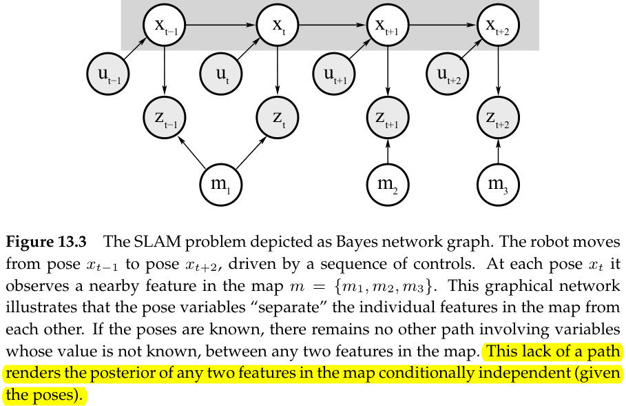
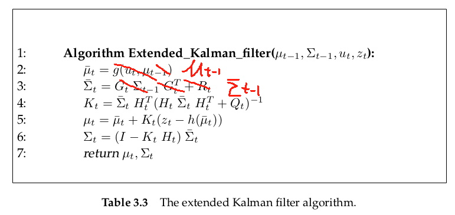
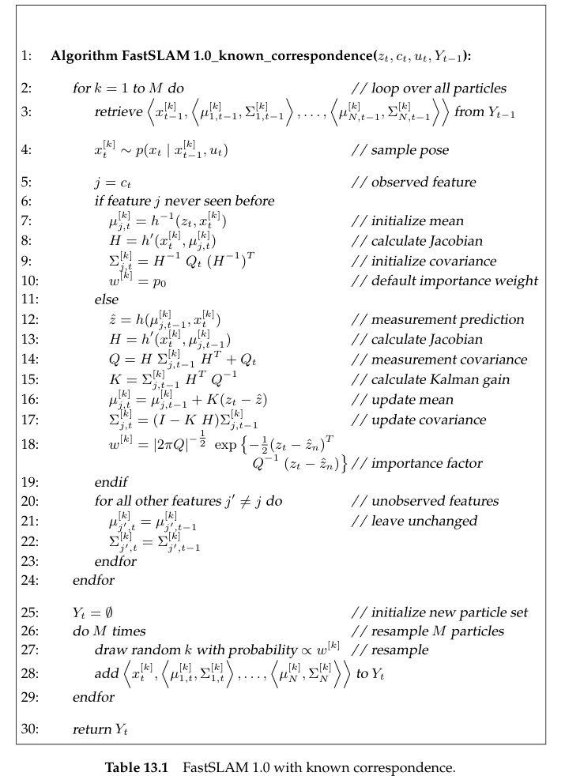

# The FastSLAM Algorithm

## Introduction

In this chapter, we will turn out attention to the particle filter approach to SLAM. This raise the question as to whether particle filters are applicable to the SLAM problem. **Unfortunately, whereas Gaussian scale between linearly and quadratically with the number of dimensions of the estimation problem, particle filters scale exponentially!**

The algorithm in this chapter is based on an important characteristic of the SLAM problem

- the full SLAM problem with known correspondences **possesses a conditional independence between any two disjoint sets of features in the map, given the robot pose**. Put differently, if an oracle told us the true robot path, we could estimate the location of all features independently of each other. **Dependencies among features in these estimates arise only through robot pose uncertainty**.

This structural observation will make it possible to apply a version of particle filters to SLAM known as *Rao-Blackwellized particle filters*.

**FastSLAM**

- **FastSLAM uses particle filters for estimating the robot path.** 

- for each of these particles the individual map errors are **conditionally independent**. Hence the mapping problem can be factored into many separate problems, one for each feature in the map.
- FastSLAM **estimates these map features locations by EKFs**, but using a separate low-dimensional EKF for each individual feature. 

The key advantages of FastSLAM

- it stems from the fact that data association decisions can be made on **per-particle** basis. As a result, the filter maintains posteriors over multiple data associations, not just the most likely one. The ability to pursue multiple data associations simultaneously make FastSLAM significantly more robust to data association problems than algorithms based on incremental maximum likelihood data association.
- Particle filters can cope with non-linear robot motion models, whereas previous techniques approximate such models via linear functions

## FastSLAM Algorithm with Known Correspondence

The SLAM posterior can be factored into 
$$
\begin{split}
p(y_{1:t}|z_{1:t},u_{1:t},c_{1:t}) &= p(x_{1:t}|z_{1:t},u_{1:t},c_{1:t})p(m|x_{1:t},z_{1:t},c_{1:t})\\
&= p(x_{1:t}|z_{1:t},u_{1:t},c_{1:t})\prod_{n=1}^N p(m_n|x_{1:t},c_{1:t},z_{1:t})
\end{split}
$$
Above we mention a characteristic of the SLAM problem

> the full SLAM problem with known correspondences **possesses a conditional independence between any two disjoint sets of features in the map, given the robot pose**.

which means that the conditional probability could be factored into 
$$
p(m|x_{1:t},z_{1:t},c_{1:t}) = \prod_{n=1}^N p(m_n|x_{1:t},c_{1:t},z_{1:t})
$$
and we are going to prove that

### Mathematical Derivation of the Factored SLAM Posterior(the Prove of the Conditional Independence)

We firstly use Bayes rules to factor the posterior
$$
p(m|x_{1:t},z_{1:t},c_{1:t}) = \frac{p(z_t|m,x_{1:t},c_{1:t},z_{1:t-1})p(m|x_{1:t},c_{1:t},z_{1:t-1})}{p(z_t|x_{1:t},c_{1:t},z_{1:t-1})}
$$
for $p(z_t|m,x_{1:t},c_{1:t},z_{1:t-1})$, according to the Markov, we have
$$
p(z_t|m,x_{1:t},c_{1:t},z_{1:t-1}) = p(z_t|m,x_t,c_t)
$$
according to the above graph, one observation $z_t$ only correspond to one map feather $m_{c_t}$ (we assume one observation correspond to one feather for simplicity) for which we have
$$
p(z_t|m,x_{1:t},c_{1:t},z_{1:t-1}) = p(z_t|m,x_t,c_t) = p(z_t|m_{c_t},x_t,c_t)
$$
for $p(m|x_{1:t},c_{1:t},z_{1:t-1})$, we estimate the feather map through the observation $z_t$ with the current pose $x_t$. But now current observation $z_t$ is absent for which the current pose $x_t$ is worthless.
$$
p(m|x_{1:t},c_{1:t},z_{1:t-1}) = p(m|x_{1:t-1},c_{1:t-1},z_{1:t-1})
$$
so
$$
\begin{split}
p(m|x_{1:t},z_{1:t},c_{1:t}) &= \frac{p(z_t|m,x_{1:t},c_{1:t},z_{1:t-1})p(m|x_{1:t},c_{1:t},z_{1:t-1})}{p(z_t|x_{1:t},c_{1:t},z_{1:t-1})}\\
&= \frac{p(z_t|m,x_{t},c_{t})p(m|x_{1:t-1},c_{1:t-1},z_{1:t-1})}{p(z_t|x_{1:t},c_{1:t},z_{1:t-1})}\\
\end{split}
$$
Now we will use mathematical induction(数学归纳法) to prove $p(m|x_{1:t},z_{1:t},c_{1:t}) = \prod_{n=1}^N p(m_n|x_{1:t},c_{1:t},z_{1:t})$

we assume that the posterior at time $t-1$ is already factored
$$
p(m|x_{1:t-1},z_{1:t-1},c_{1:t-1}) = \prod_{n=1}^N p(m_n|x_{1:t-1},c_{1:t-1},z_{1:t-1})
$$
**This statement is trivially true for $t=1$, since in the beginning of time the robot has no knowledge about any feature; hence all estimates must be independent.**

Now for each one of the feather $m_n$, we will consider the following two situations

1. observation **at time t** $z_t$ that is not correspond to the feature $m_n$ ($c_t\neq n$)

   we have 
   $$
   p(m_n|x_{1:t},c_{1:t},z_{1:t}) = p(m_n|x_{1:t-1},c_{1:t-1},z_{1:t-1})
   $$
   since we estimate the feather $m_n$ through the observation $z_t$ with the current pose $x_t$. But now current observation $z_t$ is not correspond to $m_n$, so the observation $z_t$ is nonvalid. 

2. observation **at time t** $z_t$ that is correspond to the feature $m_n$ ($c_t= n$)

   we have
   $$
   \begin{split}
   p(m_n|x_{1:t},c_{1:t},z_{1:t}) &= p(m_{c_t}|x_{1:t},c_{1:t},z_{1:t})\\
   &= \frac{p(z_t|m_{c_t},x_{1:t},c_{1:t},z_{1:t-1})p(m_{c_t}|x_{1:t},c_{1:t},z_{1:t-1})}{p(z_t|x_{1:t},c_{1:t},z_{1:t-1})}\\
   &= \frac{p(z_t|m_{c_t},x_{t},c_{t})p(m_{c_t}|x_{1:t-1},c_{1:t-1},z_{1:t-1})}{p(z_t|x_{1:t},c_{1:t},z_{1:t-1})}
   \end{split}
   $$
   inversing this equation, we have
   $$
   \begin{split}
   p(m_{c_t}|x_{1:t-1},c_{1:t-1},z_{1:t-1})&= \frac{p(z_t|x_{1:t},c_{1:t},z_{1:t-1})}{p(z_t|m_{c_t},x_{t},c_{t})}p(m_n|x_{1:t},c_{1:t},z_{1:t}) 
   
   \end{split}
   $$

Now the posterior at time $t-1$ can be written as
$$
\begin{split}
p(m|x_{1:t-1},z_{1:t-1},c_{1:t-1}) &= \prod_{n=1}^N p(m_n|x_{1:t-1},c_{1:t-1},z_{1:t-1})\\
&= \bigg[\prod_{n\neq c_t}p(m_n|x_{1:t-1},c_{1:t-1},z_{1:t-1})\bigg] \cdot \bigg[\prod_{n= c_t}p(m_n|x_{1:t-1},c_{1:t-1},z_{1:t-1})\bigg] \\
&= \bigg[\prod_{n\neq c_t}p(m_n|x_{1:t},c_{1:t},z_{1:t})\bigg] \cdot  \frac{p(z_t|x_{1:t},c_{1:t},z_{1:t-1})}{p(z_t|m_{c_t},x_{t},c_{t})}p(m_n|x_{1:t},c_{1:t},z_{1:t}) \\
&= \frac{p(z_t|x_{1:t},c_{1:t},z_{1:t-1})}{p(z_t|m_{c_t},x_{t},c_{t})}\prod_{n=1 }^Np(m_n|x_{1:t},c_{1:t},z_{1:t})
\end{split}
$$
Substitute back to $p(m|x_{1:t},z_{1:t},c_{1:t})=\frac{p(z_t|m,x_{t},c_{t})p(m|x_{1:t-1},c_{1:t-1},z_{1:t-1})}{p(z_t|x_{1:t},c_{1:t},z_{1:t-1})}$
$$
\begin{split}
p(m|x_{1:t},z_{1:t},c_{1:t}) 
&= \frac{p(z_t|m,x_{t},c_{t})}{p(z_t|x_{1:t},c_{1:t},z_{1:t-1})}p(m|x_{1:t-1},c_{1:t-1},z_{1:t-1})\\
&= \frac{p(z_t|m,x_{t},c_{t})}{p(z_t|x_{1:t},c_{1:t},z_{1:t-1})}\frac{p(z_t|x_{1:t},c_{1:t},z_{1:t-1})}{p(z_t|m_{c_t},x_{t},c_{t})}\prod_{n=1 }^Np(m_n|x_{1:t},c_{1:t},z_{1:t})\\
&= \prod_{n=1 }^Np(m_n|x_{1:t},c_{1:t},z_{1:t})
\end{split}
$$

### FastSLAM with Known Data Association

FastSLAM exploits the factored representation by maintaining $MN+1$ filters

- 1 particle filter for estimating the path posterior $p(x_{1:t}|z_{1:t},u_{1:t},c_{1:t})$
- we have $N$ features. each feather is represented by $M$ particles and each particle is used by EKF to estimate

As noted, FastSLAM estimates the path posterior using a particle filter. The map feature locations are estimated using EKFs. **Each individual EKF is conditioned on a robot path.**

*Particles* in FastSLAM will be denoted
$$
Y_t^{[k]} = \bigg< x_t^{[k]},\mu_{1,t}^{[k]}, \Sigma_{1,t}^{[k]},\ldots ,\mu_{N,t}^{[k]},\Sigma_{N,t}^{[k]} \bigg>
$$

- the bracketed notation $[k]$ indicates the index of the particle
- $x_t^{[k]}$ is the path estimate of the robot
- $\mu_{n,t}^{[k]}$ and $\Sigma_{n,t}^{[k]}$ are the mean and variance of the Gaussian representing the $n$-th feature location, relative to the $k$-th particle.

#### Steps of FastSLAM 1.0

1. **Extending the path posterior by sampling new poses**

   FastSLAM 1.0 uses the control $u_t$ to sample new robot pose $x_t$ **for each particle in $Y_{t-1}$.**
   $$
   x_t^{[k]} \quad \mathrm{sample\space from\quad } p(x_t|x_{t-1}^{[k]},u_t)
   $$
   The resulting sample $x_t^{[k]}$ is then added to a **temporary** set of particles, along with the path of previous poses, $x_{1:t-1}^{[k]}$

2. **Updating the observed feature estimate**

   the feature estimates are represented by the mean $\mu_{n,t-1}^{[k]}$ and the covariance $\Sigma_{n,t-1}^{[k]}$. The updated values are then added to the **temporary** particle set, along with the new pose.

   The exact update equation depends on whether or not a feature $m_n$ was observed at time $t$. 

   - for $n\neq c_t$ 
     $$
     \begin{split}
     p(m_n|x_{1:t},c_{1:t},z_{1:t}) &= p(m_n|x_{1:t-1},c_{1:t-1},z_{1:t-1}) 
     \\ &\downarrow \\
     \bigg<\mu_{n,t}^{[k]},\Sigma_{n,t}^{[k]}\bigg>
     &=
     \bigg<\mu_{n,t-1}^{[k]},\Sigma_{n,t-1}^{[k]}\bigg>
     \end{split}
     $$

   - for $n=c_t$

     using EKF to update the feature estimate. **Note that we are new estimating position of feature**, analogying it to estimation of pose.

     model it as an EKF problem
     $$
     \begin{cases}
     m_{c_t}^{t+1} = f(m_{c_t}^t,u_t)+\sigma_t\\
     z_{t+1} = h(m_{c_t}^{t+1},x_{t+1})+\varepsilon_t
     \end{cases}
     $$
     **Since the position of feature $m_{c_t}$ is fixed, the value of equation $m_{c_t}^{t+1} = f(m_{c_t}^t,u_t)+\sigma_t$ is changeless no wonder what $u_t$ is and how the pose $x_t$ changes. ** So we can directly use $m_{c_t}^t$ as the result of control prediction.
     $$
     \bar{\mu}_{n,t}^{[k]} = \mu_{n,t-1}^{[k]}\\
     \bar{\Sigma}_{n,t}^{[k]} = \Sigma_{n,t-1}^{[k]}\\
     $$
     

     **measurement update step**
     $$
     \begin{split}
     h(m_{c_t},x_t^{[k]}) &\approx \underbrace{h(\mu_{c_t,t-1}^{[k]},x_t^{[k]})}_{=:\hat{z}_t^{[k]}}+\frac{\partial}{\partial m_{c_t}}\underbrace{h(x_t^{[k]},\mu_{c_t,t-1}^{[k]})}_{=:H_t^{[k]}}(m_{c_t}-\mu_{c_t,t-1}^{[k]})\\
     &= \hat{z}_t^{[k]}+H_t^{[k]}(m_{c_t}-\mu_{c_t,t-1}^{[k]})\\
     &\downarrow \\
     K_t^{[k]} &= \Sigma_{c_t,t-1}^{[k]}H_t^{[k]T}(H_t^{[k]}\Sigma_{c_t,t-1}^{[k]}H_t^{[k]T}+Q_t)^{-1}\\
     \mu_{c_t,t}^{[k]} &= \mu_{c_t,t-1}^{[k]}+K_t^{[k]}(z_t-\hat{z}_t^{[k]})\\
     \Sigma_{c_t,t}^{[k]}&= (I-K_t^{[k]}H_t^{[k]})\Sigma_{c_t,t-1}^{[k]}
     \end{split}
     $$

3. **Resampling**

   The necessity to resample arise from the fact that the particles **in the temporary set are not distributed according to the desired posterior: Step 1 generates poses $x_t$ only in accordance with the most recent control $u_t$, paying no attention to the measurement $z_t$**. Resampling is the commom technique in particle filtering to correct for such mismatches.

   - target distribution
     $$
     p(x_{1:t}^{[k]}|z_{1:t},u_{1:t},c_{1:t})
     $$

   - proposal distribution
     $$
     \begin{split}
     p(x_{1:t}^{[k]}|z_{1:t-1},u_{1:t},c_{1:t-1}) &= p(x_{t}^{[k]}|x_{1:t-1}^{[k]},z_{1:t-1},u_{1:t},c_{1:t-1})p(x_{1:t-1}^{[k]}|z_{1:t-1},u_{1:t},c_{1:t-1})\\
     &\xlongequal[]{\mathrm{Markov}} p(x_{t}^{[k]}|x_{t-1}^{[k]},u_{t})p(x_{1:t-1}^{[k]}|z_{1:t-1},u_{1:t-1},c_{1:t-1})\\
     
     \end{split}
     $$

   - weight
     $$
     \begin{split}
     w_t^{[k]} &= \frac{\mathrm{target\space distribution}}{\mathrm{proposal\space distribution}}\\
     &= \frac{p(x_{1:t}^{[k]}|z_{1:t},u_{1:t},c_{1:t})}{p(x_{1:t}^{[k]}|z_{1:t-1},u_{1:t},c_{1:t-1})}\\
     &= \frac{\eta p(z_t|x_t^{[k]},c_t)p(x_{1:t}^{[k]}|z_{1:t-1},u_{1:t},c_{1:t-1})}{p(x_{1:t}^{[k]}|z_{1:t-1},u_{1:t},c_{1:t-1})}\\
     &= \eta p(z_t|x_t^{[k]},c_t)
     \end{split}
     $$
     the weight could be approximated as
     $$
     w_t^{[k]}\approx \eta|2\pi Q_t^{[k]}|^{-\frac{1}{2}}\exp\{-\frac{1}{2}(z_t-\hat{z}_t^{[k]})^TQ_t^{[k]-1}(z_t-\hat{z}_t^{[k]}) \}\\
     with \quad Q_t^{[k]} = H_t^{[k]T}\Sigma_{n,t-1}^{[k]}H_t^{[k]}+Q_t
     $$
     mathematical derivation
     $$
     \begin{split}
     w_t^{[k]} &= \eta p(z_t|x_t^{[k]},c_t) = \eta\int p(z_t|m_{c_t},x_t^{[k]},c_t)p(m_{c_t}|x_t^{[k]},c_t) dm_{c_t}\\
     &= \eta\int p(z_t|m_{c_t},x_t^{[k]},c_t)\underbrace{p(m_{c_t}|x_{1:t}^{[k]},z_{1:t-1},c_t) }_{\mathrm{reverse\space Markov}}dm_{c_t}\\
     &\approx \eta\int p(z_t|m_{c_t},x_t^{[k]},c_t)\underbrace{p(m_{c_t}|x_{1:t-1}^{[k]},z_{1:t-1},c_t) }_{\mathcal{N}(\mu_{c_t,t-1}^{[k]},\Sigma_{c_tt-1}^{[k]})}dm_{c_t}\\
     \end{split}
     $$
     $z_t$ is obtained from the observation function
     $$
     z_t = h(m_{c_t},x_t,c_t)+\varepsilon_t\\
     with \quad \varepsilon_t\sim\mathcal{N}(0,Q_t)
     $$
     we employs linear approximation with respective to $(\mu_{n,t-1}^{[k]},x_t^{[k]},m_{c_t})$
     $$
     \begin{split}
     h(m_{c_t},x_t^{[k]}) &\approx \underbrace{h(\mu_{c_t,t-1}^{[k]},x_t^{[k]})}_{=:\hat{z}_t^{[k]}}+\underbrace{\frac{\partial}{\partial m_{c_t}}h(x_t^{[k]},\mu_{c_t,t-1}^{[k]})}_{=:H_t^{[k]}}(m_{c_t}-\mu_{c_t,t-1}^{[k]})+\varepsilon_t\\
     &= \hat{z}_t^{[k]}+H_t^{[k]}(m_{c_t}-\mu_{c_t,t-1}^{[k]})+\varepsilon_t\\
     \end{split}
     $$
     since
     $$
     m_{c_t}\sim \mathcal{N}(\mu_{c_t,t-1}^{[k]},\Sigma_{c_t,t-1}^{[k]})\\
     H_t^{[k]}(m_{c_t}-\mu_{c_t,t-1}^{[k]})\sim\mathcal{N}(0,H_t^{[k]T}\Sigma^{[k]}_{n,t-1}H_t^{[k]})
     $$
     so
     $$
     \begin{split}
     p(z_t|m_{c_t},x_t^{[k]},c_t) &\sim \mathcal{N}(\hat{z}_t^{[k]},H_t^{[k]T}\Sigma^{[k]}_{n,t-1}H_t^{[k]}+Q_t)\\
     &= |2\pi Q_t^{[k]}|^{-\frac{1}{2}}\exp\{-\frac{1}{2}(z_t-\hat{z}_t^{[k]})^TQ_t^{[k]-1}(z_t-\hat{z}_t^{[k]}) \}
     \end{split}
     $$
     
     $$
     \begin{split}
     w_t^{[k]}
     &\approx \eta\int p(z_t|m_{c_t},x_t^{[k]},c_t)\underbrace{p(m_{c_t}|x_{1:t-1}^{[k]},z_{1:t-1},c_t) }_{\mathcal{N}(\mu_{c_t,t-1}^{[k]},\Sigma_{c_tt-1}^{[k]})}dm_{c_t}\\
     &\approx \eta \int |2\pi Q_t^{[k]}|^{-\frac{1}{2}}\exp\{-\frac{1}{2}(z_t-\hat{z}_t^{[k]})^TQ_t^{[k]-1}(z_t-\hat{z}_t^{[k]}) \}\cdot \mathcal{N}(m_{c_t};\mu_{c_t,t-1}^{[k]},\Sigma_{c_tt-1}^{[k]})dm_{c_t}\\
     &= \eta |2\pi Q_t^{[k]}|^{-\frac{1}{2}}\exp\{-\frac{1}{2}(z_t-\hat{z}_t^{[k]})^TQ_t^{[k]-1}(z_t-\hat{z}_t^{[k]}) \}\cdot  \underbrace{\int\mathcal{N}(m_{c_t};\mu_{c_t,t-1}^{[k]},\Sigma_{c_tt-1}^{[k]})dm_{c_t}}_{=1}\\
     &= \eta |2\pi Q_t^{[k]}|^{-\frac{1}{2}}\exp\{-\frac{1}{2}(z_t-\hat{z}_t^{[k]})^TQ_t^{[k]-1}(z_t-\hat{z}_t^{[k]}) \}
     \end{split}
     $$
   
   **why use $p(x_{1:t}^{[k]}|z_{1:t-1},u_{1:t},c_{1:t-1})$ as the proposal**
   
   Because it has the factor $p(x_{1:t-1}^{[k]}|z_{1:t-1},u_{1:t-1},c_{1:t-1})$ **which is the target distribution at last time $t-1$**
   
   1. firstly, we have the estimation at time $t-1$ which is distributed to
      $$
      x_{1:t-1}^{[k]}\sim p(x_{1:t-1}^{[k]}|z_{1:t-1},u_{1:t-1},c_{1:t-1})
      $$
   
   2. sample from $p(x_{t}^{[k]}|x_{1:t-1}^{[k]},z_{1:t-1},u_{1:t},c_{1:t-1})=p(x_{t}^{[k]}|x_{t-1}^{[k]},u_{t})$ **which is conditioned on $x_{1:t-1}^{[k]}$**. This condition is very important. The reason for $x_{t}^{[k]}$ distributed on the product of $p(x_{t}^{[k]}|x_{t-1}^{[k]},u_{t})$ and $p(x_{1:t-1}^{[k]}|z_{1:t-1},u_{1:t-1},c_{1:t-1})$ is that $p(x_{t}^{[k]}|x_{t-1}^{[k]},u_{t})$ is conditioned on $x_{1:t-1}^{[k]}$
      $$
      x_{t}^{[k]}\sim p(x_{t}^{[k]}|x_{t-1}^{[k]},u_{t})p(x_{1:t-1}^{[k]}|z_{1:t-1},u_{1:t-1},c_{1:t-1})
      $$
   
   3. resample according to the weight **which is conditioned on $x_{t}^{[k]}$**
      $$
      \begin{split}
      x_t^{[k]} &\sim \eta p(z_t|x_t^{[k]},c_t)p(x_{t}^{[k]}|x_{t-1}^{[k]},u_{t})p(x_{1:t-1}^{[k]}|z_{1:t-1},u_{1:t-1},c_{1:t-1})\\
      &= p(x_{1:t}^{[k]}|z_{1:t},u_{1:t},c_{1:t})
      \end{split}
      $$
      

## FastSLAM 2.0: Improving the Proposal Distribution

FastSLAM 2.0 is largely equivalent to FastSLAM 1.0, with one important exception: Its proposal distribution takes the measurement $z_t$ into account, when sampling the pose $x_t$. By doing so it can overcome a key limitation of FastSLAM 1.0

### Extending the Path Posterior by Sampling a New Pose

In FastSLAM 2.0, the pose $x_t^{[k]}$ is drawn from the posterior
$$
x_t^{[k]} \sim p(x_t|x_{1:t-1}^{[k]},u_{1:t},z_{1:t},c_{1:t})
$$
this formula can also be factored into
$$
p(x_t|x_{1:t-1}^{[k]},u_{1:t},z_{1:t},c_{1:t}) = \eta^{[k]}\int \underbrace{p(z_t|m_{c_t},x_t,c_t)}_{\sim \mathcal{N}(z_t;h(m_{c_t},x_t),Q_t)}\space \underbrace{p(m_{c_t}|x_{1:t-1}^{[k]},z_{1:t-1},c_{1:t-1})}_{\sim\mathcal{N}(m_{c_t};\mu_{c_t,t-1}^{[k]},\Sigma_{c_t,t-1}^{[k]})}dm_{c_t}\cdot \underbrace{p(x_t|x_{t-1}^{[k]},u_t)}_{\sim\mathcal{N}(x_t;g(x_{t-1}^{[k]}),R_t)}
$$
with
$$
\eta^{[k]}=\frac{1}{p(z_t|x_{1:t-1}^{[k]},u_{1:t},z_{1:t-1},c_{1:t})}
$$
we can use Taylor expansion to linearize $h(m_{c_t},x_t)$ which is similar to **Resampling step in FastSLAM 1.0**. You can refer to page 452 for detailed process.

### Updating the Observed Feature Estimate

$$
p(m_{c_t}|x_t^{[k]},c_{1:t},z_{1:t}) = \eta\space \underbrace{p(z_t|m_{c_t},x_t^{[k]},c_t)}_{\sim\mathcal{N}(z_t;h(m_{c_t},x_t^{[k]}),Q_t)}\space \underbrace{p(m_{c_t}|x_{1:t-1}^{[k]},z_{1:t-1},c_{1:t-1})}_{\sim\mathcal{N}(m_{c_t};\mu_{c_t,t-1}^{[k]},\Sigma_{c_t,t-1}^{[k]})}
$$

similar to **Updating the observed feature estimate step in FastSLAM 1.0**
$$
\begin{split}
h(m_{c_t},x_t^{[k]}) &\approx \underbrace{h(\mu_{c_t,t-1}^{[k]},x_t^{[k]})}_{=:\hat{z}_t^{[k]}}+\frac{\partial}{\partial m_{c_t}}\underbrace{h(x_t^{[k]},\mu_{c_t,t-1}^{[k]})}_{=:H_t^{[k]}}(m_{c_t}-\mu_{c_t,t-1}^{[k]})\\
&= \hat{z}_t^{[k]}+H_t^{[k]}(m_{c_t}-\mu_{c_t,t-1}^{[k]})\\
&\downarrow \\
K_t^{[k]} &= \Sigma_{c_t,t-1}^{[k]}H_t^{[k]T}(H_t^{[k]}\Sigma_{c_t,t-1}^{[k]}H_t^{[k]T}+Q_t)^{-1}\\
\mu_{c_t,t}^{[k]} &= \mu_{c_t,t-1}^{[k]}+K_t^{[k]}(z_t-\hat{z}_t^{[k]})\\
\Sigma_{c_t,t}^{[k]}&= (I-K_t^{[k]}H_t^{[k]})\Sigma_{c_t,t-1}^{[k]}
\end{split}
$$

### Calculating Importance Factors

$$
\begin{split}
\mathrm{target\space distribution} &= p(x_t^{[k]}|z_{1:t},u_{1:t},c_{1:t})\\
\mathrm{proposal\space distribution} &= p(x_t^{[k]}|x_{1:t-1}^{[k]},z_{1:t},u_{1:t},c_{1:t})p(x_{1:t-1}^{[k]}|z_{1:t-1},u_{1:t-1},c_{1:t-1})
\end{split}
$$

$$
\begin{split}
w_t^{[k]} &= \frac{\mathrm{target\space distribution}}{\mathrm{proposal\space distribution}}\\
&\xlongequal[]{\mathrm{Bayes,\space Markov}} \eta p(z_t|x_{1:1}^{[k]},u_{1:t},z_{1:t-1},c_{1:t})
\end{split}
$$

Refer to page 456 for more details

