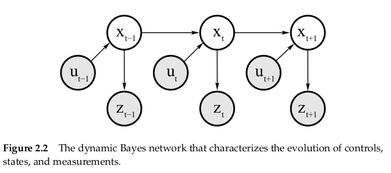
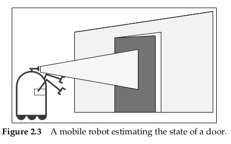
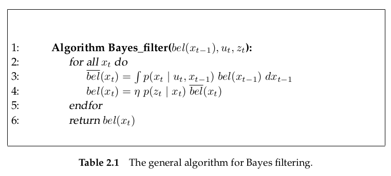

# Recursive State Estimation

## Basic concepts in probability

- conditional probability
  $$
  p(x|y) = \frac{p(x,y)}{p(y)}
  $$
  the factor $p(y)^{-1}$ is often denoted as $\eta$

  if X and Y are independent
  $$
  P(x|y)=\frac{p(x)p(y)}{p(y)}=p(x)
  $$

- conditional independence

  if X and Y are independent
  $$
  p(x,y|z)=p(x|z)p(y|z)\\
  p(x|z,y)=p(x|z)\\
  p(y|z,x)=p(y|z)
  $$
  p(x,y|z) means the joint probability of X and Y, conditioned on Z
  
  p(x|z,y) means the probability of x conditioned on joint event Z and Y
  
  p(y|z,x) means the probability of y conditioned on joint event Z and X
  
  derivation of $p(x|z,y)=p(x|z)$
  
  under the fact that $p(x,y|z)=p(x|z)p(y|z)$ if X and Y are independent
  $$
  p(z,y|z)=\frac{p(x,y,z)}{p(z)}\rightarrow p(x,y,z)=p(z)p(z,y|z)\\
  p(x|z,y)=\frac{p(x,y,z)}{p(y,z)}=\frac{p(x,y|z)p(z)}{p(y|z)p(z)}=\frac{p(x|z)p(y|z)p(z)}{p(y|z)p(z)}=p(x|z)
  $$
  **Conditional independence does not imply absolute independence**
  $$
  p(x,y|z)=p(x|z)p(y|z) \quad \nRightarrow \quad p(x,y)=p(x)p(y)
  $$
  The converse is also in general untrue: absolute independence does not imply conditional independence
  $$
  p(x,y)=p(x)p(y) \quad \nRightarrow \quad p(x,y|z)=p(x|z)p(y|z)
  $$

- Bayes rule

  Bayes rule relates a conditional of the type P(x|y) to its "inverse" p(y|x)
  $$
  p(x|y)=\frac{p(y|x)p(x)}{p(y)} = \frac{p(y|x)p(x)}{\sum_{x'}p(y|x')p(x')} \qquad (discrete)\\
  p(x|y)=\frac{p(y|x)p(x)}{p(y)} = \frac{p(y|x)p(x)}{\int_{x'}p(y|x')p(x')dx'} \qquad (continuous)
  $$
  the factor $p(y)^{-1}$ is always denoted as $\eta$

- entropy
  $$
  H_p(x)=E[-\log_2 p(x)] \rightarrow 
  \begin{cases}
  -\sum_x p(x)\log_2p(x) \quad (discrete)\\
  -\int p(x)\log_2 p(x) dx \quad (continuous)
  \end{cases}
  $$

## Robot Environment Interaction

the robot can acquire information about its environment using its sensors. The robot can also influence its environment through its actuators

### State

environments are characterized by state

state will be convenient to think of the state as the collection of all aspects of the robot and its environment that can impact the future

**state will be denoted $x$**

typical state variables: robot pose, robot manipulation, robot velocity and the velocities of its joints, the location and features of surrounding objects in the environment

#### complete state

a state $x_t$ will be called complete if it contains the knowledge of past states, measurements, or controls carry no additional information that would help us predict the future.

**completeness is commonly known as Markov property**

### Environment Interaction

There are two fundamental types of interactions between a robot and its environment: **the robot can influence the state of its environment through its actuator, and it can gather information about the state through its sensors.**

summarize them into **control actions **and **environment sensor measurements**

- **environment sensor measurements**
  **perception**: perception is the process by which the robot uses its sensors to obtain information about the state of its environment

  **measurement**: the result of such a perceptual interaction will be called a measurement, sometimes we also call it **observation** or **percept**

- **control actions**

  **control actions change the state of the world**

In accordance with the two types of environment interactions, the robot has access to **two different data streams**

- **environment measurement date**

  it provides information about a momentary state of the environment

  **the measurement data a time t will be denoted $z_t$**

  and the notation
  $$
  z_{t_1:t_2} = z_{t_1},z_{t_1+1},z_{t_1+2},...,z_{t_2}
  $$
  denotes the set of all measurements acquired from time $t_1$ to time $t_2$

- **control data**

  control data carry information about the **change of state** in the environment.

  **control data will be denoted $u_t$**

  also we have
  $$
  u_{t_1:t_2} = u_{t_1},u_{t_1+1},u_{t_1+2},...,u_{t_2}
  $$

### Probabilistic Generative Laws

at first glance, the emergence of state $x_t$ might be conditioned on all past states $x_{0:t-1}$, measurements $z_{1:t-1}$, and controls $u_{1:t-1}$ and **current control $u_t$**. So the state might given by a probability distribution of the following form
$$
p(x_t|x_{0:t-1},z_{1:t-1},u_{1:t})
$$
**if the state x is complete** which means that state x has the Markov property, **state $x_{t-1}$ has all information of all previous controls, measurements and state**. so the form above can be written as
$$
p(x_t|x_{0:t-1},z_{1:t-1},u_{1:t})=p(x_t|x_{t-1},u_t)
$$
the property expressed by this equality is an example of **conditional independence**. It states that certain variables are independent of others if one knows the values of a third group of variables, the conditioning variables.

based on the state completeness, the evolution of controls, states, and measurements can be modeled as dynamic Bayes network like the picture above

It means that current state $x_t$ is generated by last time state $x_{t-1}$ and current control action $u_t$. current measurement is generated by current state $x_t$

- **state transition probability**

  the probability
  $$
  p(x_t|x_{0:t-1},z_{1:t-1},u_{1:t})=p(x_t|x_{t-1},u_t)
  $$
  is called state transition probability. it is the function of current robot control $u_t$. and it is a probability distribution, not a deterministic function.

- **measurement probability**

  the probability
  $$
  p(z_t|x_{0:t},z_{1:t-1},u_{1:t})=p(z_t|x_t)
  $$
  is called the measurement probability. 

The state transition probability and the measurement probability together describe dynamical stochastic system of the robot and its environment. **Such a temporal generative model is also known as hidden Markov model (HMM) or dynamic Bayes network**

### Belief Distributions

#### belief

a belief reflects the robot's internal knowledge about the of the environment. state cannot be measured directly, it should **be inferred from data gained by sensor**

for example, a mobile robot is estimating the state of a door. It can not directly measure the state of the door through sensor. It has to estimate the state of the door from the measurement data like distance and so on.

#### belief distribution

belief distributions are posterior probabilities over state variables conditioned on the available data
$$
bel(x_t)=p(x_t|z_{1:t},u_{1:t})
$$
according to the form, belief over state $x_t$ is that estimating the $x_t$ from the existing data $z_{1:t},u_{1:t}$

#### prediction

$$
\overline{bel}=p(x_t|z_{1:t-1},u_{1:t})
$$

it uses the past measurement $z_{1:t-1}$, past control action $u_{1:t-1}$ and current control action $u_t$ to predict the current state $x_t$

### Bayes Filters

calculate the belief distribution from measurement and control data. it is recursive

#### mathematical derivation

use induction(归纳法)

assume that we correctly initialize the prior belief $bel(x_0)$ at time $t=0$

based on Bayes rule, we have equation
$$
p(x|y,z)=\frac{p(y|x,z)p(x|z)}{p(y|z)}
$$
derivation
$$
p(x|y,z)=\frac{p(x,y,z)}{p(y,z)}=\frac{p(y|x,z)p(x,z)}{p(y|z)p(z)}=\frac{p(y|x,z)p(x|z)p(z)}{p(y|z)p(z)}=\frac{p(y|x,z)p(x|z)}{p(y|z)}
$$
so
$$
\begin{split}
bel(x_t)=p(x_t|z_{1:t},u_{1:t})&=\frac{p(z_t|x_t,z_{1:t-1},u_{1:t})p(x_t|z_{1:t-1},u_{1:t})}{p(z_t|z_{1:t-1},u_{1:t})}\\
&= \eta \space p(z_t|x_t,z_{1:t-1},u_{1:t})p(x_t|z_{1:t-1},u_{1:t})
\end{split}
$$
because of the state completeness
$$
p(z_t|x_t,z_{1:t-1},u_{1:t})=p(z_t|x_t)
$$
so
$$
bel(x_t)=\eta\space p(z_t|x_t)p(x_t|z_{1:t-1},u_{1:t})=\eta \space p(z_t|x_t)\overline{bel}(x_t)
$$
then expand the term $\overline{bel}(x_t)$, using theorem of total probability
$$
\begin{split}
\overline{bel}(x_t)&=p(x_t|z_{1:t-1},u_{1:t})\\
&= \int_{x_{t-1}}p(x_t|x_{t-1},z_{1:t-1},u_{1:t})p(x_{t-1}|z_{1:t-1},u_{1:t})dx_{t-1}
\end{split}
$$
because of the state completeness
$$
p(x_t|x_{t-1},z_{1:t-1},u_{1:t})=p(x_t|x_{t-1},u_t)
$$

$$
\overline{bel}(x_t)
= \int_{x_{t-1}}p(x_t|x_{t-1},u_t)p(x_{t-1}|z_{1:t-1},u_{1:t})dx_{t-1}
$$

