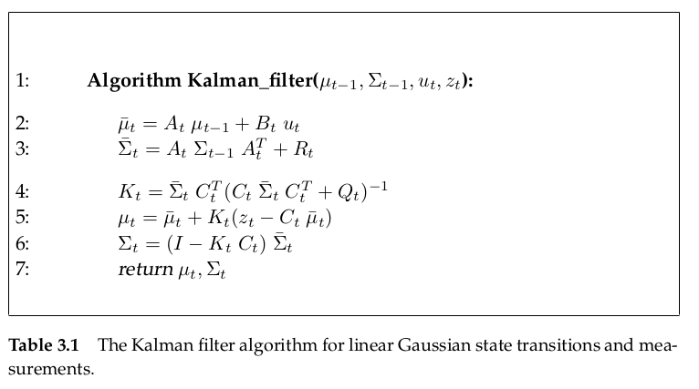
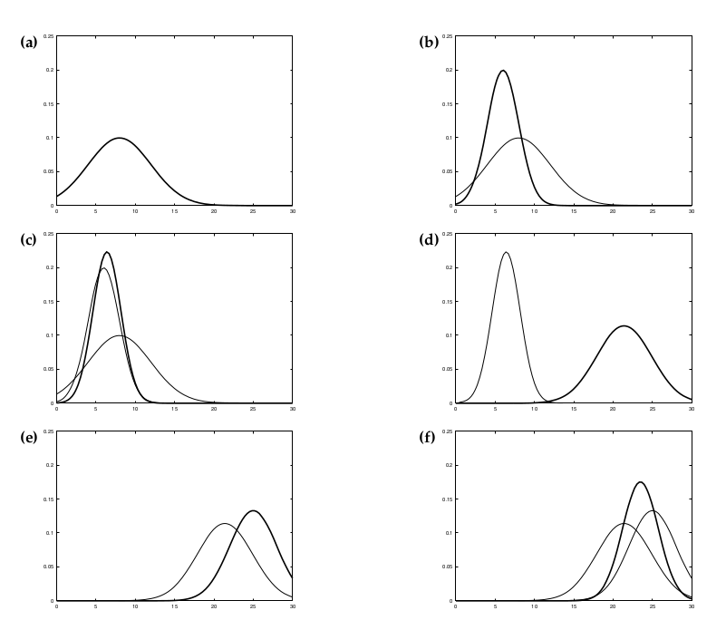
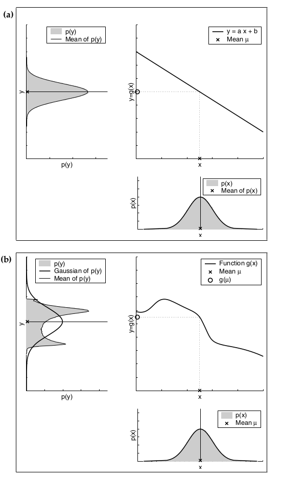
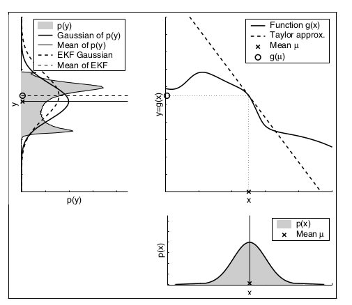
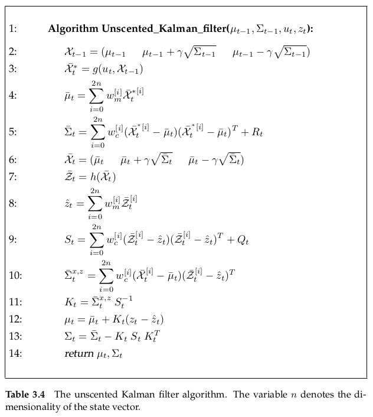
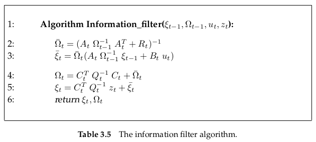
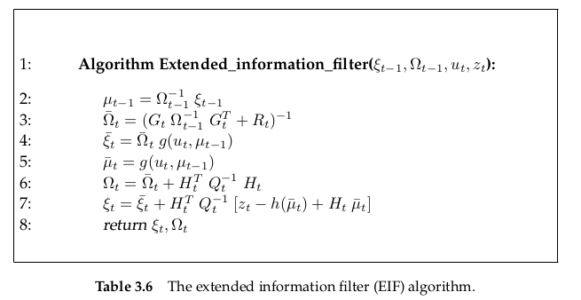

# Gaussian Filters

Gaussian Filters shares the basic idea that beliefs are represented by multivariate normal distributions.
$$
p(x)=\det (2\pi\Sigma)^{-\frac{1}{2}}\exp\{-\frac{1}{2}(x-\mu)^T\Sigma^{-1}(x-\mu)\}
$$

- the mean $\mu$ is a vector that possesses the same dimensionality as the state x
- the covariance is quadratic matrix that is **symmetric and positive-semidefinite**

## Kalman Filter

### Linear Gaussian System

Kalman filter implements belief computation in **linear Gaussian system**. 

**if the following three condition is satisfied, the posterior $bel(x_t)$ is always a Gaussian for any point in time t.**

- the state transition probability $p(x_t|u_t,x_{t-1})$ must be a linear function in its arguments with added Gaussian noise
  $$
  x_t = A_tx_{t-1}+B_tu_t+\varepsilon_t
  $$
  here
  $$
  x_t = \begin{bmatrix}
  x_{1,t}\\
  x_{2,t}\\
  \vdots\\
  x_{n,t}
  \end{bmatrix}
  \quad , \quad 
  u_t=\begin{bmatrix}
  u_{1,t}\\
  u_{2,t}\\
  \vdots\\
  u_{m,t}
  \end{bmatrix}
  \quad and \quad
  \varepsilon_t=\begin{bmatrix}
  \varepsilon_{1,t}\\
  \varepsilon_{2,t}\\
  \vdots\\
  \varepsilon_{n,t}
  \end{bmatrix}
  $$
  **the random variable $\varepsilon_t$ is a Gaussian random vector** that **models the uncertainty introduced by the state transition.** In other words, $\varepsilon_t$ is Gaussian noise. **Its mean is zero, and its covariance will be denoted $R_t$**

- the measurement probability $p(z_t|x_t)$ must also be linear in its arguments with added Gaussian noise
  $$
  z_t = C_tx_t+\delta_t
  $$
  the distribution of $\delta_t$ is a multivariate Gaussian with zero mean and covariance $Q_t$

- the initial belief $bel(x_0)$ must be normally distributed

### Kalman filter algorithm

### Illustration of Kalman filter

Suppose the robot moves along the horizontal axis in each diagram in Figure 3.2. Let the prior over the robot location be given by the normal distribution shown in Figure 3.2a. The robot queries its sensors on its location (e.g., a GPS system), and those return a measurement that is centered at the peak of the bold Gaussian in Figure 3.2b. This bold Gaussian illustrates this measurement: Its peak is the value predicted by the sensors, and its width (variance) corresponds to the uncertainty in the measurement. Combining the prior with the measurement, via lines 4 through 6 of the Kalman filter algorithm in Table 3.1, yields the bold Gaussian in Figure 3.2c. This belief’s mean lies between the two original means, and its uncertainty radius is smaller than both contributing Gaussians. The fact that the residual uncertainty is smaller than the contributing Gaussians may appear counter-intuitive, but it is a general characteristic of information
integration in Kalman filters. Next, assume the robot moves towards the right. Its uncertainty grows
due to the fact that the state transition is stochastic. Lines 2 and 3 of the Kalman filter provide us with the Gaussian shown in bold in Figure 3.2d. This Gaussian is shifted by the amount the robot moved, and it is also wider for the reasons just explained. The robot receives a second measurement illustrated by the bold Gaussian in Figure 3.2e, which leads to the posterior shown in bold in Figure 3.2f. As this example illustrates, the Kalman filter alternates a measurement update step (lines 5-7), in which sensor data is integrated into the present belief, with a prediction step (or control update step), which modifies the belief in accordance to an action. The update step decreases and the prediction step increases uncertainty in the robot’s belief.

### The Extended Kalman Filter

the assumption if Kalman filter is that it is a linear system. But the state transitions and measurements are rarely linear in practice. The extended Kalman filter relax that linear system assumption. Its assumption is that the state transition probability and measurement probabilities are governed by nonlinear functions g and h
$$
x_t = g(u_t,x_{t-1})+\varepsilon_t\\
z_t = h(x_t)+\delta_t
$$

the key idea of extended Kalman filter is linearizing the  state transition probability and measurement probability via Taylor Expansion

assume that function $g$ is expanded at point $(u_t,\mu_{t-1})$
$$
g(u_t,x_{t-1})\approx g(u_t,\mu_{t-1})+\underbrace{\frac{\partial g(u_t,\mu_{t-1})}{\partial x_{t-1}}}_{=: G_t}\space(x_{t-1}-\mu_{t-1})
$$

here $\mu_{t-1}$ is the mean of $x_{t-1}$. while expand the function at this point? I think he may think that random variable appear neat the mean with the great probability, like normal distribution.

here is a problem that why it only expand the function $g$ only for variable $x_{t-1}$ without $u_t$

another approximation is
$$
h(x_t) \approx h(\overline{\mu_t})+\underbrace{\frac{\partial h(x_t)}{\partial x_t}}_{=: H_t}(x_t-\overline{\mu}_t)
$$
The extended Kalman filter algorithm is as follow

### Unscented Kalman Filter

linear Kalman filter use the mean of last time $\mu_{t-1}$ to determine the prediction of next time mean $\overline{\mu}_t$. It can be realized that **one point** $\mu_{t-1}$ go through a linear function $x_t = A_tx_{t-1}+B_tu_t+\varepsilon_t$ to get the prediction mean $\overline{\mu}_t$

unscented Kalman Filter **use several points** go through the nonlinear function $g$ to get the prediction mean $\overline{\mu}_t$

1. choose the points at origin distribution

   the points are called sigma points $\chi^{[i]}$. for an $n$-dimensional Gaussian with mean $\mu$ and covariance $\Sigma$, $2n+1$ sigma points are always chosen. the choosing rule is as follow, which lead to that the sigma points are about $\mu$ symmtry.
   $$
   \begin{split}
   \chi^{[0]}_{t-1} &= \mu_{t-1}\\
   \chi^{[i]}_{t-1} &= \mu_{t-1}+\left(\sqrt{(n+\lambda)\Sigma_{t-1}}\right)\\
   \chi^{[i]}_{t-1} &= \mu_{t-1}-\left(\sqrt{(n+\lambda)\Sigma_{t-1}}\right)\\
   \end{split}
   $$
   here $\lambda=\alpha^2(n+\kappa)-n$, with $\alpha$ and $\kappa$ being scaling parameters that determine how far the sigma points are spread from the mean.

2. pass the sigma points to nonlinear function $g$
   $$
   \mathcal{Y}^{[i]}_{t} = g(\chi^{[i]}_{t-1})
   $$

3. compute the prediction from mapped sigma points $\mathcal{Y}^{[i]}$. each sigma point $\chi^{[i]}$ has two weights associated with it. one weight $w_m^{[i]}$ is used when computing the mean, the other $w_c^{[i]}$ is used then recovering the covariance of Gaussian.
   $$
   \begin{split}
   w_m^{[0]} &= \frac{\lambda}{n+\lambda}\\
   w_c^{[0]} &= \frac{\lambda}{n+\lambda}+(1-\alpha^2+\beta)\\
   w_m^{[i]} &= w_c^{[i]} = \frac{1}{2(n+\lambda)}\qquad for \quad i=1,\ldots ,2n
   \end{split}
   $$
   computing the prediction
   $$
   \begin{split}
   \overline{\mu}_{t} &= \sum_{i=0}^{2n}w_m^{[i]}\mathcal{Y}^{[i]}_{t}\\
   \overline{\Sigma}_{t} &= \sum_{i=0}^{2n}w_c^{[i]}(\mathcal{Y}^{[i]}_{t}-\overline{\mu}_{t})(\mathcal{Y}^{[i]}_{t}-\overline{\mu}_{t})^T + R_t
   \end{split}
   $$
   $R_t$ is added to the sigma point covariance in order to model the additional prediction noise uncertainty

4. choose sigma points $\overline{\chi}^{[i]}_{t}$ in prediction distribution $(\overline{\mu}_{t},\overline{\Sigma}_{t})$

5. pass the sigma points $\overline{\chi}^{[i]}_{t}$ to nonlinear function $h$, resulting $\overline{\mathcal{Z}}^{[i]}_{t}=h(\overline{\chi}^{[i]}_{t})$

6. compute the measurement $\hat{z}$ with weight
   $$
   \hat{z}_{t}=\sum_{i=0}^{2n}w_m^{[i]}\overline{\mathcal{Z}}^{[i]}_{t}
   $$
   and its uncertainty $S_t$
   $$
   S_t = \sum_{i=0}^{2n}w_c^{[i]}(\overline{\mathcal{Z}}_t^{[i]}-\hat{z_t})(\overline{\mathcal{Z}}_t^{[i]}-\hat{z_t})^T+Q_t
   $$
   the $Q_t$ is the covariance matrix of the additive measurement noise

7. determines the cross-covariance between state and observation
   $$
   \overline{\Sigma}_t^{x,z} = \sum_{i=0}^{2n}(\overline{\mathcal{X}}_t^{[i]}-\overline{\mu}_t)(\overline{\mathcal{Z}}_t^{[i]}-\hat{z_t})^T
   $$

8. compute the Kalman gain $K_t$
   $$
   K_t = \bar{\Sigma}_t^{x,z}S_t^{-1}
   $$

9. update
   $$
   \mu_t = \bar{\mu}_t+K_t(z_t-\hat{z}_t)\\
   \Sigma_t = \bar{\Sigma}_t-K_tS_tK_t^T
   $$

## Information Filter

the key difference between the KF and the IF arises from the way the Gaussian belief is represented. Whereas in the Kalman filter family of algorithms, Gaussian are represented by their moments (mean $\mu$ and covariance $\Sigma$), information filters represented Gaussian in their canonical parameterization, information matrix $\Omega$ and information vector $\xi$
$$
\Omega = \Sigma^{-1}\\
\xi = \Sigma^{-1}\mu
$$
like Kalman filter, the information filter assumes that the state transition and measurement probabilities are linear.
$$
\begin{split}
x_t &= A_tx_{t-1}+B_tu_t+\varepsilon_t\\
z_t &= C_tx_t + \delta_t
\end{split}
$$

### The Extended Information Filter

the state transition probability and measurement probabilities are governed by nonlinear functions g and h

