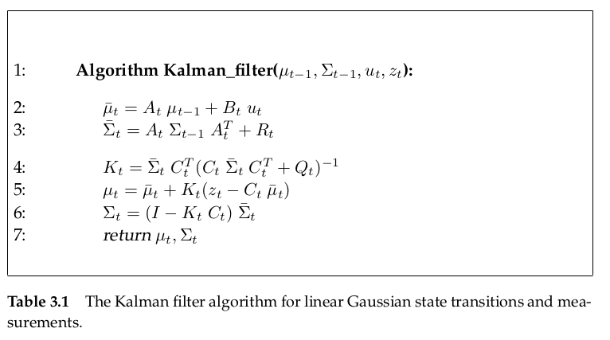
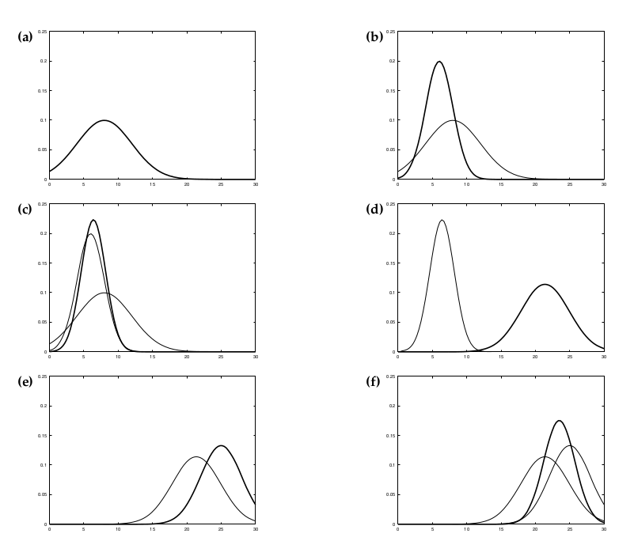
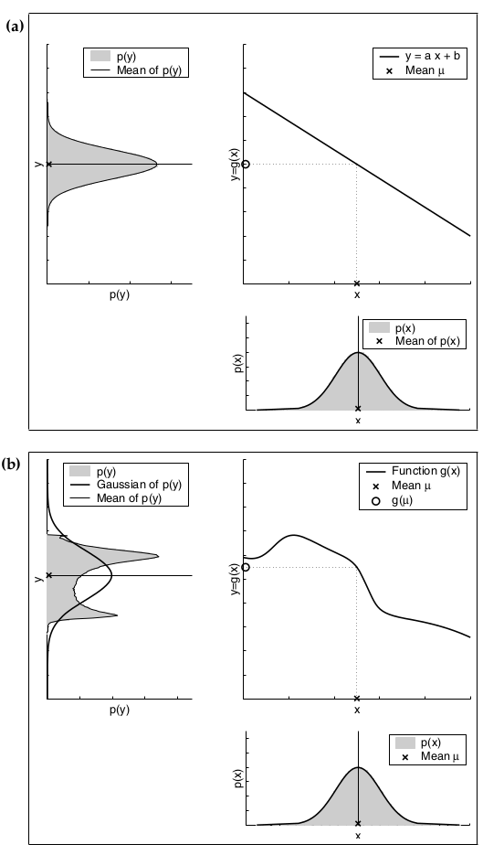

# Gaussian Filters

Gaussian Filters shares the basic idea that beliefs are represented by multivariate normal distributions.
$$
p(x)=\det (2\pi\Sigma)^{-\frac{1}{2}}\exp\{-\frac{1}{2}(x-\mu)^T\Sigma^{-1}(x-\mu)\}
$$

- the mean $\mu$ is a vector that possesses the same dimensionality as the state x
- the covariance is quadratic matrix that is **symmetric and positive-semidefinite**

## Kalman Filter

### Linear Gaussian System

Kalman filter implements belief computation in **linear Gaussian system**. 

**if the following three condition is satisfied, the posterior $bel(x_t)$ is always a Gaussian for any point in time t.**

- the state transition probability $p(x_t|u_t,x_{t-1})$ must be a linear function in its arguments with added Gaussian noise
  $$
  x_t = A_tx_{t-1}+B_tu_t+\varepsilon_t
  $$
  here
  $$
  x_t = \begin{bmatrix}
  x_{1,t}\\
  x_{2,t}\\
  \vdots\\
  x_{n,t}
  \end{bmatrix}
  \quad , \quad 
  u_t=\begin{bmatrix}
  u_{1,t}\\
  u_{2,t}\\
  \vdots\\
  u_{m,t}
  \end{bmatrix}
  \quad and \quad
  \varepsilon_t=\begin{bmatrix}
  \varepsilon_{1,t}\\
  \varepsilon_{2,t}\\
  \vdots\\
  \varepsilon_{n,t}
  \end{bmatrix}
  $$
  **the random variable $\varepsilon_t$ is a Gaussian random vector** that **models the uncertainty introduced by the state transition.** In other words, $\varepsilon_t$ is Gaussian noise. **Its mean is zero, and its covariance will be denoted $R_t$**

- the measurement probability $p(z_t|x_t)$ must also be linear in its arguments with added Gaussian noise
  $$
  z_t = C_tx_t+\delta_t
  $$
  the distribution of $\delta_t$ is a multivariate Gaussian with zero mean and covariance $Q_t$

- the initial belief $bel(x_0)$ must be normally distributed

### Kalman filter algorithm

### Illustration of Kalman filter

Suppose the robot moves along the horizontal axis in each diagram in Figure 3.2. Let the prior over the robot location be given by the normal distribution shown in Figure 3.2a. The robot queries its sensors on its location (e.g., a GPS system), and those return a measurement that is centered at the peak of the bold Gaussian in Figure 3.2b. This bold Gaussian illustrates this measurement: Its peak is the value predicted by the sensors, and its width (variance) corresponds to the uncertainty in the measurement. Combining the prior with the measurement, via lines 4 through 6 of the Kalman filter algorithm in Table 3.1, yields the bold Gaussian in Figure 3.2c. This belief’s mean lies between the two original means, and its uncertainty radius is smaller than both contributing Gaussians. The fact that the residual uncertainty is smaller than the contributing Gaussians may appear counter-intuitive, but it is a general characteristic of information
integration in Kalman filters. Next, assume the robot moves towards the right. Its uncertainty grows
due to the fact that the state transition is stochastic. Lines 2 and 3 of the Kalman filter provide us with the Gaussian shown in bold in Figure 3.2d. This Gaussian is shifted by the amount the robot moved, and it is also wider for the reasons just explained. The robot receives a second measurement illustrated by the bold Gaussian in Figure 3.2e, which leads to the posterior shown in bold in Figure 3.2f. As this example illustrates, the Kalman filter alternates a measurement update step (lines 5-7), in which sensor data is integrated into the present belief, with a prediction step (or control update step), which modifies the belief in accordance to an action. The update step decreases and the prediction step increases uncertainty in the robot’s belief.

## The Extended Kalman Filter

the assumption if Kalman filter is that it is a linear system. But the state transitions and measurements are rarely linear in practice. The extended Kalman filter relax that linear system assumption. Its assumption is that the state transition probability and measurement probabilities are governed by nonlinear functions g and h
$$
x_t = g(u_t,x_{t-1})+\varepsilon_t\\
z_t = h(x_t)+\delta_t
$$

the key idea of extended Kalman filter is linearizing the  state transition probability and measurement probability via Taylor Expansion

assume that function $g$ is expanded at point $(a,b)$
$$
g(u_t,x_{t-1})\approx g(a,b)+\mathbf{D}_{x_{t-1}}g(a,b)\space(x_{t-1})
$$

