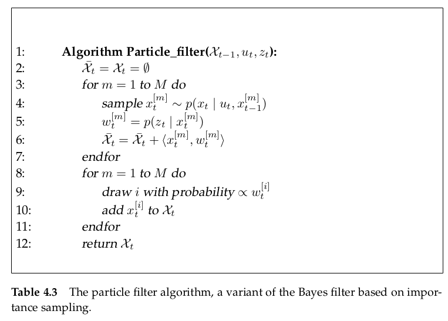

# Nonparametric Filter

Nonparametric filters do not rely on a fixed functional form of the posterior, such as Gaussian. Instead, they approximate posteriors by a finite number of values, each roughly corresponding to a region in state space. Some nonparametric Bayes filters rely on a decomposition of the state space, in which each such value corresponds to the cumulative probability of the posterior density in a compact subregion of the state space. Others approximate the state space by random samples drawn from the posterior distribution.

## Histogram Filter

**Histogram filters decompose the state space into finitely many regions and represent the cumulative posterior for each region by a single probability value. ** When applied to **finite spaces**, 

 such filter are known as discrete Bayes filters, when applied to **continuous spaces**, they are commonly called histogram filters.

### The Discrete Bayes Filter Algorithm

the belief at time t is an assignment of a probability to each state $x_k$, denoted $p_{k,t}$

### Continuous State

Histogram filter **decompose a continuous state space into finitely regions**
$$
\mathrm{dom}(X_t) = \mathbf{x}_{1,t} \cup \mathbf{x}_{2,t} \cup \ldots \cup \mathbf{x}_{K,t}
$$
**here $\mathbf{x}_{k,t}$ is a region**, notation $\mathrm{dom}$ is means of domain

for each $i \neq k$, we have $\mathbf{x}_{i,t} \cap \mathbf{x}_{k,t}$

after decomposing the continuous state space into finitely regions, **in each region, we approximate the probability of state $x_t$ in this region as a constant**
$$
p(x_t) = \mathrm{const}
$$
and the state transition probability and measurement probability can be approximated as
$$
\begin{split}
p(z_t|\mathbf{x}_{k,t}) &\approx p(z_t|\hat{x}_{k,t})\\
p(\mathbf{x}_{k,t}|u_t,\mathbf{x}_{k,t-1}) &\approx \eta |\mathbf{x}_{k,t}|p(\hat{x}_{k,t}|u_t,\hat{x}_{i,t-1})
\end{split}
$$
here
$$
\hat{x}_{k,t} = |\mathbf{x}_{k,t}|^{-1}\int_{\mathbf{x}_{k,t}} x_t \space \dd x_t
$$
**the meaning of the form $p(z_t|\mathbf{x}_{k,t}) \approx p(z_t|\hat{x}_{k,t})$ is that while a state $x_t$ fall in the region $\mathbf{x}_{k,t}$, the probability $p(z_t|x_t)$ in this region is approximated as a constant. We will choose a point to represent this region. so, we  choose the mean of this region $\hat{x}_{k,t} = |\mathbf{x}_{k,t}|^{-1}\int_{\mathbf{x}_{k,t}} x_t \space \dd x_t$ to represent this region.**

detailed derivation of histogram approximation is displayed at page 89 to page 91

noting, the meaning of $p(z_t|\mathbf{x}_{k,t})$ is that under the condition of state $x_t$ falling in the region $\mathbf{x}_{k,t}$, the probability of $z_t$ appearing. so the condition event is state $x_t$ falling in the region $\mathbf{x}_{k,t}$. that is why there is a integral at the beginning of derivation.
$$
\begin{split}
p(z_t|\mathbf{x}_{k,t}) &= \frac{p(z_t,\mathbf{x}_{k,t})}{p(\mathbf{x}_{k,t})}\\
&= \frac{\int_{\mathbf{x}_{k,t}}p(z_t,x_t)\space \dd x_t}{\int_{\mathbf{x}_{k,t}} p(x_t)\space \dd x_t}
\end{split}
$$

## Binary Bayes Filters with Static State

when the state is static, the belief is a function only of the measurements
$$
bel_t(x) = p(x|z_{1:t},u_{1:t}) = p(x|z_{1:t})
$$
if the state is binary, we have
$$
bel_t(x) = 1-bel_t(\lnot x)
$$
In binary Bayes filter with static state, we use log odds ratio to replace the belief
$$
l_t(x) := \log\frac{bel_t(x)}{1-bel_t(x)}
$$
the belief $bel_t(x)$ can be recovered from the log odds ratio 
$$
bel_t(x) = 1-\frac{1}{1+\exp\{l_t(x)\}}
$$
**so the update of belief can be changed into the update of log odds ratio**

detailed derivation is displayed at page 95 to 96.

the final iterator form is
$$
\begin{split}
l_t(x) &= \log\frac{p(x|z_t)}{1-p(x|z_t)}+\log\frac{p(x|z_{1:t-1})}{1-p(x|z_{1:t-1})}+\log\frac{1-p(x)}{p(x)}\\
&= \log\frac{p(x|z_t)}{1-p(x|z_t)}+l_{t-1}(x)+\log\frac{1-p(x)}{p(x)}
\end{split}
$$
here $p(x)$ is the prior probability of the state $x$

## The Particle Filter

[A fancy course about partial filter](https://www.youtube.com/watch?v=N7rH_VVtqRA)

Just like histogram filters, particle filters approximate the posterior by a finite number of number of parameters. The key idea of the particle filter is to **represent the posterior $bel(x_t)$ by a set of random state samples drawn from this posterior**. Such approximation is nonparametric and therefore can represent a much broader space of distributions. 

the samples of a posterior distribution are called *particles* and are denoted
$$
\mathcal{X}_t := x_t^{[1]},x_t^{[2]},\ldots,x_t^{[M]} \qquad \mathrm{with} \quad 1\leqslant m\leqslant M
$$
each particle $x_t^{[m]}$ is a concrete **instantiation** of the state at time $t$

**the likelihood(可能性) for a state hypothesis $x_t$ to be included in the particle set $\mathcal{X}_t$ shall be proportional(正比于) to its Bayes filter posterior $bel(x_t)$**
$$
x_t^{[m]} \sim p(x_t|z_{1:t},u_{1:t})
$$
**as a consequence of this, the denser(密集) a subregion of the state space is populated(填充) by samples, the more likely it is that the true state falls into this region.**

so as the lower right figures in the Figure 4.3

### Mathematical Derivation of the PF

By sampling, we convert the probability density to the particle density in sub-domain. By **important sampling**, we convert the particle density in sub-domain to the position and the corresponding weight. See [Monte Carlo Method](Monte_Carlo_Method.md).

**The target distribution in particle filter is posterior over all state sequences**
$$
\begin{split}
bel(x_{0:t}) &= p(x_{0:t}|u_{1:t},z_{1:t})\\
&\xlongequal[]{\mathrm{Bayes}} \eta p(z_t|x_{0:t},z_{1:t-1},u_{1:t})p(x_{0:t}|z_{1:t-1},u_{1:t})\\
&\xlongequal{\mathrm{Markov}} \eta p(z_t|x_t)p(x_{0:t}|z_{1:t-1},u_{1:t})\\
&= \eta p(z_t|x_t)p(x_t|x_{0:t-1},z_{1:t-1},u_{1:t})p(x_{0:t-1}|z_{1:t-1},u_{1:t})\\
&\xlongequal{\mathrm{Markov}} \eta p(z_t|x_t)p(x_t|x_{t-1},u_t)p(x_{0:t-1}|z_{1:t-1},u_{1:t-1})
\end{split}
$$
We set the proposal distribution which the particle are sampled from
$$
proposal = p(x_t|x_{t-1},u_t)bel(x_{0:t-1})=p(x_t|x_{t-1},u_t)p(x_{0:t-1}|z_{1:t-1},u_{1:t-1})
$$
the important weight is
$$
\begin{split}
w_t^{[m]} &= \frac{\mathrm{target\space distribution}}{\mathrm{proposal\space distribution}}\\
&= \frac{\eta p(z_t|x_t)p(x_t|x_{t-1},u_t)p(x_{0:t-1}|z_{1:t-1},u_{1:t-1})}{p(x_t|x_{t-1},u_t)p(x_{0:t-1}|z_{1:t-1},u_{1:t-1})}\\
&= \eta p(z_t|x_t)
\end{split}
$$
The most important point is **by resampling particles with probability proportional to $w_t^{[m]}$, the resulting particles are indeed distributed according to the product of the proposal and the importance weights $w_t^{[m]}$**
$$
w_t^{[m]}p(x_t|x_{t-1},u_t)p(x_{0:t-1}|z_{0:t-1},u_{0:t-1})=bel(x_{0:t})
$$

