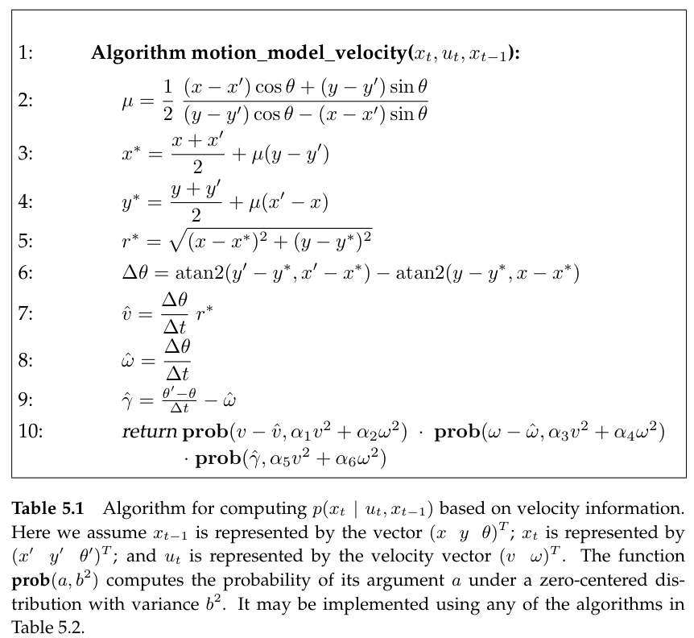
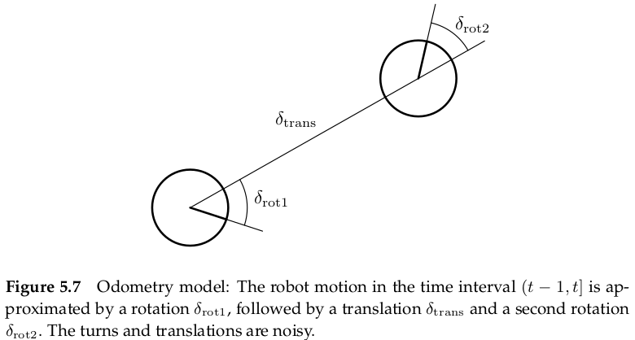
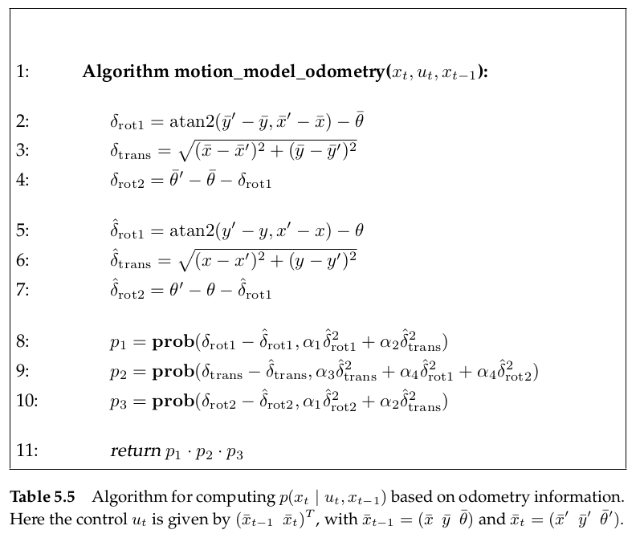
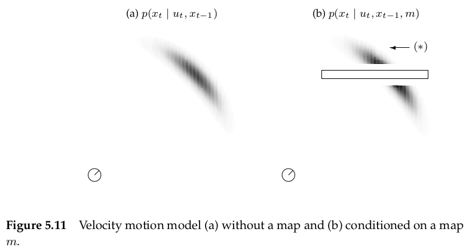

# Robot Motion

Motion models comprise the state transition probability $p(x_t|u_t,x_{t-1})$, which plays an essential role in the prediction step of the Bayes  filter. Robot kinematics has almost exclusively been addressed in deterministic form. Probabilistic robotics generalizes  kinematic equations to the fact  that  the outcome of the control is uncertain, due to the control noise or unmodeled exogenous effects. 

## Kinematic

Kinematic is the **calculus**(微积分) describing the effect of control actions on the  configuration of a robot. 

The configuration of a rigid mobile robot is commonly described **six variables**, its **three-dimensional Cartesian coordinates** and its **three Euler angles (roll, pitch, yaw)** relative to an external coordinate frame.

### Kinematic configuration in planar case

**In planar case**, the kinematic state is **summarized by three variables**, referred to as **pose**. The pose comprises its **two-dimensional planar coordinates relative to an external coordinate frame**, along with its **angular orientation(朝向)**. Denoting the two-dimensional planar coordinates as $x$ and $y$, and angular orientation by $\theta$.
$$
pose = \begin{bmatrix}
x\\
y\\
\theta
\end{bmatrix}
$$
As shown in figure, we postulate that a robot with  orientation $\theta=0$ points into the direction of its $x$-axis and a robot with orientation $\theta=0.5\pi$ points into the direction of its $y$-axis.

**pose without orientation will be called *location***
$$
location = \begin{bmatrix}
x\\
y
\end{bmatrix}
$$

### Probabilistic Kinematics Model

The model is the familiar conditional density
$$
p(x_t|u_t,x_{t-1})
$$
Here, **$x_t$  and $x_{t-1}$ are both robot poses (not just x-coordinates), and $u_t$ is a motion command**. This model describes the posterior distribution over kinematic states that a robot assumes when executing the motion command $u_t$  at $x_{t-1}$

for example

the distribution $p(x_t|u_t,x_{t-1})$ is visualized by the shaded area: the darker a pose, the more likely it is. In figure (a), a robot moves forward some distance, during which it may accrue translational and rotational error as indicated.

## Two specific probabilistic motion models

The first assumes that the motion data $u_t$ specifies the velocity commands given to the robot's motors. The second model assumes that one has access to odometry information.

In practice, odometry models tend to be more accurate than velocity models, for the simple reason that most commercial robots do not execute velocity commands with  the level of accuracy that can be obtained by measuring the revolution of the robot's wheels.(电动机执行命令的精度无法超过里程计测量轮子转速的精度)

**However, odometry is only available for getting information after executing a motion command**. Hence it cannot be used for motion planning. Planning algorithms such as collision avoidance have to predict the effects of motion. Thus, odometry models are usually applied for estimation, whereas velocity models are used for probabilistic motion planning.

### Velocity Motion Model

The *velocity motion model* assumes that we can **control** a robot through two velocities, **translational velocity and rotational velocity**. We denote the translational velocity at time t by $v_t$ and the rotational velocity by $\omega_t$
$$
u_t =\begin{bmatrix}
v_t\\
\omega_t
\end{bmatrix}
$$
we postulate that **positive rotational velocities $\omega_t$ induce a counterclockwise rotation**. **positive translational velocities $v_t$ correspond to forward motion**

The velocity motion model accepts as input an initial pose $x_{t−1} = (x,y,\theta)^T$ , a control $u_t = (v,\omega)^T$ , and a hypothesized successor pose $x_t = (x',y',θ')^T$ . It outputs the probability $p(x_t | u_t , x_{t−1} )$ of being at $x_t$ after executing control $u_t$ beginning in state $x_{t−1}$ , assuming that the control is carried out for the fixed duration $\Delta t$.

#### Mathematical Derivation of the Velocity Motion Model

##### Exact Motion without Noise

assuming that the initial pose is $x_{t-1}$
$$
x_{t-1}=\begin{bmatrix}
x\\
y\\
\theta
\end{bmatrix}
$$
the control command is 
$$
u_t = \begin{bmatrix}
v\\
\omega
\end{bmatrix}
$$
and **the translational velocities and rotational velocities keep a fixed value at the entire time $(t-1,t]$**

**so at time $(t-1,t]$, the trajectory of the robot is a circle**. the radius of the circle can be derived as follow
$$
v=\omega\cdot r\quad \rightarrow \quad  r=\left|\frac{v}{\omega}\right|
$$
the center of  the circle is at
$$
\begin{cases}
x_c = x-\frac{v}{\omega}\sin\theta\\
y_c = y+\frac{v}{\omega}\cos\theta
\end{cases}
$$
according to the trigonometry, the resulting pose $x_t$ is
$$
\begin{bmatrix}
x'\\y'\\ \theta'
\end{bmatrix}
=
\begin{bmatrix}
x_c+\frac{v}{\omega}\sin(\theta+\omega\Delta t)\\
y_c-\frac{v}{\omega}\cos(\theta+\omega\Delta t)\\
\theta+\omega\Delta t
\end{bmatrix}
=
\begin{bmatrix}
x\\y\\ \theta
\end{bmatrix}
+
\begin{bmatrix}
-\frac{v}{\omega}\sin\theta+\frac{v}{\omega}\sin(\theta+\omega\Delta t)\\
\frac{v}{\omega}\cos\theta-\frac{v}{\omega}\cos(\theta+\omega\Delta t)\\
\omega\Delta t
\end{bmatrix}
$$
**the  derivation is based on the assumption that both the velocities keep the fixed value the time $(t-1,t]$**. So, it is therefore common practice to use small values for $\Delta t$ to approximate the actual velocity by a constant within each time interval

##### Real Motion with Noise

In reality, robot motion is subject to noise. The actual velocities differ from the commanded ones. **We model this noise by a zero-centered random variable with  finite variance** and **assume the noise is additive.**
$$
\begin{bmatrix}
\hat{v}\\ \hat{\omega}
\end{bmatrix}
=
\begin{bmatrix}
v\\ \omega
\end{bmatrix}
+
\begin{bmatrix}
\varepsilon_{\alpha_1 v^2+\alpha_2\omega^2}\\
\varepsilon_{\alpha_3 v^2+\alpha_4\omega^2}
\end{bmatrix}
$$
**Here, $\varepsilon_{b^2}$ is a zero-mean error  variable with  variance $b^2$**

a better model of the actual pose $x_t=[x',y',\theta']^T$ after executing the motion command $u_t=[v,w]^T$ at $x_{t-1}=[x,y,\theta]^T$ is thus
$$
\begin{bmatrix}
x'\\y'\\ \theta'
\end{bmatrix}
=
\begin{bmatrix}
x\\y\\ \theta
\end{bmatrix}
+
\begin{bmatrix}
-\frac{\hat{v}}{\hat{\omega}}\sin\theta+\frac{\hat{v}}{\hat{\omega}}\sin(\theta+\hat{\omega}\Delta t)\\
\frac{\hat{v}}{\hat{\omega}}\cos\theta-\frac{\hat{v}}{\hat{\omega}}\cos(\theta+\hat{\omega}\Delta t)\\
\hat{\omega}\Delta t
\end{bmatrix}
$$
 so, the three-dimension pose is relevant to two-dimension noise. the book said **this degeneracy** has important ramifications when applying Bayes filters for state estimation.  therefore, to generalize the motion model accordingly, we will assume that the robot perform a rotation $\hat{\gamma}$ when it arrives at its final pose.
$$
\theta'=\theta+\hat{\omega}\Delta t+\hat{\gamma}\Delta t
$$
with
$$
\hat{\gamma}=\varepsilon_{\alpha_5v^2+\alpha_6\omega^2}
$$
Thus, the resulting motion model is as follows
$$
\begin{bmatrix}
x'\\y'\\ \theta'
\end{bmatrix}
=
\begin{bmatrix}
x\\y\\ \theta
\end{bmatrix}
+
\begin{bmatrix}
-\frac{\hat{v}}{\hat{\omega}}\sin\theta+\frac{\hat{v}}{\hat{\omega}}\sin(\theta+\hat{\omega}\Delta t)\\
\frac{\hat{v}}{\hat{\omega}}\cos\theta-\frac{\hat{v}}{\hat{\omega}}\cos(\theta+\hat{\omega}\Delta t)\\
\hat{\omega}\Delta t+\hat{\gamma}\Delta t
\end{bmatrix}
$$

##### Computation of $p(x_t|u_t,x_{t-1})$

$$
\begin{bmatrix}
x'\\y'\\ \theta'
\end{bmatrix}
=
\begin{bmatrix}
x\\y\\ \theta
\end{bmatrix}
+
\begin{bmatrix}
-\frac{\hat{v}}{\hat{\omega}}\sin\theta+\frac{\hat{v}}{\hat{\omega}}\sin(\theta+\hat{\omega}\Delta t)\\
\frac{\hat{v}}{\hat{\omega}}\cos\theta-\frac{\hat{v}}{\hat{\omega}}\cos(\theta+\hat{\omega}\Delta t)\\
\hat{\omega}\Delta t
\end{bmatrix}
$$

according to above equation, the resulting pose $x_t$ is relevant to $x,y,\theta,\Delta t,v,\omega \ldots$. But most of them are determined. Only $\hat{v},\hat{\omega},\hat{\gamma}$ are random variables. and
$$
\begin{bmatrix}
\hat{v}\\ \hat{\omega} \\ \hat{\gamma}
\end{bmatrix}
=
\begin{bmatrix}
v\\ \omega \\ \gamma
\end{bmatrix}
+
\begin{bmatrix}
\varepsilon_{\alpha_1 v^2+\alpha_2\omega^2}\\
\varepsilon_{\alpha_3 v^2+\alpha_4\omega^2}\\
\varepsilon_{\alpha_5 v^2+\alpha_6\omega^2}\\
\end{bmatrix}
$$
here, $v,\omega$ are determined and $\gamma=0$. So resulting pose $x_t$ is relevant to the three noise
$$
x_t \quad \sim \quad \begin{bmatrix}
\varepsilon_{\alpha_1 v^2+\alpha_2\omega^2}\\
\varepsilon_{\alpha_3 v^2+\alpha_4\omega^2}\\
\varepsilon_{\alpha_5 v^2+\alpha_6\omega^2}\\
\end{bmatrix}
$$
**since we assume independence between the different noise**, the desired probability $p(x_t|u_t,x_{t-1})$ is the product of these individual noise
$$
p(x_t|u_t,x_{t-1}) = \varepsilon_{\alpha_1v^2+\alpha_2\omega^2}\cdot \varepsilon_{\alpha_3v^2+\alpha_4\omega^2}\cdot \varepsilon_{\alpha_5v^2+\alpha_6\omega^2}
$$

the following is copied from book page 130

the robot travels with a fixed velocity during Δt, resulting in a circular trajectory. For a robot that moved from $x_{t−1} = (x,y,\theta)^T$ to $x_t = (x',y')^T$, the center of the circle is defined as $(x^*,y^*)^T$ and given by
$$
\begin{bmatrix}
x^*\\ y^*
\end{bmatrix}
= 
\begin{bmatrix}
x\\ y
\end{bmatrix}
+
\begin{bmatrix}
-\lambda\sin\theta\\
\lambda\cos\theta
\end{bmatrix}
=
\begin{bmatrix}
\frac{x+x'}{2}+\mu(y-y')\\
\frac{y+y'}{2}+\mu(x'-x)
\end{bmatrix}
$$
for some unknown $\lambda,\mu \in R$. The first equality is the result of the fact that the circle’s center is orthogonal to the initial heading direction of the robot; the second is a straightforward constraint that the center of the circle lies on a ray that lies on the half-way point between $(x,y)^T$ and $(x',y')^T$ and is orthogonal to the line between these coordinates.

the equation has the solution
$$
\mu=\frac{1}{2}\frac{(x-x')\cos\theta+(y-y')\sin\theta}{(y-y')\cos\theta-(x-x')\sin\theta}
$$
The radius of the circle is now given by the Euclidean distance
$$
r^* = \sqrt{(x-x^*)^2+(y-y^*)^2}=\sqrt{(x'-x)^2+(y'-y)^2}
$$
Furthermore, we can now calculate the change of heading direction

$$
\Delta \theta=\atan2(y'-y^*,x'-x^*)-\atan2(y-y^*,x-x^*)
$$
Since we assume that the robot follows a circular trajectory, the translational distance between $x_t$ and $x_{t−1}$ along this circle is
$$
\Delta \mathrm{dist} = r^*\cdot \Delta \theta
$$
From $\Delta \mathrm{dist}$ and $\Delta\theta$, it is now easy to compute the velocities $\hat{v}$ and $\hat{\omega}$
$$
\hat{u}_t = \begin{bmatrix}
\hat{v}\\ \hat{\omega}
\end{bmatrix}
=
\Delta t^{-1}\begin{bmatrix}
\Delta \mathrm{dist}\\
\Delta \theta
\end{bmatrix}
$$
The rotational velocity $\hat{\gamma}$ needed to achieve the final heading $\theta'$ of the robot
in $(x',y')$ within $\Delta t$ can be determined as
$$
\hat{\gamma} = \Delta t^{-1}(\theta'-\theta)-\hat{\omega}
$$
The motion error is the deviation of $\hat{u}_t$ and $\hat{\gamma}$ from the commanded velocity $u_t = (v,\omega)^T$ and $\gamma = 0$,
$$
\begin{split}
v_{err} &= v-\hat{v}\\
\omega_{err}& = \omega - \hat{\omega}\\
\gamma_{err} &= \hat{\gamma}
\end{split}
$$
Under our error model, these errors have the following probabilities
$$
\varepsilon_{\alpha_1 v^2+\alpha_2\omega^2}(v_{err})\\
\varepsilon_{\alpha_3 v^2+\alpha_4\omega^2}(\omega_{err})\\
\varepsilon_{\alpha_5 v^2+\alpha_6\omega^2}(\gamma_{err})\\
$$
**since we assume independence between the different noise**, the desired probability $p(x_t|u_t,x_{t-1})$ is the product of these individual noise
$$
p(x_t|u_t,x_{t-1}) = \varepsilon_{\alpha_1v^2+\alpha_2\omega^2}(v_{err})\cdot \varepsilon_{\alpha_3v^2+\alpha_4\omega^2}(\omega_{err})\cdot \varepsilon_{\alpha_5v^2+\alpha_6\omega^2}(\gamma_{err})
$$

### Odometry Motion Model

Odometry is commonly obtained by integrating wheel encoder information. The odometry motion model uses odometry measurements in lieu of controls.

#### Mathematical Derivation of the Odometry Motion Model

Technically, odometric information are sensor measurements, not controls. To model odometry as measurements, the resulting Bayes filter would have to include the actual velocity as state variables-which increases the dimension of the state space. **To keep the state space small, it is therefore common to consider odometry data as if it were control signals.**
$$
u_t = \begin{bmatrix}
\bar{x}_{t-1}\\ \bar{x}_t
\end{bmatrix}
$$
while
$$
\bar{x}_{t-1} = \begin{bmatrix}
\bar{x}\\ \bar{y} \\ \bar{\theta}
\end{bmatrix}
,\bar{x}_{t} = \begin{bmatrix}
\bar{x}'\\ \bar{y}' \\ \bar{\theta}'
\end{bmatrix}
$$
here, **the bar indicates that these are odometry measurements**

##### The Odometry Model

The odometry model uses the **relative motion information**(相对运动信息). To extract relative odometry, **$u_t$ is transformed into a sequence of three steps: a rotation $\delta_{\mathrm{rot1}}$, followed by a straight line motion $\delta_{\mathrm{trans}}$, and the second rotation $\delta_{\mathrm{rot2}}$.**  each pair of positions $(\bar{s}, \bar{s}')^T$ has a unique parameter vector $(\delta_{\mathrm{rot1}},\delta_{\mathrm{trans}},\delta_{\mathrm{rot2}})^T$, and these parameters are sufficient to reconstruct the relative motion between $\bar{s}$ and $\bar{s}'$.

##### Mathematical Derivation

This algorithm accepts as an input an initial pose $x_{t−1}$ , a pair of poses $u_t = (\bar{x}_{t−1},\bar{x}_t)^T$ obtained from the robot’s odometry, and a hypothesized final pose $x_t$ . It outputs the numerical probability $p(x_t | u_t , x_{t−1} )$.

we first calculate the difference between the two measurements $\bar{x}_{t-1}, \bar{x}_t$ from odometry.

here
$$
\bar{x}_{t-1} = \begin{bmatrix}
\bar{x}\\ \bar{y} \\ \bar{\theta}
\end{bmatrix}
,\bar{x}_{t} = \begin{bmatrix}
\bar{x}'\\ \bar{y}' \\ \bar{\theta}'
\end{bmatrix}
$$
difference
$$
\begin{split}
\delta_{\mathrm{rot1}} &= \atan2(\bar{y}'-\bar{y},\bar{x}'-\bar{x})-\bar{\theta}\\
\delta_{\mathrm{trans}} &= \sqrt{(\bar{x}-\bar{x}')^2+(\bar{y}-\bar{y}')^2}\\
\delta_{\mathrm{rot2}} &= \bar{\theta}'-\bar{\theta}-\delta_{\mathrm{rot1}}
\end{split}
$$
**we assume that the '*true*' values of the rotation and translation are obtained from the measured one by subtracting independent noise $\varepsilon_{b^2}$ with zero mean and variance $b^2$**

the true value
$$
\begin{split}
\hat{\delta}_{\mathrm{rot1}} &= \delta_{\mathrm{rot1}}-\varepsilon_{\alpha_1\delta^2_{\mathrm{rot1}}+\alpha_2\delta^2_{\mathrm{trans}}}\\
\hat{\delta}_{\mathrm{trans}} &= \delta_{\mathrm{trans}}-\varepsilon_{\alpha_3\delta^2_{\mathrm{trans}}+\alpha_4\delta^2_{\mathrm{rot1}}+\alpha_4\delta^2_{\mathrm{rot2}}}\\
\hat{\delta}_{\mathrm{rot2}} &= \delta_{\mathrm{rot2}}-\varepsilon_{\alpha_1\delta^2_{\mathrm{rot1}}+\alpha_2\delta^2_{\mathrm{trans}}}
\end{split}
$$
so, the **true position $x_t$ is**
$$
\begin{bmatrix}
x'\\y'\\ \theta'
\end{bmatrix}
=
\begin{bmatrix}
x\\y\\ \theta
\end{bmatrix}
+
\begin{bmatrix}
\hat{\delta}_{\mathrm{trans}}\cos(\theta+\hat{\delta}_{\mathrm{rot1}})\\
\hat{\delta}_{\mathrm{trans}}\sin(\theta+\hat{\delta}_{\mathrm{rot1}})\\
\hat{\delta}_{\mathrm{rot1}}+\hat{\delta}_{\mathrm{rot2}}
\end{bmatrix}
$$
Pay attention to distinguish that in odometry motion model, the true value is the real pose $x_t$ in real world and the measurement value $\bar{x}_t$ is the true value plus noise. while in velocity motion model, the control command $[v,\omega]^T$ is true value, but when executing the command, it mix with noise that cause the pose with noise $\hat{x}_t$

so the true pose is relevant to the three noise factors
$$
\begin{bmatrix}
x'\\y'\\ \theta'
\end{bmatrix}
\quad \sim \quad
\begin{bmatrix}
\varepsilon_{\alpha_1\delta^2_{\mathrm{rot1}}+\alpha_2\delta^2_{\mathrm{trans}}}\\
\varepsilon_{\alpha_3\delta^2_{\mathrm{trans}}+\alpha_4\delta^2_{\mathrm{rot1}}+\alpha_4\delta^2_{\mathrm{rot2}}}\\
\varepsilon_{\alpha_1\delta^2_{\mathrm{rot1}}+\alpha_2\delta^2_{\mathrm{trans}}}
\end{bmatrix}
$$
and assume that any two of the noise are independent

so, the probability of pose $x_t$ is the product of the noise
$$
p(x_t|u_t,x_{t-1}) =\varepsilon_{\alpha_1\delta^2_{\mathrm{rot1}}+\alpha_2\delta^2_{\mathrm{trans}}}\cdot\varepsilon_{\alpha_3\delta^2_{\mathrm{trans}}+\alpha_4\delta^2_{\mathrm{rot1}}+\alpha_4\delta^2_{\mathrm{rot2}}} \cdot\varepsilon_{\alpha_1\delta^2_{\mathrm{rot1}}+\alpha_2\delta^2_{\mathrm{trans}}}
$$

### Motion Model with Map

By considering $p(x_t | u_t , x_{t−1} )$, we defined robot motion in a vacuum. In particular, this model describes robot motion in the absence of any knowledge about the nature of the environment.

we take the map $m$ into account and denote this model by $p(x_t|u_t,x_{t-1},m)$. If $m$ carries information relevant to pose estimation, we have
$$
p(x_t|u_t,x_{t-1}) \neq p(x_t|u_t,x_{t-1},m)
$$
it is called map-based motion model.

we can approximate the map-based motion model into
$$
p(x_t|u_t,x_{t-1},m) \approx \eta\frac{p(x_t|u_t,x_{t-1})p(x_t|m)}{p(x_t)}
$$
the approximation has two condition

1. approximate $p(x_t|u_t,x_{t-1},m)$ by $p(x_t|m)$
2. $p(m)$ is a constant relative to the desired posterior

so the derivation is as follow:
$$
\begin{split}
p(x_t|u_t,x_{t-1},m) &= \eta \space p(m|x_t)p(x_t|u_t,x_{t-1})\\
&= \eta \space \frac{p(x_t|m)p(m)}{p(x_t)}p(x_t|u_t,x_{t-1})\\
&= \eta \space \frac{p(x_t|m)p(x_t|u_t,x_{t-1})}{p(x_t)}\\
\end{split}
$$
example

The density in Figure 5.11a is $p(x_t | u_t , x_{t−1} )$, computed according to the velocity motion model. The map is a occupied map. Now suppose the map m possesses a long rectangular obstacle, as indicated in Figure 5.11b. The probability $p(x_t | m)$ is zero at all poses $x_t$ where the robot would intersect the obstacle. The map-based motion model $p(x_t|u_t,x_{t-1},m)$ is proportional to the product of $p(x_t|m)$ and $p(x_t|u_t,x_{t-1})$. So the probability $p(x_t|u_t,x_{t-1},m)$ is zero at all poses $x_t$ where the robot would intersect the obstacle.

