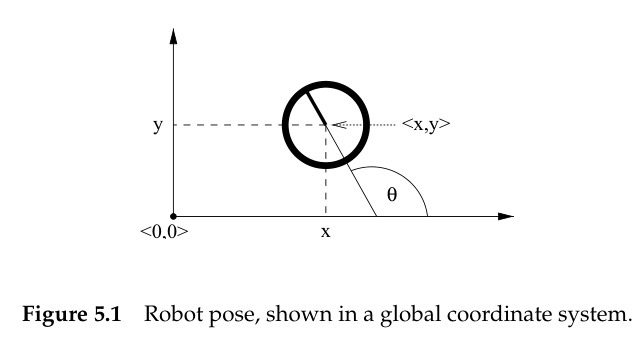
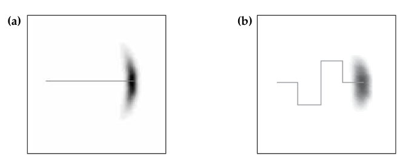
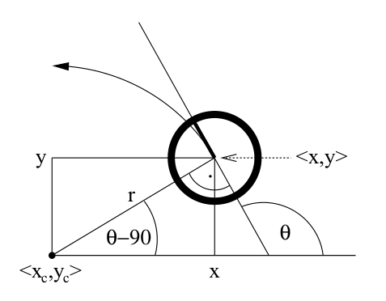

# Robot Motion

Motion models comprise the state transition probability $p(x_t|u_t,x_{t-1})$, which plays an essential role in the prediction step of the Bayes  filter. Robot kinematics has almost exclusively been addressed in deterministic form. Probabilistic robotics generalizes  kinematic equations to the fact  that  the outcome of the control is uncertain, due to the control noise or unmodeled exogenous effects. 

## Kinematic

Kinematic is the **calculus**(微积分) describing the effect of control actions on the  configuration of a robot. 

The configuration of a rigid mobile robot is commonly described **six variables**, its **three-dimensional Cartesian coordinates** and its **three Euler angles (roll, pitch, yaw)** relative to an external coordinate frame.

### Kinematic configuration in planar case

**In planar case**, the kinematic state is **summarized by three variables**, referred to as **pose**. The pose comprises its **two-dimensional planar coordinates relative to an external coordinate frame**, along with its **angular orientation(朝向)**. Denoting the two-dimensional planar coordinates as $x$ and $y$, and angular orientation by $\theta$.
$$
pose = \begin{bmatrix}
x\\
y\\
\theta
\end{bmatrix}
$$
As shown in figure, we postulate that a robot with  orientation $\theta=0$ points into the direction of its $x$-axis and a robot with orientation $\theta=0.5\pi$ points into the direction of its $y$-axis.

**pose without orientation will be called *location***
$$
location = \begin{bmatrix}
x\\
y
\end{bmatrix}
$$

### Probabilistic Kinematics Model

The model is the familiar conditional density
$$
p(x_t|u_t,x_{t-1})
$$
Here, **$x_t$  and $x_{t-1}$ are both robot poses (not just x-coordinates), and $u_t$ is a motion command**. This model describes the posterior distribution over kinematic states that a robot assumes when executing the motion command $u_t$  at $x_{t-1}$

for example

the distribution $p(x_t|u_t,x_{t-1})$ is visualized by the shaded area: the darker a pose, the more likely it is. In figure (a), a robot moves forward some distance, during which it may accrue translational and rotational error as indicated.

## Two specific probabilistic motion models

The first assumes that the motion data $u_t$ specifies the velocity commands given to the robot's motors. The second model assumes that one has access to odometry information.

In practice, odometry models tend to be more accurate than velocity models, for the simple reason that most commercial robots do not execute velocity commands with  the level of accuracy that can be obtained by measuring the revolution of the robot's wheels.(电动机执行命令的精度无法超过里程计测量轮子转速的精度)

**However, odometry is only available for getting information after executing a motion command**. Hence it cannot be used for motion planning. Planning algorithms such as collision avoidance have to predict the effects of motion. Thus, odometry models are usually applied for estimation, whereas velocity models are used for probabilistic motion planning.

### Velocity Motion Model

The *velocity motion model* assumes that we can **control** a robot through two velocities, **translational velocity and rotational velocity**. We denote the translational velocity at time t by $v_t$ and the rotational velocity by $\omega_t$
$$
u_t =\begin{bmatrix}
v_t\\
\omega_t
\end{bmatrix}
$$
we postulate that **positive rotational velocities $\omega_t$ induce a counterclockwise rotation**. **positive translational velocities $v_t$ correspond to forward motion**

#### Mathematical Derivation of the Velocity Motion Model

##### Exact Motion without Noise

assuming that the initial pose is $x_{t-1}$
$$
x_{t-1}=\begin{bmatrix}
x\\
y\\
\theta
\end{bmatrix}
$$
the control command is 
$$
u_t = \begin{bmatrix}
v\\
\omega
\end{bmatrix}
$$
and **the translational velocities and rotational velocities keep a fixed value at the entire time $(t-1,t]$**

**so at time $(t-1,t]$, the trajectory of the robot is a circle**. the radius of the circle can be derived as follow
$$
v=\omega\cdot r\quad \rightarrow \quad  r=\left|\frac{v}{\omega}\right|
$$
the center of  the circle is at
$$
\begin{cases}
x_c = x-\frac{v}{\omega}\sin\theta\\
y_c = y+\frac{v}{\omega}\cos\theta
\end{cases}
$$
according to the trigonometry, the resulting pose $x_t$ is
$$
\begin{bmatrix}
x'\\y'\\ \theta'
\end{bmatrix}
=
\begin{bmatrix}
x_c+\frac{v}{\omega}\sin(\theta+\omega\Delta t)\\
y_c-\frac{v}{\omega}\cos(\theta+\omega\Delta t)\\
\theta+\omega\Delta t
\end{bmatrix}
=
\begin{bmatrix}
x\\y\\ \theta
\end{bmatrix}
+
\begin{bmatrix}
-\frac{v}{\omega}\sin\theta+\frac{v}{\omega}\sin(\theta+\omega\Delta t)\\
\frac{v}{\omega}\cos\theta-\frac{v}{\omega}\cos(\theta+\omega\Delta t)\\
\omega\Delta t
\end{bmatrix}
$$
**the  derivation is based on the assumption that both the velocities keep the fixed value the time $(t-1,t]$**. So, it is therefore common practice to use small values for $\Delta t$ to approximate the actual velocity by a constant within each time interval

##### Real Motion with Noise

In reality, robot motion is subject to noise. The actual velocities differ from the commanded ones. **We model this noise by a zero-centered random variable with  finite variance** and **assume the noise is additive.**
$$
\begin{bmatrix}
\hat{v}\\ \hat{\omega}
\end{bmatrix}
=
\begin{bmatrix}
v\\ \omega
\end{bmatrix}
+
\begin{bmatrix}
\varepsilon_{\alpha_1 v^2+\alpha_2\omega^2}\\
\varepsilon_{\alpha_3 v^2+\alpha_4\omega^2}
\end{bmatrix}
$$
**Here, $\varepsilon_{b^2}$ is a zero-mean error  variable with  variance $b^2$**

a better model of the actual pose $x_t=[x',y',\theta']^T$ after executing the motion command $u_t=[v,w]^T$ at $x_{t-1}=[x,y,\theta]^T$ is thus
$$
\begin{bmatrix}
x'\\y'\\ \theta'
\end{bmatrix}
=
\begin{bmatrix}
x\\y\\ \theta
\end{bmatrix}
+
\begin{bmatrix}
-\frac{\hat{v}}{\hat{\omega}}\sin\theta+\frac{\hat{v}}{\hat{\omega}}\sin(\theta+\hat{\omega}\Delta t)\\
\frac{\hat{v}}{\hat{\omega}}\cos\theta-\frac{\hat{v}}{\hat{\omega}}\cos(\theta+\hat{\omega}\Delta t)\\
\hat{\omega}\Delta t
\end{bmatrix}
$$
 so, the three-dimension pose is relevant to two-dimension noise. the book said **this degeneracy** has important ramifications when applying Bayes filters for state estimation.  therefore, to generalize the motion model accordingly, we will assume that the robot perform a rotation $\hat{\gamma}$ when it arrives at its final pose.
$$
\theta'=\theta+\hat{\omega}\Delta t+\hat{\gamma}\Delta t
$$
with
$$
\hat{\gamma}=\varepsilon_{\alpha_5v^2+\alpha_6\omega^2}
$$
Thus, the resulting motion model is as follows
$$
\begin{bmatrix}
x'\\y'\\ \theta'
\end{bmatrix}
=
\begin{bmatrix}
x\\y\\ \theta
\end{bmatrix}
+
\begin{bmatrix}
-\frac{\hat{v}}{\hat{\omega}}\sin\theta+\frac{\hat{v}}{\hat{\omega}}\sin(\theta+\hat{\omega}\Delta t)\\
\frac{\hat{v}}{\hat{\omega}}\cos\theta-\frac{\hat{v}}{\hat{\omega}}\cos(\theta+\hat{\omega}\Delta t)\\
\hat{\omega}\Delta t+\hat{\gamma}\Delta t
\end{bmatrix}
$$

##### Computation of $p(x_t|u_t,x_{t-1})$

