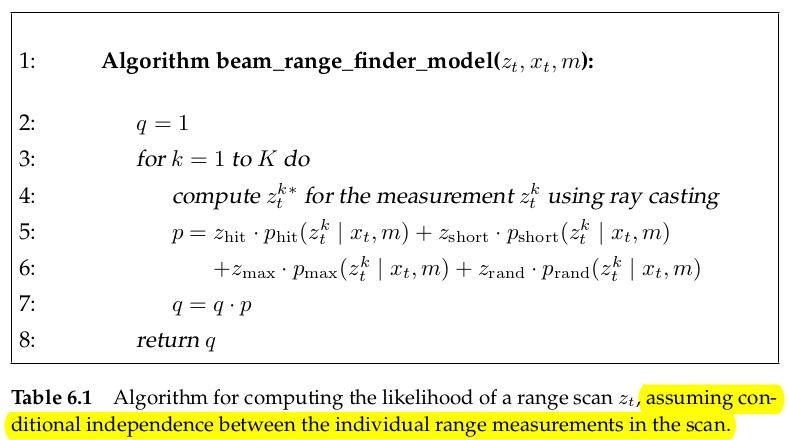
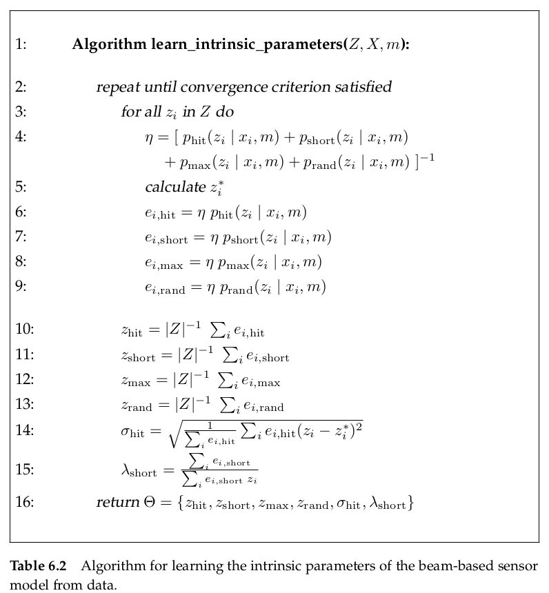
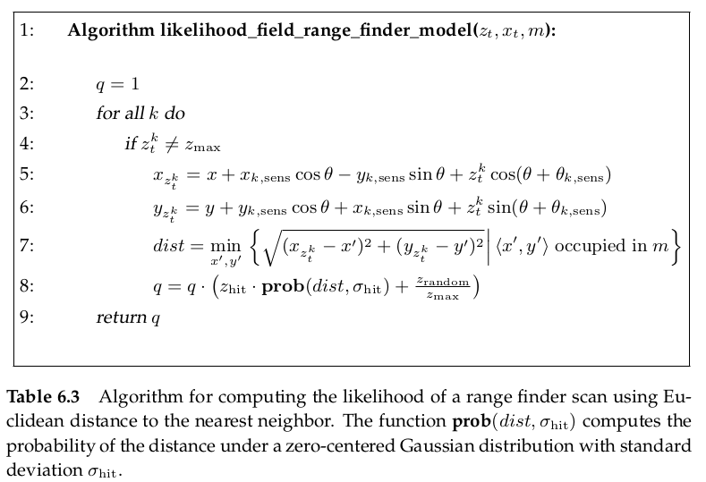
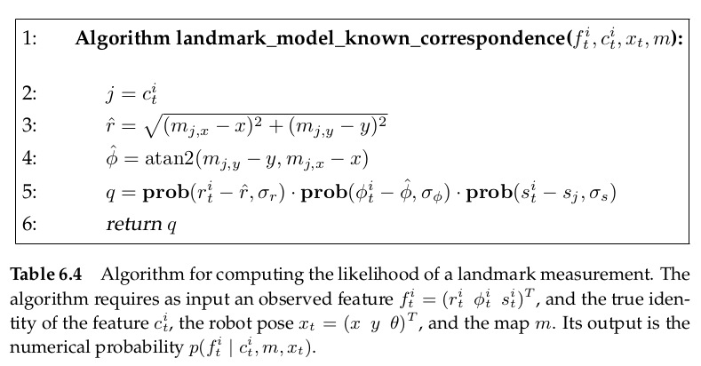

# Robot Perception

Environment measurement models describe the information process by which sensor measurements are generated in the physical world.

**Probabilistic robotics explicitly models the noise in sensor measurements. Such models account for the inherent uncertainty in the robot's sensors. Formally, the measurement model is defined as a conditional probability distribution $p(z_t|x_t,m)$**, where $x_t$ is the robot pose, $z_t$ is the measurement at time $t$, and $m$ id the map of the environment. 

By modeling the measurement process as a conditional probability density, $p(z_t|x_t)$, instead of a deterministic function $z_t=f(x_t)$, the uncertainty in the sensor model can be accommodated in the non-deterministic aspects of the model.

Many sensors generate more than one numerical measurement value when queried. We denote the number of such measurement values within a measurement $z_t$ by $K$
$$
z_t = \{z_t^1,z_t^2,\ldots,z_t^K\}
$$
We will **use $z_t^k$ to refer to an individual measurement.**

We ideally assume that **it is independent between each individual measurement beam**. So **the probability $p(z_t|x_t,m)$ is obtained as the product of the individual measurement likelihoods.**
$$
p(z_t|x_t,m)=\prod_{k=1}^{K}p(z_t^k|x_t,m)
$$

## Maps

A map of the environment is a list of objects in the environment and their locations. Formally, a map $m$ is a list of objects in the environment along with their properties
$$
m=\{m_1,m_2,\ldots,m_N\}
$$
each $m_n$ with $1\leq n \leq N$ specifies a property.

Maps are usually indexed in one of two ways

- *feature-based*: In feature-based maps, $n$ is a feature index. The value of $m_n$ contains the Cartesian location of the feature next to the properties of a feature.
- *location-based*: In location-based maps, the index $n$ corresponds to a specific location. In planar maps, it is common to denote a map element by $m_{x,y}$ instead of $m_n$, to make explicit that $m_{x,y}$ is the property of a specific world coordinate $(x,y)$.

## Beam Models of Range Finders

Range finder **measure the range to nearby objects**. Range may be measured along a beam, which is a good model of the workings of laser range finders.

### The Basic Measurement Algorithm

#### Four types of errors

Our model incorporates four types of measurement errors, all of which are essential to making this model work: **small measurement noise, errors due to unexpected objects, errors due to failures to detect objects and random unexplained noise**. **The desired model $p(z_t|x_t,m)$ is therefore a mixture of four densities. Each of densities corresponds to a particular type of error:

1. **Correct range with local measurement noise.**

   In real world, because of the limited resolution of range sensor, atmospheric effect on the measurement signal and so on, the measurement noise always arises. 

   We denote this measurement noise by $p_{\mathrm{hit}}$. **This measurement noise is usually modeled by a narrow Gaussian**. Let's use $z_t^{k*}$ to denote the "true" range of the object measured by $z_t^k$. **We set the mean of Gaussian to be $z_t^{k*}$ and denote the standard deviation of Gaussian to be $\sigma_{\mathrm{hit}}$**. 

   In practice, the values measured by the range sensor are limited to the interval $[0;z_{\max}]$, where $z_{\max}$ denotes the maximum sensor range. Thus the **measurement probability** is given by
   $$
   p_{\mathrm{hit}}(z_t^k|x_t,m)=\begin{cases}
   \eta \mathcal{N} (z_t^k;z_t^{k*},\sigma^2_{\mathrm{hit}}) & 0\leqslant z_t^k\leqslant z_{\max}\\
   0 & \mathrm{otherwise}
   \end{cases}
   $$
   $z_t^{k*}$ is calculated from $x_t$ and $m$ via [ray casting](https://en.wikipedia.org/wiki/Ray_casting)

   The normalizer $\eta$ evaluates to 
   $$
   \eta=\left(\int_{0}^{z_{\max}}\mathcal{N}(z_t^k;z_t^{k*},\sigma^2_{\mathrm{hit}})\dd{z_t^k}\right)^{-1}
   $$
   !!notice that!!, the standard deviation $\sigma_{\mathrm{hit}}$ is an intrinsic parameter that should be estimation.

2. **Unexpected objects**

   Environments of mobile robots are dynamic, whereas maps $m$ are static. Some moving objects like people will **cause a very short range**. A simple approach to **deal with these is to treat them as sensor noise**. Unmodeled objects have the property that **they cause ranges to be shorter than $z_t^{k*}$, not longer.** Because if they cause ranges longer than $z_t^{k*}$, the maps will hide block them.

   Mathematically, **the probability of range measurements in such situations is described by an *exponential distribution***. The parameter of this distribution, $\lambda_{\mathrm{short}}$, is an intrinsic parameter of the measurement model.
   $$
   p_{\mathrm{short}}(z_t^k|x_t,m)=
   \begin{cases}
   \quad \eta \lambda_{\mathrm{short}}e^{-\lambda_{\mathrm{short}}z_t^k} & 0\leqslant z_t^k\leqslant z_t^{k*}\\
   \quad 0 & \mathrm{otherwise}
   \end{cases}
   $$
   Here
   $$
   \eta=\left(\int_{0}^{z_t^{k*}} \lambda_{\mathrm{short}}e^{-\lambda_{\mathrm{short}}z_t^k}  \dd{z_t^k}\right)^{-1}=\frac{1}{1-e^{-\lambda_{\mathrm{short}}z_t^{k*}}}
   $$

3. **Failures**

   Sometimes, obstacles are missed altogether. For example, laser range finder will fail when sensing black, light-absorbing objects or for some laser systems when measuring objects in bright sunlight. **A typical result of a sensor failure is max-range measurement: the sensor return its maximum allowable value $z_{\max}$**. 

   **We will model this cases with point-mass distribution centered at $z_{\max}$**
   $$
   p_{\max}(z_t^k|x_t,m) = I(z=z_{\max})=\begin{cases}
   1 & \mathrm{if} \space z= z_{\max}\\
   0 & \mathrm{otherwise}
   \end{cases}
   $$
   Here I denotes the indicator function that takes on the value 1 if its argument is true, ans is 0 otherwise.

   $p_{\max}$ does not possess a probability density function because it is a discrete distribution. So we simply draw $p_{\max}$ as a very narrow uniform distribution centered at $z_{\max}$.

4. **Random measurements**

   Range finders occasionally produce entirely unexplainable measurements**. To keep things simple, such measurements will be modeled using a uniform distribution spread over the entire sensor measurement range $[0;z_{\max}]$**
   $$
   p_{\mathrm{rand}}(z_t^k|x_t,m)=\begin{cases}
   \frac{1}{z_{\max}} & 0\leqslant z_t^k \leqslant z_{\max}\\
   0 & \mathrm{otherwise}
   \end{cases}
   $$

#### Beam Range Finder Model

The beam range finder model is the linear combination of the above four error with four weights $z_{\mathrm{hit}},z_{\mathrm{short}},z_{\mathrm{max}},z_{\mathrm{rand}}$. And $z_{\mathrm{hit}}+z_{\mathrm{short}}+z_{\mathrm{max}}+z_{\mathrm{rand}}=1$
$$
p(z_t^k|x_t,m)=
[z_{\mathrm{hit}},z_{\mathrm{short}},z_{\mathrm{max}},z_{\mathrm{rand}}]\cdot
\begin{bmatrix}
p_{\mathrm{hit}}(z_t^k|x_t,m)\\
p_{\mathrm{short}}(z_t^k|x_t,m)\\
p_{\mathrm{max}}(z_t^k|x_t,m)\\
p_{\mathrm{rand}}(z_t^k|x_t,m)
\end{bmatrix}
$$

### Adjusting the Intrinsic Model Parameters

The beam range finder model also include the intrinsic parameters $\sigma_{\mathrm{hit}}$ and $\lambda_{\mathrm{short}}$. We will refer to the set of all intrinsic parameters as $\Theta$. So, the likelihood of any sensor measurement is a function of $\Theta$.

A more principled way to learn these parameters is learning from actual data. **This is achieved by maximizing the likelihood of a reference data set $Z=\{z_i\}$** with associated positions $X=\{x_i\}$ and map $m$. The likelihood of the data $Z$ is given by
$$
p(Z|X,m,\Theta)
$$

#### Mathematical Derivation 

According to the above, there are four types of errors. So, **we decompose the data set into four disjoint sets** $Z_{\mathrm{hit}},Z_{\mathrm{short}},Z_{\mathrm{max}},Z_{\mathrm{rand}}$. **Notice that the four sets are disjoint, which contains a assumption that while acquiring one measurement, only one type of error will appear.**

**We use maximum likelihood estimator to estimate the intrinsic parameters $\sigma_{\mathrm{hit}}$ and $\lambda_{\mathrm{short}}$. But here, the error type for each measurement is unknown. So, we would like to maximize the expectation of the likelihood**. 

The logarithm is a strictly monotonic function, so we can maximize the log-likelihood.
$$
\Theta = \arg \max_{\Theta}E\left[\log p(Z|X,m,\Theta)\right]
$$
We denote the probability of the appearance of local noise by $p(c_i=\mathrm{hit})$. So as $p(c_i=\mathrm{short}),p(c_i=\mathrm{max}),p(c_i=\mathrm{rand})$
$$
\begin{split}
E\left[\log p(Z|X,m,\Theta)\right] 
&= \sum_{z_i\in Z}p(c_i=\mathrm{hit})\log p_{\mathrm{hit}}(z_i|x_i,m)
+\sum_{z_i\in Z}p(c_i=\mathrm{short})\log p_{\mathrm{short}}(z_i|x_i,m)\\
&+\sum_{z_i\in Z}p(c_i=\mathrm{max})\log p_{\mathrm{max}}(z_i|x_i,m)
+\sum_{z_i\in Z}p(c_i=\mathrm{rand})\log p_{\mathrm{rand}}(z_i|x_i,m)
\end{split}
$$
But what is the priori knowledge of error type. We make the following approximation
$$
\begin{bmatrix}
e_{i,\mathrm{hit}}\\
e_{i,\mathrm{short}}\\
e_{i,\mathrm{max}}\\
e_{i,\mathrm{rand}}\\
\end{bmatrix}
:=
\begin{bmatrix}
p(c_i=\mathrm{hit})\\
p(c_i=\mathrm{short})\\
p(c_i=\mathrm{max})\\
p(c_i=\mathrm{rand})\\
\end{bmatrix}
=\eta \begin{bmatrix}
p_{\mathrm{hit}}(z_i|x_i,m)\\
p_{\mathrm{short}}(z_i|x_i,m)\\
p_{\mathrm{max}}(z_i|x_i,m)\\
p_{\mathrm{rand}}(z_i|x_i,m)\\
\end{bmatrix}
$$
The normalizer is given by
$$
\eta = \left[p_{\mathrm{hit}}(z_i|x_i,m)+p_{\mathrm{short}}(z_i|x_i,m)+p_{\mathrm{max}}(z_i|x_i,m)+p_{\mathrm{rand}}(z_i|x_i,m)\right]^{-1}
$$
**The maximum of the log-likelihood is obtained by setting the first derivative of the expression to zero**
$$
\begin{split}
\frac{\partial E\left[\log p(Z|X,m,\Theta)\right]}{\partial \sigma_{\mathrm{hit}}} &= 0\\
\frac{\partial E\left[\log p(Z|X,m,\Theta)\right]}{\partial \lambda_{\mathrm{short}}} &= 0\\
\end{split}
$$
Notice that only $p_{\mathrm{hit}}(z_i|x_i,m)$ is relative to $\sigma_{\mathrm{hit}}$, so
$$
\begin{split}
\frac{\partial E\left[\log p(Z|X,m,\Theta)\right]}{\partial \sigma_{\mathrm{hit}}}
&= \frac{\partial }{\partial \sigma_{\mathrm{hit}}}\sum_{z_i\in Z}p(c_i=\mathrm{hit})\log p_{\mathrm{hit}}(z_i|x_i,m)\\
&+\frac{\partial }{\partial \sigma_{\mathrm{hit}}}\sum_{z_i\in Z}p(c_i=\mathrm{short})\log p_{\mathrm{short}}(z_i|x_i,m)\\
&+\frac{\partial }{\partial \sigma_{\mathrm{hit}}}\sum_{z_i\in Z}p(c_i=\mathrm{max})\log p_{\mathrm{max}}(z_i|x_i,m)\\
&+\frac{\partial }{\partial \sigma_{\mathrm{hit}}}\sum_{z_i\in Z}p(c_i=\mathrm{rand})\log p_{\mathrm{rand}}(z_i|x_i,m)\\
&= \frac{\partial }{\partial \sigma_{\mathrm{hit}}}\sum_{z_i\in Z}p(c_i=\mathrm{hit})\log p_{\mathrm{hit}}(z_i|x_i,m)\\
&= \sum_{z_i\in Z}p(c_i=\mathrm{hit})\frac{\partial }{\partial \sigma_{\mathrm{hit}}}\log p_{\mathrm{hit}}(z_i|x_i,m)\\
\end{split}
$$
only $p_{\mathrm{short}}(z_i|x_i,m)$ is relative to $\lambda_{\mathrm{short}}$
$$
\begin{split}
\frac{\partial E\left[\log p(Z|X,m,\Theta)\right]}{\partial \lambda_{\mathrm{short}}}
&= \frac{\partial }{\partial \lambda_{\mathrm{short}}}\sum_{z_i\in Z}p(c_i=\mathrm{short})\log p_{\mathrm{short}}(z_i|x_i,m)\\
&= \sum_{z_i\in Z}p(c_i=\mathrm{short})\frac{\partial }{\partial \lambda_{\mathrm{short}}}\log p_{\mathrm{short}}(z_i|x_i,m)\\
\end{split}
$$
since 
$$
\begin{split}
p_{\mathrm{hit}}(z_i|x_i,m) &=
\eta \frac{1}{\sqrt{2\pi\sigma^2_{\mathrm{hit}}}}e^{-\frac{1}{2}\frac{(z_i-z_i^{*})^2}{\sigma^2_{\mathrm{hit}}}} \qquad 0\leqslant z_i\leqslant z_{\max}\\

p_{\mathrm{short}}(z_i|x_i,m) &= \eta\lambda_{\mathrm{short}}e^{-\lambda_{\mathrm{short}}z_i} \qquad 0\leqslant z_i\leqslant z_i^{*}
\end{split}
$$
logarithm of them will be(here, $\ln=\log$)
$$
\begin{split}
\log p_{\mathrm{hit}}(z_t^k|x_t,m) &=
\log\eta -\frac{1}{2}\log2\pi-\log\sigma_{\mathrm{hit}}-\frac{1}{2}\frac{(z_i-z_i^{*})^2}{\sigma^2_{\mathrm{hit}}} \qquad 0\leqslant z_i\leqslant z_{\max}\\

\log p_{\mathrm{short}}(z_i|x_i,m) &= 
\log\eta+\log\lambda_{\mathrm{short}}-\lambda_{\mathrm{short}}z_i \qquad 0\leqslant z_i\leqslant z_i^{*}
\end{split}
$$
sequently
$$
\begin{split}
\frac{\partial E\left[\log p(Z|X,m,\Theta)\right]}{\partial \sigma_{\mathrm{hit}}}
&= \sum_{z_i\in Z}p(c_i=\mathrm{hit})\frac{\partial }{\partial \sigma_{\mathrm{hit}}}\log p_{\mathrm{hit}}(z_i|x_i,m)\\
&= \sum_{z_i\in Z}p(c_i=\mathrm{hit})\left[-\frac{1}{\sigma_{\mathrm{hit}}}+\frac{(z_i-z_i^{*})^2}{\sigma_{\mathrm{hit}}^3}\right]\\
\frac{\partial E\left[\log p(Z|X,m,\Theta)\right]}{\partial \lambda_{\mathrm{short}}}
&= \sum_{z_i\in Z}p(c_i=\mathrm{short})\frac{\partial }{\partial \lambda_{\mathrm{short}}}\log p_{\mathrm{short}}(z_i|x_i,m)\\
&= \sum_{z_i\in Z}p(c_i=\mathrm{short})\left[\frac{1}{\lambda_{\mathrm{short}}}-z_i\right]
\end{split}
$$
set them to be zero
$$
\begin{split}
\frac{\partial E\left[\log p(Z|X,m,\Theta)\right]}{\partial \sigma_{\mathrm{hit}}} &= 0\\
\frac{\partial E\left[\log p(Z|X,m,\Theta)\right]}{\partial \lambda_{\mathrm{short}}} &= 0\\
\end{split}
\quad\longrightarrow \quad
\begin{split}
\sigma_{\mathrm{hit}} &= \sqrt{\frac{1}{\sum_{z_i\in Z}p(c_i=\mathrm{hit})}\sum_{z_i\in Z}p(c_i=\mathrm{hit})(z_i-z_i^*)^2 }\\
\lambda_{\mathrm{short}} &= \frac{\sum_{z_i\in Z}\space p(c_i=\mathrm{short})}{\sum_{z_i\in Z}\space p(c_i=\mathrm{short})z_i}
\end{split}
$$

## Likelihood Fields for Range Finder

The beam-based model exhibits a lack of smoothness. The likelihood field model can overcome this disadvantage. 

### Coordinator Transformation

We firstly let $x_t=(x,y,\theta)^T$ denote a robot pose at time $t$ under the global coordinate frame. Denote the relative location of sensor measurement in the robot's  coordinate system by $(x_{k,sens},y_{k,sens})^T$ and the angular orientation of the sensor beam relative to the robot's heading direction by $\theta_{k,sens}$. Denote the location of sensor measurement in global coordinate by $(x_{z_t^k},y_{z_t^k})^T$. According to the trigonometric transformation
$$
\begin{bmatrix}
x_{z_t^k} \\ y_{z_t^k}
\end{bmatrix}
=
\begin{bmatrix}
x \\ y
\end{bmatrix}
+
\begin{bmatrix}
\cos\theta & -\sin\theta\\
\sin\theta & \cos\theta
\end{bmatrix}
+z_t^k
\begin{bmatrix}
\cos(\theta+\theta_{k,sens})\\
\sin(\theta+\theta_{k,sens})
\end{bmatrix}
$$
These coordinates are only meaningful when the sensor detects an obstacle. If the range sensor takes on its maximum value $z_t^k=z_{\max}$, these coordinates have no meaning in the physical world. The likelihood field measurement model simply discards max-range readings.

### Three Types of Noise

#### Measurement Noise

Noise arising from the measurement process is modeled using Gaussian. Let **dist** denote the **Euclidean distance** between the **measurement coordinates $(x_{z_t^k},y_{z_t^k})$ and the nearest object in the map $m$**. Since we assume that we have the priori knowledge of $x_{t-1}$ and map $m$, we can use the knowledge of map to search minimum distance.

We model the probability of sensor measurement by zero-centered Gaussian
$$
p_{\mathrm{hit}}(z_t^k|x_t,m)=\varepsilon_{\sigma_{\mathrm{hit}}}(dist)
$$
????? why the probability of sensor measurement is given by **zero-centered** Gaussian, not $z_t^k$-centered. so confusing. No wonder the book said this model lacks a plausible physical explanation at the beginning of the section.

#### Failures

We assume that max-range readings have a distinct large likelihood. As before, this is modeled by point-mass distribution $p_{\max}$

#### Unexplained random measurements

A uniform distribution $p_{\mathrm{rand}}$ is used to model random noise in perception.

### Likelihood field range finder model

Just as for the beam-based sensor model, the desired probability $p(z_t^k|x_t,m)$ integrates all three distribution with mixing three weight $z_{\mathrm{hit}},z_{\mathrm{rand}},z_{\mathrm{max}}$
$$
p(z_t^k|x_t,m)=z_{\mathrm{hit}}\cdot p_{\mathrm{hit}}+z_{\mathrm{rand}}\cdot p_{\mathrm{rnad}}+z_{\mathrm{max}}\cdot p_{\mathrm{max}}
$$
And the model under actual set is 
$$
p(z_t|x_t,m) = \prod_{k}p(z_t^k|x_t,m)
$$

## Correlation-Based Measurement Models

There exist a number of range sensor models in the literature that measure correlations between a measurement and the map. A common technique is known as *map matching*. **The sensor measurement model compares the local map $m_{local}$ to global map $m$, such that the more similar $m$ and $m_{local}$, the larger $p(m_{local}|x_t,m)$.** Since the local map is represented relative to the robot location, this comparison requires that the cells of the local map are transformed into the coordinate framework of the global map. 

**If the robot is at location $x_t$, we denote by $m_{x,y,local}(x_t)$ the grid cell in the local map that corresponds to $(x,y)^T$ in global coordinates. Once both maps are in the same reference frame, they can be compared using the map correlation function, which is defined as follows:**
$$
\rho_{m,m_{local},x_t} = \frac{\sum_{x,y}(m_{x,y}-\bar{m})\cdot(m_{x,y,local}(x_t)-\bar{m})}{\sqrt{\sum_{x,y}(m_{x,y}-\bar{m})^2\sum_{x,y}(m_{x,y,local}(x_t)-\bar{m})^2}}
$$
Here the sum is evaluated over cells defined in both maps, and $\bar{m}$ is the average map value:
$$
\bar{m}=\frac{1}{2N}\sum_{x,y}(m_{x,y}+m_{x,y,local})
$$
where **N denotes the number of elements in the overlap between the local and global map**. The correlation $\rho_{m,m_{local},x_t}$ scales between $\pm1$. **Map matching interprets the value**
$$
p(m_{local}|x_t,m)=\max\{\rho_{m,m_{local},x_t},0\}
$$
as the probability of the local map conditioned on the global map $m$ and the robot pose $x_t$.

## Feature-Based Measurement Models

### Feature Extraction

The sensor models discussed thus far are all based on raw sensor measurements. An alternative approach is to extract features from the measurements. Most feature extractors extract a small number of features from high-dimensional sensor measurements to reduce computing consumption.

If we denote the feature extractor as a function $f$, the features extracted from a range measurement are given by $f(z_t)$.

### Landmark Measurements

In many robotics applications, features correspond to distinct objects in the physical world. For example, in indoor environments features may be door posts or windowsills; outdoors they may correspond to tree trunks or corners of buildings. **In robotics, it is common to call those physical objects landmarks.**

The most common model for processing landmarks assumes that the sensor can measure **the range and the bearing of the landmark relative to the robot's local coordinate frame**. The feature extractor may generate a **signature** that may equally be an integer (e.g. an average color) that characterizes the type of the observed landmark, or a multidimensional  vector characterizing a landmark (e.g. height and color).

If we denote the range by $r$, the bearing by $\phi$, and the signature by $s$, the feature vector is given by a collection of triplets
$$
f(z_t)=\{f_t^1,f_t^2,\ldots\}=\{
\begin{bmatrix}
r_t^1 \\ \phi_t^1\\ s_t^1
\end{bmatrix}
,
\begin{bmatrix}
r_t^2 \\ \phi_t^2\\ s_t^2
\end{bmatrix}
, \ldots
\}
$$
many probabilistic robotic algorithms assume conditional independence between features
$$
p(f(z_t)|x_t,m)=\prod_ip(r_t^i,\phi_t^i,s_t^i|x_t,m)
$$
**Landmark measurement models are usually defined only for feature-based maps.** Those maps consist of lists of features, $m=\{m_1,m_2,\ldots\}$. Each feature may possess a signature and a location coordinate. The location of a feature, denoted $m_{i,x}$ and $m_{i,y}$, is simply its coordinate in the global coordinate frame of the map.

We will **model noise in landmark perception by independent Gaussian noise** on the range, bearing, and the signature. The resulting measurement model is formulated for the case where the i-th feature at time t corresponds to the j-th landmark in the map. As usual, the robot pose is given by $x_t = (x, y, \theta)^T$ .

??????? whom the i-th feature is belong to???  Is the j-th landmark a feature of the map???  why corresponding the i-th feature to the j-th landmark not the j-th landmark??? For example, there 6 landmarks in the map and they are [rabbit, dog, cat, bird]. Rabbit is the $1^{th}$ landmark. Dog is the $2^{th}$ landmark. Cat... Bird... At this time $t=t$, we observe 2 feature $z_t = [z_t^1,z_t^2]$. Which landmark does the feature belong to? If $z_t^1=bird$, that means the $1^{th}$ feature corresponds to $4^{th}$ landmark.
$$
\begin{bmatrix}
r_t^i \\ \phi_t^i \\ s_t^i
\end{bmatrix}
=
\begin{bmatrix}
\sqrt{(m_{j,x}-x)^2+(m_{j,y}-y)^2}\\
\atan2(m_{j,y}-y,m_{j,x}-x)-\theta\\
s_j
\end{bmatrix}
+\begin{bmatrix}
\varepsilon_{\sigma_r^2}\\
\varepsilon_{\sigma_\phi^2}\\
\varepsilon_{\sigma_s^2}
\end{bmatrix}
$$

### Sensor Model with Known Correspondence

A key problem for range/bearing sensors is known as the data association problem. This problem arises when landmarks cannot be uniquely identified, so that some residual uncertainty exists with regards to the identity of a landmark. Just like the problem above, why corresponding the i-th feature to the j-th landmark. So we need to specify correspondence between the feature and landmark.

If we know the correspondence 

