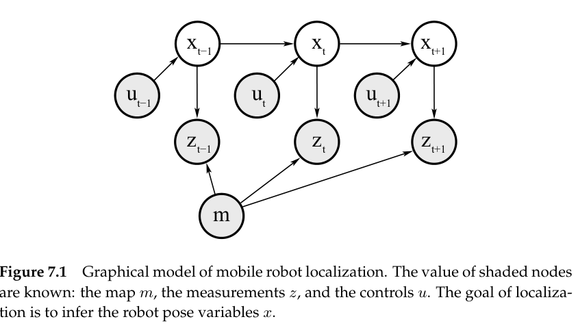
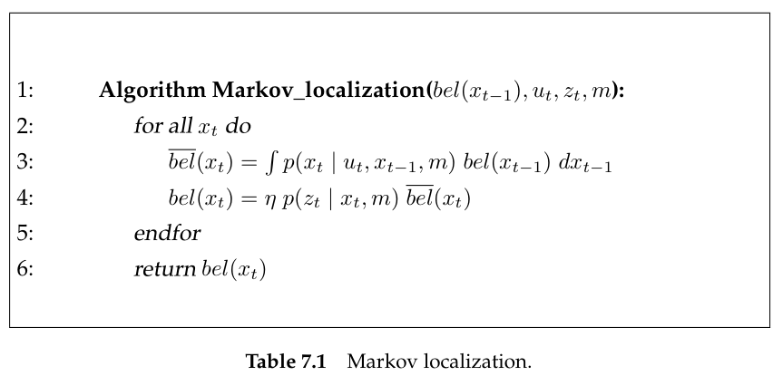
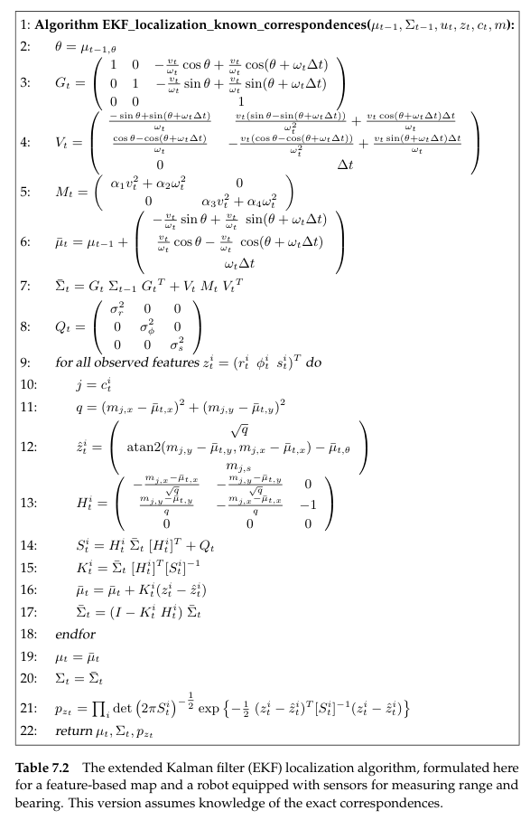
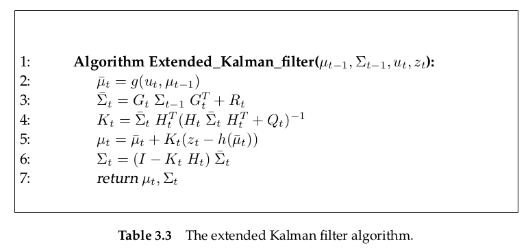
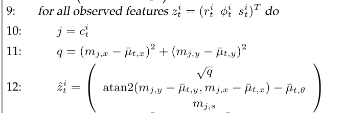
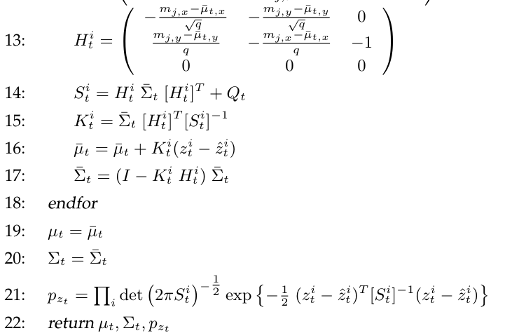
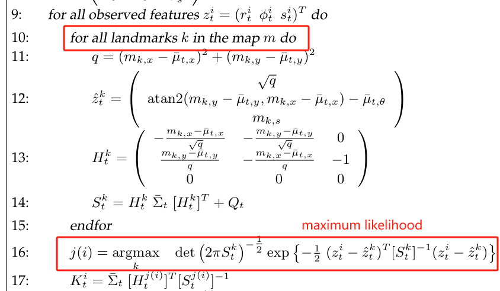

# Mobile Robot Localization: Markov and Gaussian

Mobile robot localization is the problem of determining the pose of a robot relative to a **given map** of the environment. It is often called **position estimation**. 

Mobile robot localization can be seen as a problem of coordinate transformation. Maps are described in a global coordinate system, which is independent of a robot's pose. Localization is the process of establishing correspondence between the map coordinate system and the robot's local coordinate system.

## A Taxonomy of Localization Problems

1. **Local Versus Global Localization**

   Localization problems are characterized by the type of knowledge that is available initially and at run-time.

   - *Position tracking*

     It assumes that the initial robot pose is known.

   - *Global localization*

     The initial pose of the robot is unknown.

   - *Kidnapped robot problem*

     During operation, the robot can get kidnapped(绑架) and teleported to some other location.

2. **Static Versus Dynamic Environment**

   - *Static environments*

     Static environments are environments where the only variable quantity is the robot's pose.

   - *Dynamic environments*

     Dynamic environments possess objects other than the robot whose location or configuration changes over time.

3. **Passive Versus Active Approaches**

   A third dimension that characterizes different localization problems pertains to the fact whether or not the localization algorithm controls the motion of the robot.

   - *Passive localization*

     The localization module only observes the robot operating. The robot is controlled through some other means, and the robot's motion is not aimed at facilitating localization.

   - *Active localization*

     Active localization algorithms control the robot so as to minimize the localization error and /or the coses arising from moving a poorly localized robot into a hazardous place.

4. **Single-Robot Versus Multi-Robot**

## Markov Localization

**Probabilistic localization algorithm are variants of the Bayes filter.** The straightforward application of Bayes filters to the localization problem is called Markov localization. Markov localization addresses the global localization problem, the position tracking problem, and the kidnapped robot problem **in static environment**.

The initial belief, $bel(x_0)$, reflects the initial knowledge of the robot's pose. It is set differently depending on the type of localization problem.

- **Position tracking**

  If the initial pose is known, $bel(x_0)$ is initialized by a point-mass distribution. Let $\bar{x}_0$ denote the known initial pose. Then
  $$
  bel(x_0)=\begin{cases}
  1 & \mathrm{if}\space x_0=\bar{x}_0\\
  0 & \mathrm{otherwise}
  \end{cases}
  $$
  Point-mass distributions are discrete and therefore do not possess a density. In practice the initial pose is often just known in approximation. The belief $bel(x_0)$ is then usually initialized by a narrow Gaussian distribution centered around $\bar{x}_0$.
  $$
  bel(x_0) = \underbrace{\det (2\pi\Sigma)^{-\frac{1}{2}}\exp\{-\frac{1}{2}(x_0-\bar{x}_0)^T\Sigma^{-1}(x_0-\bar{x}_0)\}}_{\sim \mathcal{N}(x_0;\bar{x}_0,\Sigma)}
  $$

- **Global localization**

  If the initial pose is unknown, $bel(x_0)$ is initialized by a uniform distribution over the space over the space of all legal poses in the map
  $$
  bel(x_0)=\frac{1}{|X|}
  $$
  where $|X|$ stands for the volume (Lebesgue measure) of the space of all poses within the map.

## EKF Localization

The extended Kalman filter localization algorithm is a special case of Markov localization. EKF localization represents beliefs $bel(x_t)$ by their first and second moment, the mean $\mu_t$ and the covariance $\Sigma_t$.

Our EKF localization algorithm assumes that **the map is represented by collection of features**. At any point in time t, the robot gets to observe a vector of ranges and bearings to nearby features: $z_t=\{z_t^1,z_t^2,...\}$. We begin with a localization algorithm in which **all features are uniquely identifiable.** **The identity of a feature is expressed by a set of correspondence variables, denoted $c^i_t$, one for each feature vector $z_t^i$.** The second, more general version applies a maximum likelihood estimator too estimate the value of the latent correspondence variable, and uses the result of this estimation as if it were ground truth.

### EKF Localization with known correspondences Algorithm

In this discussion, we use the following assumptions. 

- The map is feature-based map. The feature-based map consist of point landmarks.
- For such point landmarks, we use the common measurement model discussed in Chapter 6.6.
- We adopt the velocity motion model defined in Chapter 5.3

The EKF localization with known correspondences algorithm requires as its input a Gaussian estimate of the robot pose at time $t-1$, with mean $\mu_{t-1}$ and covariance $\Sigma_{t-1}$. Further, it requires a control $u_t$, a map $m$, and **a set of features $z_t=\{z_t^1,z_t^2,...\}$ measured at time $t$, along with the correspondence variables $c_t=\{c_t^1,c_t^2,...\}$.** Its output is a new, revised estimate $\mu_t,\Sigma_t$, along with the likelihood of the feature observation, $p_{z_t}$.

### Mathematical Derivation of EKF localization

1. Prediction Step (Lines 3-7), calculate the $\bar{\mu}_t, \bar{\Sigma}_t$

According to EKF algorithm
$$
g(u_t,x_{t-1})\approx g(u_t,\mu_{t-1})+\underbrace{\frac{\partial g(u_t,\mu_{t-1})}{\partial x_{t-1}}}_{=: G_t}\space(x_{t-1}-\mu_{t-1})\\
h(x_t) \approx h(\overline{\mu_t})+\underbrace{\frac{\partial h(x_t)}{\partial x_t}}_{=: H_t}(x_t-\overline{\mu}_t)\\
\bar{\mu}_t = g(u_t,\mu_{t-1})\\
\bar{\Sigma_t} = G_t\Sigma_{t-1}G_t^T+R_t
$$
using the motion modal
$$
\underbrace{\begin{bmatrix}
x'\\y'\\ \theta'
\end{bmatrix}}_{x_t}
=
\underbrace{\begin{bmatrix}
x\\y\\ \theta
\end{bmatrix}}_{x_{t-1}}
+
\begin{bmatrix}
-\frac{\hat{v}_t}{\hat{\omega}_t}\sin\theta+\frac{\hat{v}_t}{\hat{\omega}_t}\sin(\theta+\hat{\omega}_t\Delta t)\\
\frac{\hat{v}_t}{\hat{\omega}_t}\cos\theta-\frac{\hat{v}_t}{\hat{\omega}_t}\cos(\theta+\hat{\omega}_t\Delta t)\\
\hat{\omega}_t\Delta t
\end{bmatrix}
$$
the true motion is described by a translational velocity $\hat{v}_t$, and a rotational velocity $\hat{\omega}_t$. These velocities are generated by the motion control $u_t=[v_t, \omega_t]^T$ with additive Gaussian noise
$$
\begin{bmatrix}
\hat{v}_t\\ \hat{\omega}_t
\end{bmatrix}
=
\begin{bmatrix}
v_t \\ \omega_t
\end{bmatrix}
+
\begin{bmatrix}
\varepsilon_{\alpha_1 v_t^2+\alpha_2\omega_t^2}\\
\varepsilon_{\alpha_3 v_t^2+\alpha_4\omega_t^2}\\
\end{bmatrix}
=
\begin{bmatrix}
v_t \\ \omega_t
\end{bmatrix}
+
\mathcal{N}(0,M_t)
$$
We decompose the motion model into a noise-free part and a random noise component **as a approximation**
$$
\underbrace{\begin{bmatrix}
x'\\y'\\ \theta'
\end{bmatrix}}_{x_t}
=
\underbrace{\begin{bmatrix}
x\\y\\ \theta
\end{bmatrix}
+
\begin{bmatrix}
-\frac{v_t}{\omega_t}\sin\theta+\frac{v_t}{\omega_t}\sin(\theta+\omega_t\Delta t)\\
\frac{v_t}{\omega_t}\cos\theta-\frac{v_t}{\omega_t}\cos(\theta+\omega_t\Delta t)\\
\omega_t\Delta t
\end{bmatrix}}_{g(u_t,x_{t-1})}
+
\mathcal{N}(0,R_t)
$$
**The trick of EKF is its linearization operation.**
$$
g(u_t,x_{t-1})\approx g(u_t,\mu_{t-1})+\underbrace{\frac{\partial g(u_t,\mu_{t-1})}{\partial x_{t-1}}}_{=: G_t}\space(x_{t-1}-\mu_{t-1})
$$
The **Jacobian** $G_t$ is the derivative of th function $g$ with respect to $x_{t-1}$ evaluated at $u_t$ and $\mu_{t-1}$. [Matrix_Differentiation](./Matrix_Differentiation.md)
$$
\begin{split}
G_t &= \frac{\partial g}{\partial x_{t-1}}|_{u_t=u_t,x_{t-1}=\mu_{t-1}}
=\begin{bmatrix}
\frac{\partial g_1}{\partial x} & \frac{\partial g_1}{\partial y} & \frac{\partial g_1}{\partial \theta}\\
\frac{\partial g_2}{\partial x} & \frac{\partial g_2}{\partial y} & \frac{\partial g_2}{\partial \theta}\\
\frac{\partial g_3}{\partial x} & \frac{\partial g_3}{\partial y} & \frac{\partial g_3}{\partial \theta}\\
\end{bmatrix}\\
&= \begin{bmatrix}
1 & 0 & \frac{v_t}{\omega_t}(-\cos\mu_{t-1,\theta}+\cos(\mu_{t-1,\theta}+\omega_t\Delta t))\\
0 & 1 & \frac{v_t}{\omega_t}(-\sin\mu_{t-1,\theta}+\sin(\mu_{t-1,\theta}+\omega_t\Delta t))\\
0 & 0 & 1
\end{bmatrix}
\end{split}
$$
Then we have to determine the covariance of the additional motion noise $\mathcal{N}(0,R_t)$. **Now the noise we have is motion noise in *control space*. We have to map this noise into the *state space***
$$
M_t = \begin{bmatrix}
\alpha_1v_t^2+\alpha_2\omega_t^2 & 0\\
0 & \alpha_3v_t^2+\alpha_3\omega_t^2
\end{bmatrix}
\xrightarrow[]{mapping} R_t
$$
Conclusion first, let
$$
V_t = \frac{\partial g(u_t,\mu_{t-1})}{\partial u_t}
$$
and **the multiplication $V_tM_tV_t^T$ provides an approximate mapping between the motion noise in control space to the motion noise in state space.**

Explanation

assume a scalar augment scalar function $f(x)$. Let $\Delta x$ denote as noise. So the noise caused by augment noise can be **approximated** as 
$$
\Delta f\approx \frac{\dd{f}}{\dd{x}} \Delta x
$$
In a similar way for $g(u_t,x_{t-1})$, $M_t$ represent the noise in motion space and $V_t$ represent the derivation. The noise cause by noise in motion space   can be approximated as 
$$
V_tM_tV_t^T
$$

Or let's explain it from a different angle.

We do not decompose the into motion $[v_t, \omega_t]^T$ and noise $\mathcal{N}(0,M_t)$. We directly treat it as a random variable
$$
\begin{bmatrix}
\hat{v}_t\\ \hat{\omega}_t
\end{bmatrix}
=
\begin{bmatrix}
v_t \\ \omega_t
\end{bmatrix}
+
\begin{bmatrix}
\varepsilon_{\alpha_1 v_t^2+\alpha_2\omega_t^2}\\
\varepsilon_{\alpha_3 v_t^2+\alpha_4\omega_t^2}\\
\end{bmatrix}
=
\begin{bmatrix}
v_t \\ \omega_t
\end{bmatrix}
+
\mathcal{N}(0,M_t)
$$

$$
u_t=\begin{bmatrix}
\hat{v}_t\\ \hat{\omega}_t
\end{bmatrix}
\sim
\mathcal{N}(\begin{bmatrix} v_t\\ \omega_t\end{bmatrix},M_t)
$$

So the motion function is
$$
\underbrace{\begin{bmatrix}
x'\\y'\\ \theta'
\end{bmatrix}}_{x_t}
=
\underbrace{\begin{bmatrix}
x\\y\\ \theta
\end{bmatrix}
+
\begin{bmatrix}
-\frac{\hat{v}_t}{\hat{\omega_t}}\sin\theta+\frac{\hat{v}_t}{\hat{\omega}_t}\sin(\theta+\hat{\omega}_t\Delta t)\\
\frac{\hat{v}_t}{\hat{\omega}_t}\cos\theta-\frac{\hat{v}_t}{\hat{\omega}_t}\cos(\theta+\hat{\omega}_t\Delta t)\\
\hat{\omega}_t\Delta t
\end{bmatrix}}_{g(u_t,x_{t-1})}
$$
use Taylor expansion to linearize function $g$. We expand it at point $(u_t=\begin{bmatrix}v_t\\ \omega_t\end{bmatrix},x_t=\mu_{t-1})$
$$
g(u_t,x_{t-1})=g(\begin{bmatrix}v_t\\ \omega_t\end{bmatrix},\mu_{t-1})
+\underbrace{\frac{\partial g}{\partial x_{t-1}}}_{G_t}\Delta x
+\underbrace{\frac{\partial g}{\partial u_t}}_{V_t}\Delta u
$$
here
$$
\Delta u=u_t-\begin{bmatrix}v_t\\ \omega_t\end{bmatrix}\space \sim \space \mathcal{N}(0,M_t)
$$
$V_t\Delta u$ can be viewed as a linear transformation on $\Delta u$. According to [Covariance_Matrix.md](./Covariance_Matrix.md), we
$$
Cov(V_t\Delta u)=V_tM_tV_t^T
$$
also
$$
Cov(x_{t-1})=Cov(\Delta x)=\Sigma_{t-1} \rightarrow Cov(G_t\Delta x)=G_t\Sigma_{t-1}G_t^T
$$
The covariance matrix of the prediction $\bar{x}_t=g(u_t,x_{t-1})$ is
$$
G_t\Sigma_{t-1}G_t^T+V_tM_tV_t^T
$$

2. Correction Step

Set the output of observation function $h(x_t)$ to be $z_t=[r_t,\phi_t,s_t]^T$. Line 9 to line 12 is the implement of observation function which match to $h(\bar{\mu}_t)$ in EKF algorithm line 5.

The next is to calculate the Kalman gain and update

??? How to realize the accumulation of $\bar{\mu}_t=\bar{\mu}_t+K_t^i(z_t^i-\hat{z}_t^i)$ ????

### EKF Localization with unknown correspondences Algorithm

Without the correspondences, we have to add one step to determine the correspondence. **We use maximum likelihood estimator to determine the correspondence**
$$
\hat{c}_t=\mathop{\arg\max}_\limits{c_t}\space p(z_t|c_{1:t},m,z_{1:t-1},u_{1:t})
$$

It can also be interpreted as minimize the Mahalanobis Distance between $z_t^i$ and the feature in map $\hat{z}_t^k$

