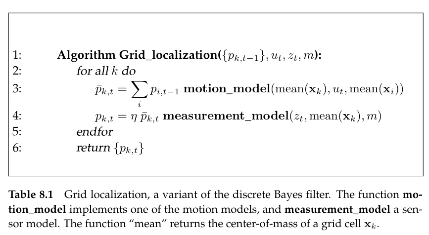
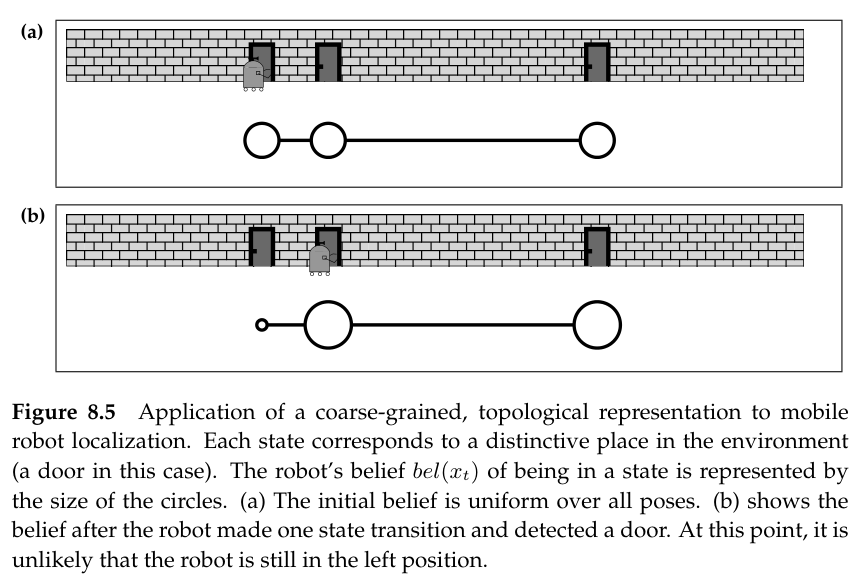
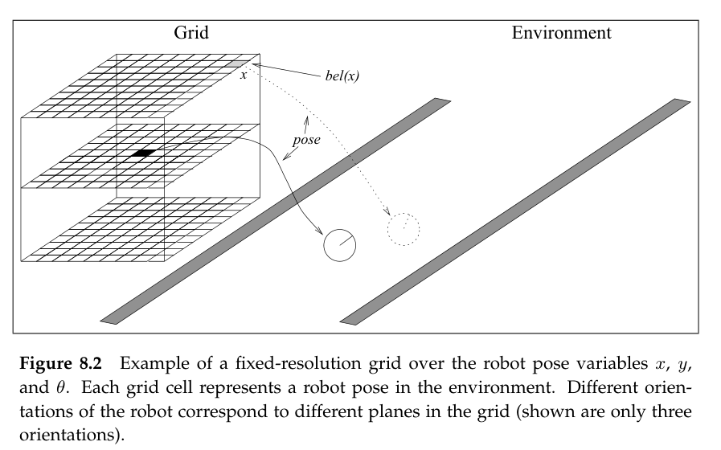
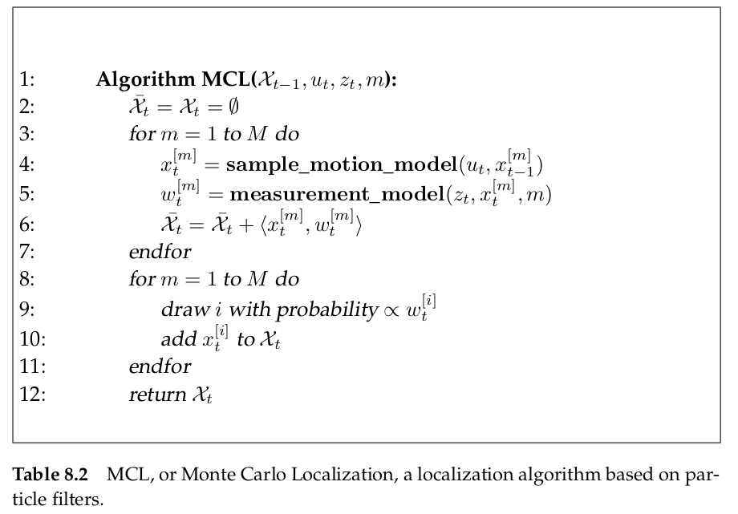
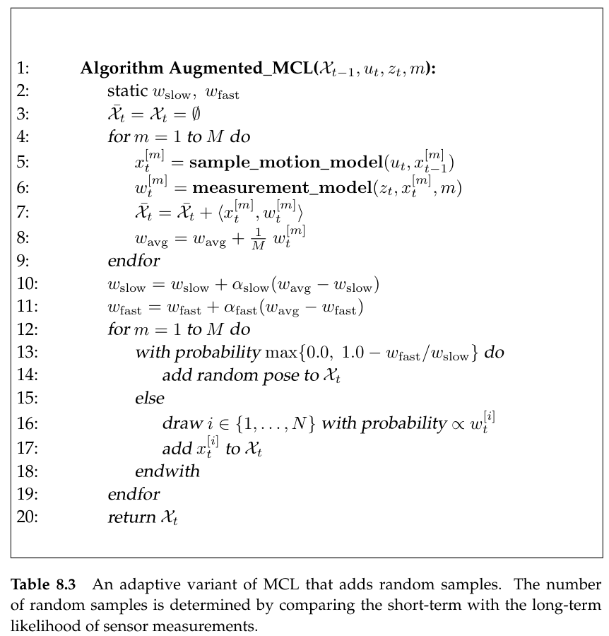
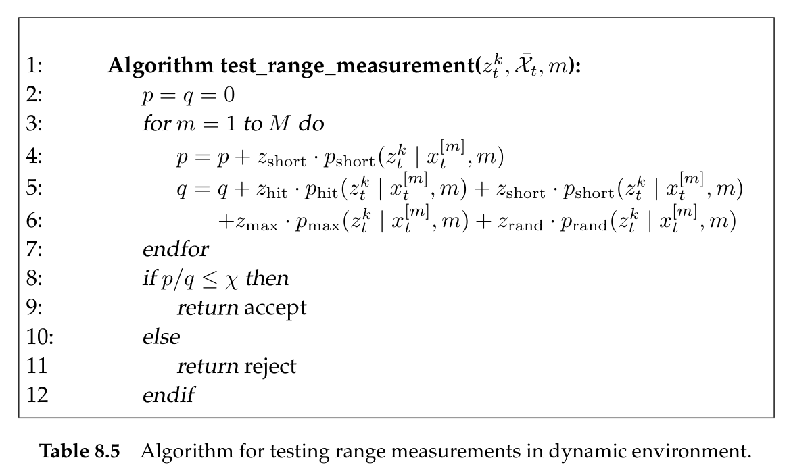

# Mobile Robot Localization: Grid And Monte Carlo

This chapter describes two localization algorithms that are capable of solving global localization problems. The algorithms discussed here possess a number of differences to the unimodal Gaussian techniques discussed in the previous chapter.

- They can process raw sensor measurements. There is no need to extract features from sensor value.
- They are non-parametric.
- They can solve global localization and-in some instances-kidnapped robot problems.

## Grid Localization

Grid localization **approximates the posterior using a histogram filter over a grid decomposition of the pose space.**

### Basic Algorithm

Grid localization is largely identical to the basic histogram filter from which it is derived. It requires as input the discrete probability values $bel(x_t)=\{p_{t-1,k}\}$, along with the most recent measurement, control, and the map. Each probability $\{p_{k,t}\}$ is defined over a grid cell $\mathbf{x}_k$. The set of all grid cells forms a partition of the space of all legitimate poses:
$$
\mathrm{domain}(X_t)=\mathbf{x}_{1,t}\cup \mathbf{x}_{2,t}\cup \ldots \mathbf{x}_{K,t}
$$
In most basic version of grid localization, the partitioning of the space of all poses is time-invariant, and each grid cell is of the same size.

### Grid Resolutions

#### Two type of sensor model representation

The type of sensor model is applicable. At the extreme end are two types of representations, *topological representation* and *metric representation*.

##### Topological Representation

This type of grid tends to be extremely coarse, and their resolution tends to be influenced by the structure of the environment. Topological representations decompose the space of all poses into regions that correspond to *significant places* in the environment. Such places may be defined by the presence of specific landmarks, such as doors and windows. In hallway environments, places may correspond to intersections, T-junctions, dead ends and so on.

##### Metric Representation

Such representations decompose the state space into fine-grained cells of uniform size. The resolution of such decompositions is usually much higher than that of topological grids. They are more accurate, but at the expense of increased computational costs.

#### Compensate for The Coarseness in the Resolution

When implementing grid for coarse resolutions, it is important to compensate for the coarseness in the resolution in the sensor and motion models. In particular, for a high-resolution sensor like a laser range finder, the value of the measurement model $p(z_t|x_t)$ may vary drastically inside each grid cell $\mathbf{x}_{k,t}$. If this is the case, just evaluating it at the center-of-mass will generally yield poor results. For example, if the motion is updated in 1 second intervals for a robot moving at 10 cm/sec, and the grid resolution is 1 meter, the naive implementation will never result in a state transition.

A common way to compensate this effect is to modify both the measurement and the motion model by inflating the amount of noise. For example, the variance of a angle finder model's main Gaussian cone may be enlarged by half the diameter of the grid cell. In doing so, the new model is much smoother, and its interpretation will be less susceptible to the exact location of the sample point relative to the correct robot location. However, this modified measurement model reduces the information extracted from the sensor measurements.

#### Computational Considerations

There exist a number of techniques to reduce the computational complexity of grid localization.

- *Model pre-caching*: A common strategy is to calculate for each grid cell essential statistics that facilitate the measurement update.
- *Sensor subsampling*: It achieves further speed-ups by evaluating the measurement model only for a subset of all ranges.
- *Delayed motion updates*: It applies the motion update at lower frequency than the control or measurement frequency of the robot.
- *Selective updating*: When updating the grid, selective techniques update a fraction of all grid cells only. A common implementation of this idea updates only those grid cells whose posterior probability exceeds a user-specified threshold.

## Monte Carlo Localization

### The MCL Algorithm

#### Properties of MCL

- MCL an approximate almost any distribution of practical importance.
- Increasing the total number of particles increases the accuracy of the approximation.

The number of particles M is a parameter that enables the user to trade off the accuracy of the computation and the computational resources necessary to run MCL. A common strategy for setting M is to keep sampling until the next pair $u_t$ and $z_t$ has arrived. However, care has to be taken that the number of particles remains high enough to avoid filter divergence.

### Random Particle MCL: Recovery from Failures

MCL, in its present form, solves the global localization problem but cannot recover from robot kidnapping, or global localization failures. Thinking a scene, while localizating, as the position is acquired, particles at places other than the most likely pose gradually disappear. At some point, particles only "survive" near a single pose, and the algorithm is unable to recover if this pose happens to be incorrect. 

This problem can be solved by a rather simple heuristic. **The idea of this heuristic is to add random particles to the particle sets**. 

The approach of adding particles raises two questions.

1. How many particles should be added at each iteration of the algorithm 
2. From which distribution should we generate these particles.

#### The number of particles should be added at each iteration

One might add a fixed number of random particles at each iteration. 

**A better idea is to add particles based on some estimate of the localization performance. One way to implement this idea is to monitor the probability of sensor measurements $p(z_t|z_{1:t-1},u_{1:t},m)$ and relate it to the average measurement probability. In particles filters, an approximation to this quantity is easily obtained from the importance factor, since, by definition, an importance weight is a stochastic estimate of this probability.** The average value
$$
\frac{1}{M}\sum_{m=1}^{M}w_t^{[m]} \approx p(z_t|z_{1:t-1},u_{1:t},m)
$$
It is usually a good idea to smooth this estimate by averaging it to over multiple time steps. There exist multiple reasons why the measurement probability may be low, besides a localization failure. The amount of sensor noise might be unnaturally high, or the particles may still be spread out during a global localization phase. **For these reasons, it is a good idea to maintain a short-term average of the measurement likelihood, and relate it to the long-term average when determining the number of random samples.**

#### Which sample distribution to use

One can draw particles according to a uniform distribution over the pose space and weight them with the current observation.

For some sensor models, it is possible to generate particles directly in accordance to the measurement distribution.

#### Augmented MCL

It is an adaptive variant of MCL that adds random samples.

The algorithm requires that $0\leqslant \alpha_{\mathrm{slow}} \ll \alpha_{\mathrm{fast}}$. The parameters $\alpha_{\mathrm{slow}}$, and $\alpha_{\mathrm{fast}}$, are **decay rates** for the exponential filters that estimate the long-term, and short-term, averages, respectively. During the resampling process, a random sample is added with probability $\max\{0.0, 1,0-w_{\mathrm{fast}}/w_{\mathrm{slow}} \}$.

The probability of adding a random sample takes into consideration the divergence between the short- and the long-term average of the measurement likelihood. **If the short-term likelihood is better or equal to the long-term likelihood, no random sample is added. If the short term likelihood is worse than the long-term one, random samples are added in proportion to the quotient of these values.** In this way, a sudden decay in measurement likelihood induces an increased number of random samples. The exponential smoothing counteracts the danger of mistaking momentary sensor noise for a poor localization result.

### MCL with mixture proposal distribution

The MCL proposal mechanism is another source that can render MCL inefficient. The particle filter uses the motion model as proposal distribution and the perceptual likelihood. The larger the difference between the proposal and the target distribution, the more samples are needed.

A simple trick provides remedy: Simply use a measurement model that artificially inflates the amount of noise in the sensor. **One can think of this inflation as accommodating not just the measurement uncertainty, but also the uncertainty induced by the approximate nature of the particle filter algorithm**.

An alternative, more sound solution involves a modification of the sampling process. **The idea is that for a small fraction of all particles, the role of the motion model and the measurement model are reversed: Particles are generated according to the measurement model**
$$
x_t^{[m]}\space\sim\space p(z_t|x_t)
$$
**and the importance weight is calculated in proportion to**
$$
w_t^{[m]} \space = \space \int p(x_t^{[m]}|u_t,x_{t-1})bel(x_{t-1})\dd{x_{t-1}}
$$
This new sampling process will be inefficient since it entirely ignores the history when generating particles. However, it is equally legitimate to generate a fraction of the particles with either of those two mechanisms and merge two particle sets.

However, the two main steps --sampling from $p(z_t|x_t)$ and calculating the importance weights $w_t^{[m]}$--can be difficult to realize. Sampling from the measurement model is only easy if its inverse possesses a closed form solution from which it is easy to sample. Calculating the importance weights is complicated by the integral, and by the fact that $bel(x_{t-1})$ is itself represented by a set of particles.

Without delving into much detail, **both steps can be implemented, but only with additional approximations.** In both cases, $p(z_t|x_t)$ was itself learned from data and represented by a density tree--an elaborate procedure whose description is beyond the scope of this book. **For calculating the importance weights, the integral was replaced by a stochastic integration, and the prior belief was continued into a space-filling density by convolving each particle with a narrow Gaussian.** 

The MCL provides a sound solution to the **kidnapped robot problem**. **By seed-starting particles using the most recent measurement only, we constantly generate particles at locations that are plausible given the momentary sensor input, regardless of past measurements and controls.**

### KLD-Sampling: Adapting the Size of Sample Sets

The size of the samples sets used to represent beliefs is an important parameter for the efficiency of particle filters. So far we only discussed particle filters that use sample sets of fixed size.

*KLD-Sampling* is a variant of MCL that adapts the number of particles over time. The name *KLD-sampling* is derived from the *Kullback-Leibler divergence*, which is a measure of the difference between two probability distributions. **The idea behind KLD-sampling is to determine the number of particles based on a statistical bound on the sample-based approximation quality.**

I didn't understand the details of the algorithm. .......

### Localization in Dynamic Environments

A key limitation of all localization algorithms discussed thus far arises from the static world assumption, or Markov assumption. Most interesting environments are populated by people and hence exhibit dynamics not modeled by state state $x_t$. **To some extent, probabilistic approaches are robust to such unmodeled dynamics, due to their ability to accommodate sensor noise.** However, the type of sensor noise accommodated in the probabilistic filtering framework must be independent at each time step, whereas unmodeled dynamics induce effects on the sensor measurements over multiple times steps.

There exist two fundamental techniques for dealing with dynamic environments.

- *state augmentation*: It includes the hidden state into the state estimated by the filter. Instead of just estimating the robot's pose, one can define a filter that also estimates people's positions, their velocities. The principle disadvantage of estimating the hidden state variables lies in its computational complexity: Instead of estimating 3 variables, the robot must now calculate posteriors over a much lager number of variables. In fact, the number of variables itself is a variable, as the number of people may vary over time.
- *outlier rejection*: It pre-processes sensor measurements to eliminate measurements affected by hidden state.

#### Outlier Rejection

**The idea is to investigate the cause of a sensor measurement, and to reject those likely to be affected by unmodeled environment dynamics.** If we manage to associate specific ways with the presence of unwanted dynamic effects--such as people--all we have to do is to discard those measurements that are with high likelihood caused by such an unmodeled entity.

In chapter 6.3, we defined the beam-based measurement model for range finders as a mixture of four terms
$$
p(z_t^k|x_t,m)=
\begin{bmatrix}
z_{\mathrm{hit}}\\
z_{\mathrm{short}}\\
z_{\mathrm{max}}\\
z_{\mathrm{rand}}\\
\end{bmatrix}^T
\cdot
\begin{bmatrix}
p_{\mathrm{hit}}(z_t^k|x_t,m)\\
p_{\mathrm{short}}(z_t^k|x_t,m)\\
p_{\mathrm{max}}(z_t^k|x_t,m)\\
p_{\mathrm{rand}}(z_t^k|x_t,m)\\
\end{bmatrix}
$$
As our derivation of the model clearly states, **one of those terms, the one involving $z_{\mathrm{short}}$ and $p_{\mathrm{short}}$, corresponds to unexpected objects.** **To calculate the probability that a measurement $z_t^k$ corresponds to an unexpected object**, we have to introduce a new **correspondence variable, $\bar{c}_t^k$** which can take on one of the four values $\{\mathrm{hit},\mathrm{short},\mathrm{max},\mathrm{rand}\}$.

The posterior probability that the range measurement $z_t^k$ corresponds to a "short" reading can be obtained by applying Bayes rule and subsequently dropping irrelevant conditioning variables
$$
\begin{split}
p(&\bar{c}_t^k = \mathrm{short}|z_t^k,z_{1:t-1},u_{1:t},m)\\
&= \frac{p(z_t^k|\bar{c}_t^k=\mathrm{short},z_{1:t-1},u_{1:t},m)p(\bar{c}_t^k=\mathrm{short}|z_{1:t-1},u_{1:t},m)}{\sum_cp(z_t^k|\bar{c}_t^k=c,z_{1:t-1},u_{1:t},m)p(\bar{c}_t^k=c|z_{1:t-1},u_{1:t},m)}\\
&= \frac{p(z_t^k|\bar{c}_t^k=\mathrm{short},z_{1:t-1},u_{1:t},m)p(\bar{c}_t^k=\mathrm{short})}{\sum_cp(z_t^k|\bar{c}_t^k=c,z_{1:t-1},u_{1:t},m)p(\bar{c}_t^k=c)}\\
\end{split}
$$
Here the variable $c$ in the denominator takes on any of the four values $\{\mathrm{hit},\mathrm{short},\mathrm{max},\mathrm{rand}\}$. The remaining probability in the above form is obtained by integrating out $x_t$
$$
\begin{split}
p(&z_t^k|\bar{c}_t^k=c,z_{1:t-1},u_{1:t},m)\\
&= \int p(z_t^k|x_t,\bar{c}_t^k=c,z_{1:t-1},u_{1:t},m) p(x_t|\bar{c}_t^k=c,z_{1:t-1},u_{1:t},m)\dd{x_t}\\
&= \int p(z_t^k|x_t,\bar{c}_t^k=c,m) p(x_t|z_{1:t-1},u_{1:t},m)\dd{x_t}\\
&= \int p(z_t^k|x_t,\bar{c}_t^k=c,m) \overline{bel}(x_t)\dd{x_t}
\end{split}
$$
Probabilities of the form $p(z_t^k|x_t,\bar{c}_t^k=c,m)$ were abbreviated as $p_{\mathrm{hit}},p_{\mathrm{short}},p_{\mathrm{max}},p_{\mathrm{rand}}$. 

So the posterior probability can be expressed as
$$
p(\bar{c}_t^k=\mathrm{short}|z_t^k,z_{1:t-1},u_{1:t},m)=\frac{\int p_{\mathrm{short}}(z_t^k|x_t,m)z_{\mathrm{short}}\overline{bel}(x_t)\dd{x_t}}{\int \sum_c p_c(z_t^k|x_t,m)z_c\overline{bel}(x_t)\dd{x_t}}
$$
**In general, the integrals in this form do not possess closed-form solutions. To evaluate them, it suffices to approximate them with a representative sample of the posterior $\overline{bel}(x_t)$ over the state $x_t$.** The measurement is them rejected if its probability of being caused by an unexpected obstacle exceeds a user-selected threshold.

