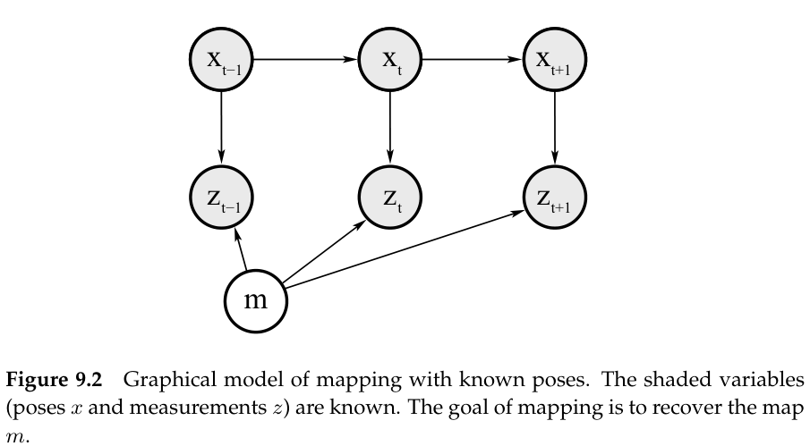
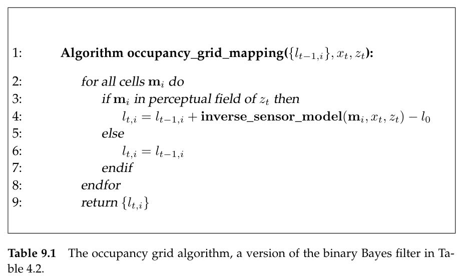
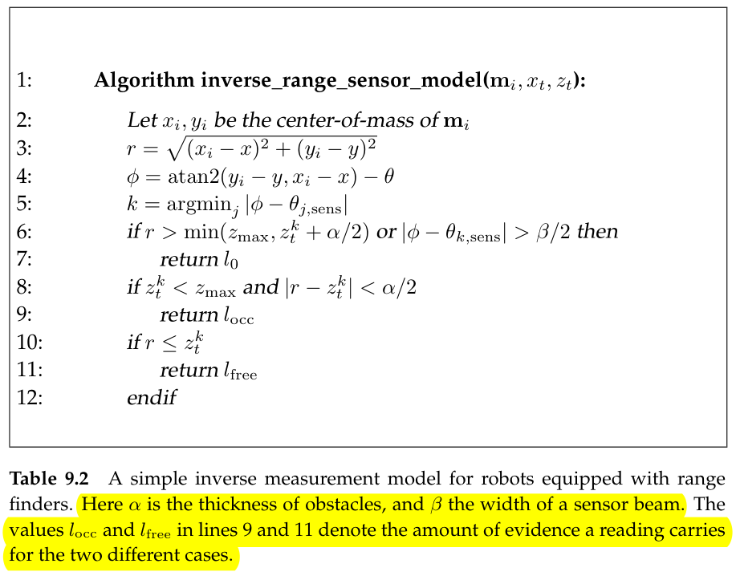
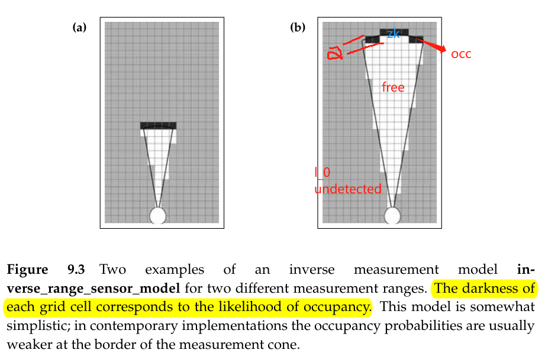
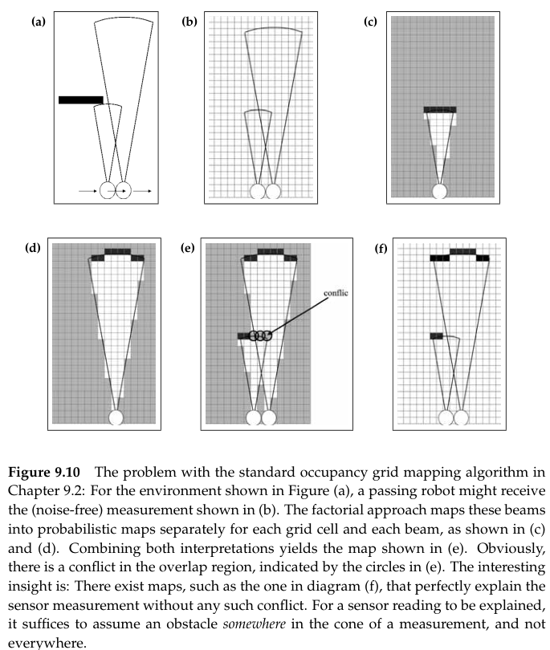
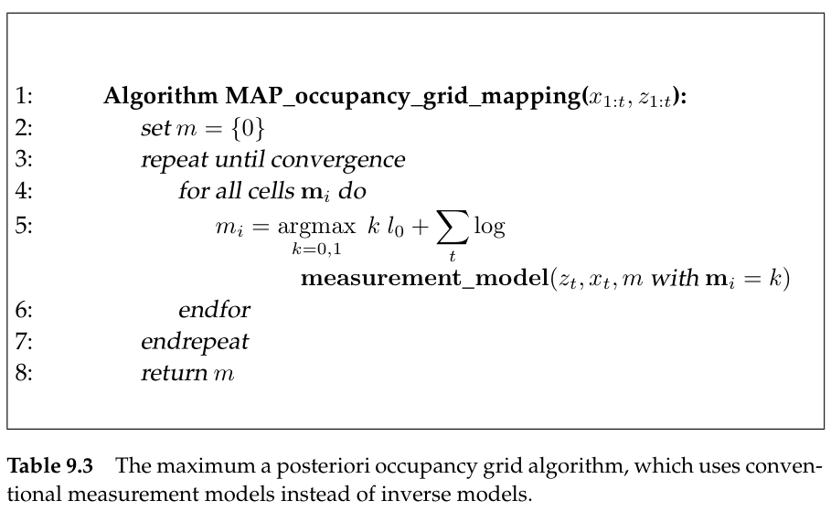

# Occupancy Grid Mapping

In the previous two chapters, we assumed that the robot was given a map in advance. This assumption is legitimate in quite a few real-world applications.

Acquiring maps with mobile robots is a challenging problem for a number of reasons:

- The hypothesis space, which is the space of all possible maps, is huge. The larger the environment relative to the robot's perceptual range, the more difficult it is to acquire a map.
- Learning maps is a "chicken-and-egg" problem, for which reason it is often referred to as the *simultaneous localization and mapping* (SLAM).

The hardness of the mapping problem is the result of collection of factors, the most important of which are:

- **Size**
- **Noise in perception and actuation**
- **Perceptual ambiguity**: The more frequently different places look alike, the more difficult it is to establish correspondence between different locations traversed at different points in time.
- **Cycles**: Cycles make robots return via different paths, and when closing a cycle the accumulated odometric error can be huge.

## Assumption in This Chapter

In this chapter, we first study the mapping problem **under the restrictive assumption that the robot pose are known.**

## The Occupancy Grid Mapping Algorithm

**The algorithm is under the assumption that the robot pose is known**. The basic idea of the occupancy grids is to **represent the map as a field of random variables**, arranged in an evenly spaced grid. **Each random variable is binary and corresponds to the occupancy of the location it covers**. 

The gold standard of any occupancy grid mapping algorithm is to **calculate the posterior over maps given the data**
$$
p(m|z_{1:t},x_{1:t})
$$
$m$ is the map, $z_{1:t}$ the set of all measurements up to time $t$ and $x_{1:t}$ is the **path** of the robot defined through the sequence of all poses. **The controls $u_{1:t}$ play no role in occupancy grid maps, since the path is already known**

**The algorithm divide the map to many grid cells**
$$
m = \{\mathbf{m}_i\}
$$
**Each $\mathbf{m}_i$ has attached to it a binary occupancy value, which specifies whether a cell is occupied or free**. We will write "1" for occupied and "0" for free. The notation $p(\mathbf{m}_i=1)$ or $p(\mathbf{m}_i)$ refers to the probability that a grid cell is occupied.

The problem of calculating the posterior $p(m|z_{1:t},x_{1:t})$ is its dimensionality. The number of grid cells in maps are in the tens of thousands. For a map with 10,000 grid cells, the number of maps that can be represented by this map is $2^{10,000}$. Calculating a posterior probability for each single map is therefore intractable.

The standard occupancy grid approach breaks down the problem of estimating the map into a collection of separate problems, namely that of estimating
$$
p(m|z_{1:t},x_{1:t})=\prod_{i} p(\mathbf{m}_i|z_{1:t},x_{1:t})
$$
It is convenient but it does not enable us to represent dependencies among neighboring cells.

For binary Bayes filter, you can refer to [ch4_Nonparametric_Filters](ch4_Nonparametric_Filters.md)

Here,the $log\space odds$ is
$$
l_{t,i} = \log\frac{p(\mathbf{m}_i|z_{1:t},x_{1:t})}{1-p(\mathbf{m}_i|z_{1:t},x_{1:t})}
\rightarrow
p(\mathbf{m}_i|z_{1:t},x_{1:t})=1-\frac{1}{1+\exp\{l_{t,i}\}}
$$
The constant $l_0$ is the prior of occupancy represented as a log odds ratio
$$
l_0=\log\frac{p(\mathbf{m}_i=1)}{p(\mathbf{m}_i=0)}=\log\frac{p(\mathbf{m}_i)}{1-p(\mathbf{m}_i)}
$$
The function **inverse_sensor_model** implements the inverse measurement model $p(\mathbf{m}_i|z_t,x_t)$ in its log odds form
$$
\mathbf{inverse\_sensor\_model}(\mathbf{m}_i,x_t,z_t)=\log\frac{p(\mathbf{m}_i|z_t,x_t)}{1-p(\mathbf{m}_i|z_t,x_t)}
$$
For range sensor, we give the following implement

We assume that the robot pose is given by $x_t=(x,y,\theta)^T$

## Multi-Sensor Fusion

Robots are often equipped with more than one type of sensor. Hence a natural objective is to integrate information from more than one sensor into a single map. This question as to how to best integrate from multiple sensors is particularly interesting **if the sensors have different characteristics**. For example, if different sensors detect different types of obstacles, the result of Bayes filtering is ill-defined. Assume that an obstacle can be recognized by one sensor type but not by another. Then these two sensor types will generate conflicting information. and the resulting map will depend on the amount of evidence brought by every sensor system.

**A popular approach to integrating information from multiple sensors is to build separate maps for each sensor type, and integrate them using an appropriate combination function**.

Let $m^k=\{\mathbf{m}_i^k\}$ denote the map build by the k-th sensor type. **If the measurements of the sensor are independent of each other**, we can directly combine them using *De Morgan's law*.
$$
p(\mathbf{m}_i) = 1-\prod_k(1-p(\mathbf{m}_i^k))
$$
or compute the maximum of all maps
$$
p(\mathbf{m}_i)=\max_k p(\mathbf{m}_i^k)
$$

## Learning Inverse Measurement Models

## Maximum A Posteriori Occupancy Mapping

In the previous sections, we assumed that we can safely decompose the map inference problem defined over high-dimensional space of all maps, into a collection of single-cell mapping problems.
$$
p(m|z_{1:t},x_{1:t})=\prod_i p(\mathbf{m}_i|z_{1:t},x_{1:t})
$$
Such a strong decomposition may cause some problems. Looking at the following example. (Notice that a cone is one beam and the range sensor predicts an object along the **entire arc** at the measured range since the range sensor's prediction unit is beam)

### Occupancy Grid Mapping with Forward Models

These dependencies are incorporated by an algorithm that outputs the mode of the posterior, instead of the full posterior. The mode is defined as the maximum of the logarithm of the map posterior.
$$
m^* =\arg\max_{m} \log p(m|z_{1:t},x_{1:t})
$$
using Bayes equation
$$
p(m|z_{1:t},x_{1:t})=\frac{p(z_{1:t}|x_{1:t},m)p(m|x_{1:t})}{p(z_{1:t}|x_{1:t})}=\eta p(z_{1:t}|x_{1:t},m)p(m|x_{1:t})
$$
we have $p(m|x_{1:t})=p(m)$ since the map is independent of the path $x_{1:t}$
$$
p(m|z_{1:t},x_{1:t})=\eta p(z_{1:t}|x_{1:t},m)p(m)\\
\rightarrow \log p(m|z_{1:t},x_{1:t})=const.+\log p(z_{1:t}|x_{1:t},m)+\log p(m)
$$
the log-likelihood $\log p(z_{1:t}|x_{1:t},m)$ decomposes into a **sum of individual measurement log-likelihoods**
$$
\log p(z_{1:t}|x_{1:t},m)=\sum\log p(z_t|x_{1:t},m)=\sum\log p(z_t|x_{t},m)
$$
**the log-prior also can be decomposed **($p(\mathbf{m})$ is the prior probability of occupancy, e.g. $p(\mathbf{m})=0.5$)
$$
\begin{split}
p(m) &= \prod_i p(\mathbf{m})^{\mathbf{m}_i}(1-p(\mathbf{m}))^{1-\mathbf{m}_i}\\
&= (1-p(\mathbf{m}))^N\prod_i p(\mathbf{m})^{\mathbf{m}_i}(1-p(\mathbf{m}))^{-\mathbf{m}_i}\\
&= \eta\prod_i p(\mathbf{m})^{\mathbf{m}_i}(1-p(\mathbf{m}))^{-\mathbf{m}_i}\\
\log p(m) &= const. + \sum_i [\mathbf{m}_i\log p(\mathbf{m})-\mathbf{m}_i\log(1-p(\mathbf{m}))]\\
&= const. + \sum_i \mathbf{m}_i\log\frac{p(\mathbf{m})}{1-p(\mathbf{m}_i)}\\
&= const. + \sum_i \mathbf{m}_il_0
\end{split}
$$
so
$$
\begin{split}
m^* &= \arg\max_m \sum_t \log p(z_{1:t}|x_{1:t},m)+\log p(m)\\
&= \arg\max_m \sum_t \log p(z_{1:t}|x_{1:t},m)+l_0\sum_i \mathbf{m}_i
\end{split}
$$
then, we use hill-climbing algorithm to maximizing this log-probability

### Shortcoming

- The algorithm is a maximum a posteriori approach, and as such returns no notion of uncertainty in toe residual map
- The algorithm is a batch algorithm and cannot be executed incrementally
- The MAP algorithm requires that all data is kept in memory

