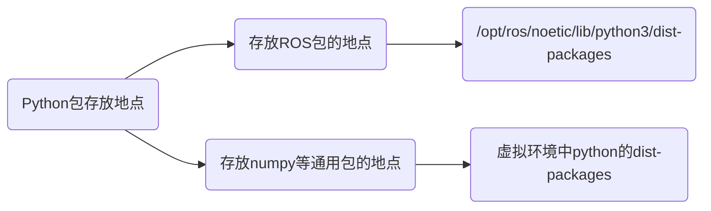

# Python Detect Module Path

给系统的`/usr/bin/python`安装python包的时候有以下几种安装方式

1. pip安装

   ```bash
   pip install matplotlib
   ```

2. apt安装

   ```bash
   sudo apt-get install python3-matplotlib
   ```

这两个方式安装的包会存放在`/usr/lib/python3/dist-packages`中

当使用apt安装时，它会给众多包加上依赖关系，当想要删除这个包时，会连带着将这些依赖的包给删掉

```bash
➜  Downloads sudo apt-get remove python3-matplotlib
[sudo] password for lyxichigoichie: 
Reading package lists... Done
Building dependency tree       
Reading state information... Done
The following packages were automatically installed and are no longer required:
  fltk1.3-doc fluid hddtemp libfltk-cairo1.3 libfltk-forms1.3 libfltk-gl1.3 libfltk-images1.3
  libfltk1.3 libfltk1.3-dev libjs-jquery-ui python-matplotlib-data python3-cycler
  python3-kiwisolver python3-opengl python3-pydot python3-pyqt5.qtopengl python3-pyqt5.qtwebkit
  ros-noetic-actionlib-tutorials ros-noetic-bond-core ros-noetic-bondpy
  ros-noetic-camera-calibration ros-noetic-common-msgs ros-noetic-common-tutorials
  ros-noetic-depth-image-proc ros-noetic-diagnostic-aggregator ros-noetic-diagnostic-analysis
  ros-noetic-diagnostic-common-diagnostics ros-noetic-diagnostics ros-noetic-executive-smach
  ros-noetic-geometry ros-noetic-geometry-tutorials ros-noetic-gl-dependency
  ros-noetic-image-common ros-noetic-image-geometry ros-noetic-image-pipeline
  ros-noetic-image-proc ros-noetic-image-publisher ros-noetic-image-rotate ros-noetic-image-view
  ros-noetic-interactive-marker-tutorials ros-noetic-interactive-markers
  ros-noetic-joint-state-publisher ros-noetic-joint-state-publisher-gui
  ros-noetic-kdl-conversions ros-noetic-kdl-parser ros-noetic-laser-assembler
  ros-noetic-laser-filters ros-noetic-laser-pipeline ros-noetic-librviz-tutorial
  ros-noetic-media-export ros-noetic-mk ros-noetic-nodelet-core ros-noetic-nodelet-topic-tools
  ros-noetic-nodelet-tutorial-math ros-noetic-pcl-conversions ros-noetic-pcl-msgs
  ros-noetic-pcl-ros ros-noetic-perception ros-noetic-perception-pcl
  ros-noetic-pluginlib-tutorials ros-noetic-qt-dotgraph ros-noetic-qt-gui-py-common
  ros-noetic-qwt-dependency ros-noetic-resource-retriever ros-noetic-robot
  ros-noetic-robot-state-publisher ros-noetic-ros ros-noetic-ros-base ros-noetic-ros-comm
  ros-noetic-ros-core ros-noetic-rosbash ros-noetic-rosboost-cfg ros-noetic-roscpp-core
  ros-noetic-roscreate ros-noetic-roslang ros-noetic-roslint ros-noetic-roslisp
  ros-noetic-rosmake ros-noetic-rqt-action ros-noetic-rqt-bag ros-noetic-rqt-console
  ros-noetic-rqt-dep ros-noetic-rqt-graph ros-noetic-rqt-image-view ros-noetic-rqt-launch
  ros-noetic-rqt-logger-level ros-noetic-rqt-moveit ros-noetic-rqt-msg ros-noetic-rqt-nav-view
  ros-noetic-rqt-pose-view ros-noetic-rqt-publisher ros-noetic-rqt-py-common
  ros-noetic-rqt-py-console ros-noetic-rqt-reconfigure ros-noetic-rqt-robot-dashboard
  ros-noetic-rqt-robot-monitor ros-noetic-rqt-robot-plugins ros-noetic-rqt-robot-steering
  ros-noetic-rqt-runtime-monitor ros-noetic-rqt-rviz ros-noetic-rqt-service-caller
  ros-noetic-rqt-shell ros-noetic-rqt-srv ros-noetic-rqt-tf-tree ros-noetic-rqt-top
  ros-noetic-rqt-topic ros-noetic-rqt-web ros-noetic-rviz ros-noetic-rviz-plugin-tutorials
  ros-noetic-rviz-python-tutorial ros-noetic-self-test ros-noetic-shape-msgs ros-noetic-smach
  ros-noetic-smach-msgs ros-noetic-smach-ros ros-noetic-stage ros-noetic-stage-ros
  ros-noetic-stereo-image-proc ros-noetic-stereo-msgs ros-noetic-tf-conversions
  ros-noetic-tf2-eigen ros-noetic-tf2-kdl ros-noetic-turtle-actionlib ros-noetic-turtle-tf
  ros-noetic-turtle-tf2 ros-noetic-urdf-parser-plugin ros-noetic-urdf-sim-tutorial
  ros-noetic-urdf-tutorial ros-noetic-vision-opencv ros-noetic-visualization-marker-tutorials
  ros-noetic-visualization-tutorials ros-noetic-webkit-dependency ros-noetic-xacro sbcl
Use 'sudo apt autoremove' to remove them.
The following packages will be REMOVED:
  python3-matplotlib ros-noetic-desktop ros-noetic-desktop-full ros-noetic-rqt-bag-plugins
  ros-noetic-rqt-common-plugins ros-noetic-rqt-plot ros-noetic-simulators ros-noetic-viz
0 upgraded, 0 newly installed, 8 to remove and 136 not upgraded.
After this operation, 14.1 MB disk space will be freed.
Do you want to continue? [Y/n] 
```

这显然不是我们想要的。因此，安装python包应该统一用pip安装，而不要用apt安装。

那么对于已经使用apt安装而又无法删除的包，非常可能由于版本问题而无法使用，为了解决这个问题，我们使用conda创建一个新的环境，而不使用系统的`/usr/bin/python`以及存放在`/usr/lib/python3/dist-packages`中的包

## Python模块搜索路径

https://www.cnblogs.com/ljhdo/p/10674242.html

Python搜索模块的路径是由四部分构成的：程序的主目录、PYTHONPATH目录、标准链接库目录和.pth文件的目录，这四部分的路径都存储在sys.path 列表中。

1. **程序的主目录**

   主目录是指包含程序的顶层脚本的目录，Python首先会到主目录中搜索模块。

   因为主目录总是第一个被搜索，如果模块完全处于主目录中，所有的导入都会自动完成，而不需要单独配置路径。

2. **PYTHONPATH目录**

   PYTHONPATH目录是指PYTHONPATH环境变量中配置的目录，是第二个被搜索的目录，Python会从左到右搜索PYTHONPATH环境变量中设置的所有目录。

3. **标准链接库目录**

   标准链接库目录是Python按照标准模块的目录，是在安装Python时自动创建的目录，通常不需要添加到PYTHONPATH目录中。通常为

   ```bash
   ➜  Downloads /usr/bin/python3
   Python 3.8.10 (default, May 26 2023, 14:05:08) 
   [GCC 9.4.0] on linux
   Type "help", "copyright", "credits" or "license" for more information.
   >>> import sys
   >>> sys.path
   ['', '/usr/lib/python38.zip', '/usr/lib/python3.8', '/usr/lib/python3.8/lib-dynload', '/home/lyxichigoichie/.local/lib/python3.8/site-packages', '/usr/local/lib/python3.8/dist-packages', '/usr/lib/python3/dist-packages']
   >>> 
   ```

4. **路径文件（.pth文件）**

   在模块搜索目录中，创建路径文件，后缀名为.pth，该文件每一行都是一个有效的目录。Python会读取路径文件中的内容，每行都作为一个有效的目录，加载到模块搜索路径列表中。简而言之，当路径文件存放到搜索路径中时，其作用和PYTHONPATH环境变量的作用相同。

   如果运行在Windows和Python3.0中，如果Python安装目录的顶层是C:\Python30，那么可以把自定义的路径文件 mypath.pth 放到该目录中。

   也可以放到标准库所在位置的sitepackages子目录中（C:\Python30\Lib\sitepackages），来扩展模块的搜搜路径。

## dist-packages 与 site-packages

https://www.cnblogs.com/kevin922/p/3161411.html

dist-packages 是 Debian特定惯例，这也存在于像是ubuntu上。 如果使用Debian软件管理器安装， 模块将被安装到 dist-packages：

```bash
/usr/lib/python2.7/dist-packages
```

dist-packages取代了site-packages。从Debian安装包安装的第三方的Python软件 被 安装到 dist-packages,不是 site-packages.这是为了减少，系统自带python 和 你手动安装的python 之间的冲突。

如果你手动安装python，它会直接使用目录site-packages。这允许你让两个安装隔离开来，特别是因为Debian 和 Ubuntu 应用 python的系统版本到许多的系统实体。

```bash
/home/lyxichigoichie/.local/lib/python3.8/site-packages
```

## ROS安装的Python包

ROS是通过扩展`$PYTHONPATH`来扩展搜索路径的

```bash
➜  dist-packages echo $PYTHONPATH
/opt/ros/noetic/lib/python3/dist-packages
```


```bash
➜  dist-packages pwd   
/opt/ros/noetic/lib/python3/dist-packages
➜  dist-packages ls
actionlib                                      roslz4
actionlib-1.14.0.egg-info                      roslz4-1.16.0.egg-info
actionlib_msgs                                 rosmake
actionlib_tutorials                            rosmake-1.15.8.egg-info
amcl                                           rosmaster
angles                                         rosmaster-1.16.0.egg-info
angles-1.9.13.egg-info                         rosmsg
base_local_planner                             rosmsg-1.16.0.egg-info
base_local_planner-1.17.3.egg-info             rosnode
bond                                           rosnode-1.16.0.egg-info
bondpy                                         rosparam
bondpy-1.8.6.egg-info                          rosparam-1.16.0.egg-info
camera_calibration                             rospy
camera_calibration-1.17.0.egg-info             rospy-1.16.0.egg-info
camera_calibration_parsers                     rospy_tutorials
camera_calibration_parsers-1.12.0.egg-info     rosservice
catkin                                         rosservice-1.16.0.egg-info
catkin-0.8.10.egg-info                         rostest
compressed_depth_image_transport               rostest-1.16.0.egg-info
compressed_image_transport                     rostopic
controller_manager                             rostopic-1.16.0.egg-info
controller_manager-0.19.6.egg-info             rosunit
controller_manager_msgs                        rosunit-1.15.8.egg-info
controller_manager_msgs-0.19.6.egg-info        roswtf
control_msgs                                   roswtf-1.16.0.egg-info
control_toolbox                                rqt_action
costmap_2d                                     rqt_action-0.4.9.egg-info
cras                                           rqt_bag
cras_cpp_common                                rqt_bag-0.5.1.egg-info
cras_msgs                                      rqt_bag_plugins
cras_py_common-2.3.1.egg-info                  rqt_bag_plugins-0.5.1.egg-info
cv_bridge                                      rqt_console
cv_bridge-1.16.2.egg-info                      rqt_console-0.4.11.egg-info
diagnostic_analysis                            rqt_dep
diagnostic_analysis-1.11.0.egg-info            rqt_dep-0.4.12.egg-info
diagnostic_common_diagnostics                  rqt_graph
diagnostic_common_diagnostics-1.11.0.egg-info  rqt_graph-0.4.14.egg-info
diagnostic_msgs                                rqt_gui
diagnostic_updater                             rqt_gui-0.5.3.egg-info
diagnostic_updater-1.11.0.egg-info             rqt_gui_py
diff_drive_controller                          rqt_gui_py-0.5.3.egg-info
dwa_local_planner                              rqt_image_view-0.4.17.egg-info
dynamic_reconfigure                            rqt_launch
dynamic_reconfigure-1.7.3.egg-info             rqt_launch-0.4.9.egg-info
gazebo_msgs                                    rqt_logger_level
gazebo_plugins                                 rqt_logger_level-0.4.11.egg-info
gazebo_plugins-2.9.2.egg-info                  rqt_moveit
gazebo_ros                                     rqt_moveit-0.5.10.egg-info
gazebo_ros-2.9.2.egg-info                      rqt_msg
gencpp                                         rqt_msg-0.4.10.egg-info
gencpp-0.7.0.egg-info                          rqt_nav_view
geneus                                         rqt_nav_view-0.5.7.egg-info
geneus-3.0.0.egg-info                          rqt_plot
genlisp                                        rqt_plot-0.4.13.egg-info
genlisp-0.4.18.egg-info                        rqt_pose_view
genmsg                                         rqt_pose_view-0.5.11.egg-info
genmsg-0.6.0.egg-info                          rqt_publisher
gennodejs                                      rqt_publisher-0.4.10.egg-info
gennodejs-2.0.2.egg-info                       rqt_py_common
genpy                                          rqt_py_common-0.5.3.egg-info
genpy-0.6.15.egg-info                          rqt_py_console
geographic_msgs                                rqt_py_console-0.4.10.egg-info
geometry_msgs                                  rqt_reconfigure
global_planner                                 rqt_reconfigure-0.5.5.egg-info
image_geometry                                 rqt_robot_dashboard
image_geometry-1.16.2.egg-info                 rqt_robot_dashboard-0.5.8.egg-info
image_proc                                     rqt_robot_monitor
image_publisher                                rqt_robot_monitor-0.5.14.egg-info
image_rotate                                   rqt_robot_steering
image_transport_codecs                         rqt_robot_steering-0.5.12.egg-info
image_transport_codecs-2.3.1.egg-info          rqt_runtime_monitor
image_view                                     rqt_runtime_monitor-0.5.9.egg-info
interactive_markers                            rqt_rviz-0.7.0.egg-info
interactive_markers-1.12.0.egg-info            rqt_service_caller
joint_state_publisher                          rqt_service_caller-0.4.10.egg-info
joint_state_publisher-1.15.1.egg-info          rqt_shell
joint_state_publisher_gui                      rqt_shell-0.4.11.egg-info
joint_state_publisher_gui-1.15.1.egg-info      rqt_srv
laser_assembler                                rqt_srv-0.4.9.egg-info
laser_filters                                  rqt_tf_tree
laser_geometry                                 rqt_tf_tree-0.6.3.egg-info
laser_geometry-1.6.7.egg-info                  rqt_top
local_planner_limits                           rqt_top-0.4.10.egg-info
map_msgs                                       rqt_topic
message_filters                                rqt_topic-0.4.13.egg-info
message_filters-1.16.0.egg-info                rqt_web
move_base                                      rqt_web-0.4.10.egg-info
move_base_msgs                                 rviz
navfn                                          rviz-1.14.20.egg-info
nav_msgs                                       sensor_msgs
nodelet                                        sensor_msgs-1.13.1.egg-info
nodelet_topic_tools                            shape_msgs
octomap_msgs                                   smach
pcl_msgs                                       smach-2.5.2.egg-info
pcl_ros                                        smach_msgs
polled_camera                                  smach_ros
python_qt_binding                              smach_ros-2.5.2.egg-info
python_qt_binding-0.4.4.egg-info               smclib
qt_dotgraph                                    smclib-1.8.6.egg-info
qt_dotgraph-0.4.2.egg-info                     std_msgs
qt_gui                                         std_srvs
qt_gui-0.4.2.egg-info                          stereo_image_proc
qt_gui_cpp                                     stereo_msgs
qt_gui_cpp-0.4.2.egg-info                      tf
qt_gui_py_common                               tf-1.13.2.egg-info
qt_gui_py_common-0.4.2.egg-info                tf2_geometry_msgs
resource_retriever                             tf2_geometry_msgs-0.7.6.egg-info
resource_retriever-1.12.7.egg-info             tf2_kdl
robot_localization                             tf2_kdl-0.7.6.egg-info
ros                                            tf2_msgs
rosbag                                         tf2_py
rosbag-1.16.0.egg-info                         tf2_py-0.7.6.egg-info
rosboost_cfg                                   tf2_ros
rosboost_cfg-1.15.8.egg-info                   tf2_ros-0.7.6.egg-info
rosclean                                       tf2_sensor_msgs
rosclean-1.15.8.egg-info                       tf2_sensor_msgs-0.7.6.egg-info
roscpp                                         tf_conversions
roscpp_tutorials                               tf_conversions-1.13.2.egg-info
roscreate                                      theora_image_transport
roscreate-1.15.8.egg-info                      topic_tools
rosgraph                                       topic_tools-1.16.0.egg-info
rosgraph-1.16.0.egg-info                       trajectory_msgs
rosgraph_msgs                                  turtle_actionlib
roslaunch                                      turtlesim
roslaunch-1.16.0.egg-info                      uuid_msgs
roslib                                         visualization_msgs
roslib-1.15.8.egg-info                         xacro
roslint                                        xacro-1.14.16.egg-info
roslint-0.12.0.egg-info                        yaml
```

ROS的Python包安装在`/opt/ros/noetic/lib/python3/dist-packages`目录下，观察一下可以发现，这里面安装的包**都是ROS相关的包，不含有numpy、matplotlib之类的通用包**。因此，可以将包做如下管理



## 创建虚拟环境

```bash
➜  dist-packages conda create --name open3d python=3.8
```

```bash
(open3d) ➜  dist-packages python
Python 3.8.18 (default, Sep 11 2023, 13:40:15) 
[GCC 11.2.0] :: Anaconda, Inc. on linux
Type "help", "copyright", "credits" or "license" for more information.
>>> import sys
>>> sys.path
['', '/opt/ros/noetic/lib/python3/dist-packages', '/home/lyxichigoichie/3rdparty/miniconda3/envs/open3d/lib/python38.zip', '/home/lyxichigoichie/3rdparty/miniconda3/envs/open3d/lib/python3.8', '/home/lyxichigoichie/3rdparty/miniconda3/envs/open3d/lib/python3.8/lib-dynload', '/home/lyxichigoichie/.local/lib/python3.8/site-packages', '/home/lyxichigoichie/3rdparty/miniconda3/envs/open3d/lib/python3.8/site-packages']
>>> 
```

可以观察到目前Python的搜索路径变成了`/opt/ros/noetic/lib/python3/dist-packages`加上虚拟环境的路径。在安装完包`rospkg`后，可正常搜索到ROS的包

```bash
(open3d) ➜  dist-packages pip3 install rospkg

(open3d) ➜  dist-packages python
Python 3.8.18 (default, Sep 11 2023, 13:40:15) 
[GCC 11.2.0] :: Anaconda, Inc. on linux
Type "help", "copyright", "credits" or "license" for more information.
>>> import rospy
>>> import tf
>>> 
```

也可以正常卸载包

```bash
(open3d) ➜  dist-packages pip3 uninstall matplotlib
Found existing installation: matplotlib 3.7.3
Uninstalling matplotlib-3.7.3:
  Would remove:
    /home/lyxichigoichie/3rdparty/miniconda3/envs/open3d/lib/python3.8/site-packages/matplotlib-3.7.3-py3.8-nspkg.pth
    /home/lyxichigoichie/3rdparty/miniconda3/envs/open3d/lib/python3.8/site-packages/matplotlib-3.7.3.dist-info/*
    /home/lyxichigoichie/3rdparty/miniconda3/envs/open3d/lib/python3.8/site-packages/matplotlib/*
    /home/lyxichigoichie/3rdparty/miniconda3/envs/open3d/lib/python3.8/site-packages/mpl_toolkits/axes_grid1/*
    /home/lyxichigoichie/3rdparty/miniconda3/envs/open3d/lib/python3.8/site-packages/mpl_toolkits/axisartist/*
    /home/lyxichigoichie/3rdparty/miniconda3/envs/open3d/lib/python3.8/site-packages/mpl_toolkits/mplot3d/*
    /home/lyxichigoichie/3rdparty/miniconda3/envs/open3d/lib/python3.8/site-packages/pylab.py
Proceed (Y/n)? 
```


